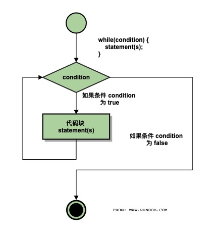
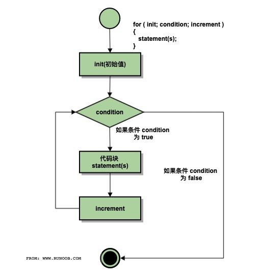

summary: 棋歌教学网 - C语言简明教程
id: clang
categories: CLang
tags: QiGe
status: Published
authors: QiGe
Feedback Link: mailto: gridwang@gmail.com

# 棋歌教学网 - C语言简明教程

## 概述

Duration: 90

本次课程我们将讲述以下内容:

### What You’ll Learn

- 程序的基本概念
- 程序设计语言
- C语言的词法
- C程序的基本结构
- 编译运行

### 程序的基本概念

#### 算法

我们给出如下问题: 有四个外观大小都一模一样的苹果, 现其中三个重量相同, 另外一个比这三个轻. 请用一个没有砝码的天平, 最大称两次, 找出这个轻的苹果.

问题一经提出, 你的大脑(CPU)就会飞快的运行, 就会找到解决这个问题的方法.(我不怀疑你马上就找到了方法, 且方法可能还不止一个)

那么, 我们就说

Positive
: ✍ 解决某问题的步骤和方法就是算法.

Positive
: ✍ 根据问题的复杂度, 算法有简单, 也有复杂的. 
✍ 比如问题改为: 有12个外观大小都一模一样的苹果, 现其中11个重量相同, 另外一个与这11个重量不同, 但不知是轻还是重. 请用一个没有砝码的天平, 最多称 三次, 找出这个不同的苹果, 并说出是轻还是重.(说明: 请不要试图马上解决, 2个小时内能找到方法则你的 IQ 超高!)

#### 程序

考虑刚才那个找苹果的算法, 你一定会告诉别人: 先如何, 再如何, 然后就成了.
是的, 我们用人类的语言描述了这个算法. 但如果我们需要计算机帮助, 那我们就需要用计算机能懂的语言, 即计算机语言.

那么, 简单的说, 

Positive
: ✍ 用某种计算机语言描述的算法就是(计算机)程序. 而程序设计(即编程)就是用计算机语言(即程序设计语言)解决问题的步骤和过程.

### 程序设计语言

#### 分类

Negative
: ✘ 以下讲述如何你不明白, 请直接忽略.

那么有哪些计算机语言或程序设计语言呢? 简单的说分为三种: 机器语言, 汇编语言, 高级语言.

比如我们要计算机帮我计算 `1 + 2`, 上面三类计算机语言可能分别是这样的:

```c
// 机器语言, 机器直接识别并能执行, 效率最高, 但程序员不喜欢
// 第一个是操作码(加法), 后面是操作数(分别是1和2)
00000011 00000001 00000010
// 汇编语言, 将机器语言纯粹的二进制做了一些改进.
// 但机器不能直接执行了, 需要汇编(简单想象成翻译好了)成计算机能识别的机器语言才能执行
// 执行效率较高, 但一般程序员也不喜欢(破解软件的或搞外挂的必须掌握)
// 下面代码先已经将1 和 2提前放到了eax和ebx寄存器了. 最后结果放到eax中
ADD %eax, %ebx
// 高级语言, 基本就是直白的数学表达式.
// 计算机更是不知所云, 需要进行编译才可运行. 相比之下效率最低
// 由于接近自然语言, 程序员非常喜欢
1 + 2
```

Positive
: ✍ 计算机做 `1 + 2` 花费的时间和做 `198964 + 469891` 的时间是相同的. 可以用一个 CPU 时钟周期来衡量.

#### C语言

C语言即是高级计算机语言的一种, 且是生命力非常强的一种(上世纪70年代初问世. 同时, 迄今不知有多少种计算机语言销声匿迹了).
我们既可以用C语言编写系统软件(`Unix, Windows, Linux, Adroid` 等等), 也可以编写各种应用软件.

Positive
: ♚ C语言之父. 丹尼斯·麦卡利斯泰尔·里奇（Dennis MacAlistair Ritchie，1941年9月9日－2011年10月12日），美国计算机科学家。黑客圈子通常称他为“dmr”。他是C语言的创造者、Unix操作系统的关键开发者，对计算机领域产生了深远影响，并与肯·汤普逊同为1983年图灵奖得主。图片摄于其去世前5个月.详情见[🌏维基百科](https://zh.wikipedia.org/wiki/%E4%B8%B9%E5%B0%BC%E6%96%AF%C2%B7%E9%87%8C%E5%A5%87)


当然, 除了C语言外, 还有不少先进的高级语言. 推荐: `Go, Java, Python, Typescript, Dart, Rust, Scala` 等等

### C语言的词法

#### 字符

既然是一门语言, 当然会规定语言中可以使用哪些字符.
C语言可使用的字符有: 大小写字母, 数字, 下划线, 一些特殊字符如 `+ - = / > ? () ; `等等.

Positive
: ✍ 请一定注意使用英文输入法下的的这些字符, 而不是中文输入法下的. 如英文的`;`与中文的 ； 就是有区别的

#### 关键字

其次, C语言有一些关键字, 也称保留字是其内含的, 不能作为它用. 如: `int float if else switch void for` 等等

Negative
: ✘ 这些关键字你无需记住, 随着我们的学习你自然就会熟悉了

#### 标识符

在程序中, 我们需要对一些对象进行命名, 这就是标识符.
假设我要处理上面称苹果的问题, 可能我会取标识符为: `apple1 apple2`等等

Positive
: ✍ C语言规定, 标识符只能由字母,数字,下划线构成, 且数字不能开头.
✍ 另外C语言严格区分大小写, 且同一个程序中的标识符必须不能相同, 也即必须唯一.

合法的标识符: `sum Sum _xyz month count lengthOfSomething` 等等
非法的标识符: `3M @qq.com $solary a/b` 等等. 想想为什么?

#### 语句

任何语言都有语句, 一个计算机程序由或多或少的语句构成.
C语言有不少语句类型, 如循环语句, 选择语句等等.

Positive
: ✍ C语言规定, 语句必须以`;` 作为结束标记. 你在实际编程中一定会出现这个错误的!!!
✍ 多个带分号的语句可以用`{}`包围起来, 称为复合语句, 此时不需要用`;`来标记了. 看看`main`函数的`{}`.
🗣 `;`分号作为语句的结束影响了相当多的后代语言如`Java/TS/Go/C#`等. DMR去世后, 计算机爱好者们以特有的方式纪念他, 许多网友的发帖中没有一个字，只有一个分号 `;`


### C程序的基本结构

或多或少的语句将组成一个个C语言程序. 显然, 这些语句需要按照一定的格式或规定进行组织.
下面是一个通用的C程序结构:

```c
#include "stdio.h"
void main() {
  // 你的语句将写在此处, 也是你知识和智慧所在
}
```

Positive
: ✍ 请留意, 本课程的要求基本不会超出上面的基本结构, 所有的代码都在`{}`内. 请尽快熟悉!

Negative
: ✘ 你也可能在其它地方看到有不同的结构如`int main()`等, 我们暂不解释区别. 强烈建议使用上面的最简单的结构.

下面我们来编写我们的第一个C语言程序. 打开你的开发软件如 Code, 新建一个以`.c`为后缀的C语言源程序文件如下:

```c
// 这是著名的 Hello World 程序
#include "stdio.h"
void main() {
  printf("Hello World!\n");
}
```

运行它试试(如果使用的是Code, 那么点击屏幕右上角的 ▷ 按钮即可运行了).
一句以上帝视角发出的问候会出现在你的屏幕的.

Positive
: 🌏 Hello World 是一个最著名的程序。对每一位程序员来说，这个程序几乎是每一门编程语言中的第一个示例程序。实际上，这个程序的功能只是告知计算机显示Hello World这句话。传统意义上，程序员一般用这个程序测试一种新的系统或编程语言。对程序员来说，看到这两个单词显示在电脑屏幕上，往往表示他们的代码已经能够编译、装载以及正常运行了，这个输出结果就是为了证明这一点。

下面我们稍微解释一下

- 整个程序由两部分组成, `#include "stdio.h` 以及 `void main() { }`
- `#include "stdio.h"`表明我们要使用`stdio.h`这个头文件(`Standard Input and Output`), 我们把它导入进来
- `main()`称为主函数. 每个C语言程序有且只能有一个`main`函数, 它是程序开始执行的地方即入口
- `main`函数的函数体即`{}`中的语句就是我们大展拳脚的地方
- 第一行是一个注释, 用于解释/标注某些东西给程序员查看, C语言系统直接忽略它
- `printf()`是来自我们前面导入的`stdio.h`头文件的一个输入函数, 简单的将要输出的内容放到`""`中即可
- 注意到`printf("...");`最后的`;`了吗, 不要忘记语句以`;`结束
- 输出内容中有个奇怪的`\n`, 它代表的是回车这个特殊字符. 去掉它试试.

Negative
: ✘ 如果你没有理解上面的解释, 或者还有一些疑问, 无需担心, 后面我们会学习的

Negative
: ✎ 试一试: 你能否将输出的内容改为`I hate C language!`或者你的姓名?

Positive
: ✍ 在 Code中如果你要输出中文的话需要在屏幕下方的 终端 窗口输入`chcp 65001`回车执行即可.

### 编译运行

Negative
: ✘ 以下内容了解即可, 如果不甚明白暂时无需担心

前面我们谈到计算机编程语言, 计算机能直接理解并运行的只有机器语言编写的程序.
如果你运行了第一个C语言程序, 你马上就会想到, 我们不是直接点击 ▷ 按钮就运行了吗?
没错, 但它不能说明高级语言编写的程序计算机能直接执行. 实际上, 点击 ▷ 按钮按钮后, 经过了

1. 编译 对源程序进行语法分析, 找出程序的语法问题, 生成二进制目标程序
2. 链接 将目标程序与相关的库文件连接, 生成可执行文件(Windows系统下即为 `.exe`文件)
3. 执行 然后才执行

Positive
: ✍ 当你点击  ▷ 按钮后, 如果没有语法错误, 你会在 Code窗口的左边栏看到一个 `.exe`文件生成了

Negative
: ✘ 你如果想了解这个`exe`文件即可执行文件如何运行, 请网上查阅.

### 课后练习

按照[棋歌教学网](https://qige.io/c/c.html)的安装说明搭建开发环境, 并成功编写运行你的第一个C语言程序.

## 数据类型与数据的输入与输出

Duration: 90

本次课程我们将讲述以下内容:

### What You’ll Learn

- 数据类型
- 常量
- 变量
- 格式化输入输出
- 字符数据的输入输出

### 数据类型

编写程序解决问题, 不可避免的会遇到很多的数据(想想现在火热的大数据`Big Data`).
这些数据一般分为两类:

- 数值数据, 可进行算术运算. 如: `3.14, 8964`等等
- 非数值数据, 即单个的字符或字符串, 一般无需进行运算, 只表示某种符号. 如: 你的姓名, 身份证号等等.

无论那种数据, 在计算机内部都是以二进制表示的.
特别是英文字符, 我们用了1个字节即8位二进制来进行编码--ASCII码, 如字母A就将其编为`01000001`, 计算机一看到这串字符就明白它代表A.(8位二进制可以编多少个码呢?)

Positive
: 🌏 你可能会想, 那么我们使用的中文, 经常发的图片, 听的歌曲, 看的视频又是什么数据, 又是怎么处理的? Google一下吧.

### 常量

常量, 程序运行过程中即不会发生改变的量.

#### 整型常量

如圆周率π为3.14, 珠峰高度8848等. 对一些较长的数, C语言还提供了科学计数的表示, 如`1.989E64`表示1.989乘以10的64次方.

Positive
: ✍ E大写小写都可以,如 `3.14e5`, 但 E或e 的前后至少一边有数字, 且后边的数字只能是整数. 所以 `0.15e3.6 E-8`都是错误的.

#### 字符常量

即单个的字符, 如 `U, $, @`等, 但C语言规定字符常量需用单引号包裹起来, 即: `'U', '$', '@'`.

Positive
: ✍ 单引号中只能包含一个字符, 如 `'an' 'sum'`等都是错的. 多个字符即所谓的字符串用双引号包裹, 如`"hahahaha"`等, 我们将在第10讲学习.

Positive
: ✍ 字符在C语言中实际存储的是其ASCII值. 这点请留意, 我们后面用到时再进行说明.

#### 转义字符

某些字符是不可见的, 如键盘上的回车或退格等.
C语言采用了一种特殊的方法来表示这些不可见的字符, 用一个`\`再加上某个字母来代表. 如`'\n'`代表的就是回车.
以`\`开头后跟一个特定字母的表示就称为转义表示, 即它不代表`\`和`n`两个字符, 而是一个其它意思的字符.

Positive
: ✍ 你想起来我们第一个程序中的`Hello World`后面跟随的`\n`了吗?

还有规定好的其它一些转义字符, 当前你只需知道`\n`即可.

### 变量

#### 概念

编程中, 我们不仅需要使用常量, 更需要使用其值可改变的量.
比如某些游戏用血量来表示角色是否活着. 开始满血可认为是100, 随着搏斗, 血量将减少, 如果减为0, 此次游戏则终止.
显然, 血量就是一个可以改变的量, 这就是变量.

#### 变量的定义

C语言规定, 要使用变量, 首先必须定义, 即需要说明其该变量是什么数据类型,叫什么名称.
C语言用`int`, `float` 和 `char`分别来定义整数, 实数(也称浮点数)和字符.
变量的名称即标识符(你还记得第一讲有关标识符的规定吧?), 一般我们希望这个名称能说明该变量用来存放什么, 如: `age powerOfBoss`等.

下面是一些定义变量的例子:

```c
int age, heigh, width;  // 定义了三个整型变量, 如果有多个用逗号进行分隔
float income = 19896.4;           // 定义了一个浮点型变量, 并给定了一个值(初始化)
char sex, isOver;       // 定义了两个字符型变量
```

Positive
: ✍ 变量如果没有定义就使用将发生编译错误, 程序是不能运行的.

### 格式化输入输出

下面我们谈谈如何在C语言中把数据输出到屏幕呈现给用户或者从键盘接收用户的输入.

#### 输出

我们使用在`stdio.h`头文件中已经定义好的`printf()`函数进行输出. 如我们要输出你的年龄:

```c
#include "stdio.h"
void main() {
  int age;  // 定义了一个整型变量age
  age = 20; // 把20放到 age 变量中
  printf("-------this year--------");     // 输出双引号中的内容
  printf("You are %d years old!\n", age); // 输出双引号中的内容, 注意 %d
  age = 21; // 把21放到 age 中, age变量以前的值被替换
  printf("-------next year--------");     // 输出双引号中的内容
  printf("You will be %d years old next year!\n", age); // 输出双引号中的内容, 注意 %d
}
```

运行上面的程序试试.
`printf()`函数将原样输出双引号中的内容(实际是一个字符串), 这点你应该看得出来.
字符串中的`\n`你也应该知道是个特殊的字符表示回车.
但是你会看到有一点异样: 字符串中`%d`的位置输出的是`age`变量的内容即`20`或`21`.

我们把`%d`称为输出占位符, 它表示此处要输出一个整数, 其值与字符串后面的量对应. 现在明白为何输出`20`或`21`了吧.

Negative
: ✎ 试一试: 注释掉`int age;`这句看能否运行? 
✎ 试一试: `%d`如果没有对应的变量age, 即改为`printf("You are %d years old!\n");`会如何?

除了`%d`是整数的占位符外, `%f`对应小数, `%c`代表一个字符. 如:

```c
#include "stdio.h"
void main() {
  int age = 20;  // 定义了一个整型变量age并初始化为20
  float income = 1989.64; // 定义了一个浮点型变量income并初始化
  char isOver = 'Y'; // 定义了一个字符型变量isOver并初始化
  printf("How old are you: %d\n", age);
  printf("How old are you: %5d\n", age);  // 注意是 %5d, 表明这个整数至少占5个字符宽度
  printf("What's your income: %f\n", income);
  printf("What's your income: %.2f\n", income); // 注意%.2f, 表明小数点后只需2位
  printf("Is this game over: %c\n", isOver);  // 输出指定的字符
  printf("Age:%5d, Income:%10.2f, Over:%c\n", age, income, isOver); // 放在一块也可以的
}
```

Negative
: ✎ 试一试: `printf("%c  %d\n", 'A', 'A')`会输出什么? `printf("%c  %d\n", 65, 65)`呢?

#### 输入

在上面的例子中, 你会发现数据都是程序中给定的. 那么我们可否在程序运行时, 用户才提供呢? 这样会更灵活.
现实编程中, 我们需要使用输入函数`scanf()`来接收用户提供的数据.
`scanf()`函数也使用`%d`,`%f`,`%c`来分别接收整数,小数和单个的字符放到对应的变量中. 如:

```c
#include "stdio.h"
void main() {
  int age;  // 定义了一个整型变量age
  float income; // 定义了一个浮点型变量income
  char isContinue; // 定义了一个字符型变量isContinue
  printf("Continue(Y/N)?"); // 问是否继续
  scanf("%c", &isContinue); // 接收用户的输入放到isContinue变量中. 注意&符号, 我们以后再说明为什么必须加
  printf("How old are you:");
  scanf("%d", &age);  // 注意 age前的&符号, 我们以后再说明为什么必须加
  printf("What's your income:");
  scanf("%f", &income); // 注意 income钱的&符号  
  printf("You are %d, your income is $%.2f. Go on? %c\n", age, income, isContinue);  
}
```

运行以上程序, 你将会发现程序在每个`scanf()`处都会停下来, 等你输入对应类型的数据才继续.

Positive
: ✍ 注意一: `scanf()`函数中的输入字符串内只放占位符, 不要放置其它东西, 如`scanf("%d", &age);`中就只有一个`%d`表明要接收一个整数并会放到`age`变量中.
✍ 注意二: `scanf()`函数中的变量名前需要`&`符号, 否则接收不正确. 原因我们在`指针`部分再讲述.

Negative
: ✎ 试一试: `scanf("%d%d%d", &a,&b,&c);`将一次性需要你输入3个整数(用空格或回车分隔这3个整数).

### 字符数据的输入输出

针对字符, C语言还额外提供了两个函数来进行输入和输出: `putchar()`和`getchar()`. 如:

```c
#include "stdio.h"
void main() {
  char gender;  // 定义了gender字符变量用于保存性别
  printf("What is your gender(F-Female, M-Male):");
  gender = getchar();  // 程序在此将等你输入F/M, 然后存到gender变量中
  printf("Your gender is ");
  putchar(gender);
  putchar('\n');  // 输出一个回车
  putchar(66);    // 这也是可以的, 输出66这个ASCII码对应的字符
}
```

Negative
: ✎ 试一试下面的代码, 你会发现不能正确接收用户的输入, 将中间那句`getchar()`前的注释去掉再试试:

```c
#include "stdio.h"
void main() {
  char gender, degree;  // 定义了gender用于保存性别, degree保存等级(ABC)
  printf("What is your gender(F-Female, M-Male):");
  gender = getchar();  // 程序在此将等你输入F/M, 然后存到gender变量中
  // getchar();  //  getchar()将接收上次输入中F/M后的回车, 以免影响下次输入
  printf("What is your degree(A, B, or C):");
  degree = getchar();  // 程序在此将等你输入A/B/C, 然后存到degree变量中
  printf("Your gender is %c, your degree is %c\n", gender, degree);  
}
```

### 课后练习

请掌握本讲列出的程序代码. 试着自行定义一些不同类型的变量, 并进行输入和输出练习.
如果你遇到了什么问题, 记录下来以进一步讨论.

## 运算符与简单程序设计

Duration: 90

本次课程我们将讲述以下内容:

### What You’ll Learn

- 赋值运算
- 算术运算
- 复合运算
- 类型转换
- 简单顺序结构

### 赋值运算

C语言将赋值也作为一种运算, 使用`=`进行, 即: 将`=`右边的值赋予左边的变量. 如:

```c
#include "stdio.h"
void main() {
  int a, b, c;  // 定义了3个整型变量a、b、c
  a = 1;    // 将1赋给a变量
  b = 2;    // 将2赋给b变量
  c = a + b;  // 将a + b的结果赋给c变量
  printf("%d\n", c);
  a = a + 1;  // 先计算a + 1, 结果为2, 再把2放到a中.
  b = b - 1;  // 先计算b - 1, 结果为1, 再把1放到b中.
  c = a + b;
  printf("%d\n", c);
}
```

Positive
: ✍ 赋值运算即`=`的左边必须是一个变量, 如此才能存放右边的值. 所以`5=3`为什么不合法?
✍ 赋值运算的优先级很低, 仅高于我们逗号运算(我们没讲该运算, 可暂时忽略)

### 算术运算

C语言的算术运算有`+ - * / %`等. 相关注意说明如下:

- 当`/`号的两边都是整数时, 结果也为整数. 如: `5/2` 的结果是 2不是2.5
- 当`/`号的任何一边为小数, 结果则为小数. 如: `5/2.0`的结果就是 2.500000
- `%`是取余运算, 要求两边都必须是整数. 如: `5%2`的结果(余数)是1. 我们通常用于判断是否能整除.

### 复合运算

#### 自增和自减`++ --`

`++`或`--`称为自增或自减, 它只能用于变量, 即将自己增加1或减少1. 如:

```c
int i = 6, j = 4;
i++;  // 等价于 i = i + 1
j--;  // 等价于 j = j - 1
printf("%d,%d", i, j);  // 结果为7,3
```

Positive
: ✍ 为什么`64++`不合法?

此外, `++`或`--`有前后位置之分. 我们以`++`为例:

```c
int i = 1, j, k;
j = i++;  // 称为后加, 即先将i的值赋给j, 然后i再自增. 所以j的值为1
k = ++i;  // 称为前加, 即先自增, 然后将i的值赋给k. 所以k的值是3（请思考为什么）
```

#### 复合赋值

C语言还提供一种算术和赋值的组合运算, 即:`+= -= *= /= %=`, 如:

```c
int a = 6;
a += 3;   // 等价于a = a + 3
a /= 3;   // 等价于a = a / 3
printf("%d", a);   // 请问结果是什么?
```

### 类型转换

前面我们知道数据有不同的数据类型如整型实型等. 在运算过程中为了不损失精度, 都会向高精度的类型进行暂时的转换.
有一种取值范围和精度都更高的类型是`double`, 我们称为双精度, 我们前面学的`float`就是单精度. 如:

```c
int a = 1, sum;
float b = 8.9;
double c = 6.4;
// 先计算a+b, 因为b是float型, 先将a暂时转换为float型, 结果是float型;
// 然后与c相加, 因为c是double型, 就将刚才那个float型的结果先转换为double型;
// 此时赋值号右边就有了一个double型的结果, 但=号的左边 sum 是一个int型, 所以最后将double型取整赋给 sum 即可.
sum = a + b + c;  
```

### 简单顺序结构

在解决问题的过程中, 我们基本会从前往后顺序执行即可。有时某些问题比较特殊，需要进行判断再决定该做些什么(如:游戏是否继续), 有时又需要重复的做某件事直至满足某种条件才停止(如拥有的金币数量不为0就继续让用户买买买直至没钱了).

这实际就是程序设计的三种基本结构： 顺序、选择和循环.

Positive
: ✍ 我们即将进行编程学习。简单的说，编写程序一般是三步曲：
1.获取用户的输入（考虑定义需要的变量，接收用户的输入）
2.处理问题（根据拟定的算法进行相关运算）
3.输出结果给用户（将最终结果展示给用户）

下面我们看看顺序结构的程序.

#### 程序一

```c
// 求两个数的和差积商
#include "stdio.h"
void main() {
  float a, b;
  float sum, difference, product, quotient;
  printf("Please input two number:");
  scanf("%f%f", &a, &b);
  sum = a + b;
  difference = a - b;
  product = a * b;
  quotient = a / b;
  printf("%.2f + %.2f = %.2f\n", a, b, sum);
  printf("%.2f - %.2f = %.2f\n", a, b, difference);
  printf("%.2f * %.2f = %.2f\n", a, b, product);
  printf("%.2f / %.2f = %.2f\n", a, b, quotient);
}
```

#### 程序二

```c
// 交换两个变量的值并输出
// 我们引入了一个临时的中间变量temp
#include "stdio.h"
void main() {
  int you, me, temp;
  printf("Please input you and me:");
  scanf("%d%d", &you, &me);
  printf("----Before----\n");
  printf("You:%d, Me:%d\n", you, me);
  temp = you;
  you = me;
  me = temp;
  printf("----After----\n");
  printf("You:%d, Me:%d\n", you, me);
}
```

### 小测试

```c
一、单选题

1.下列表达式中，表达式值为0的是（）。
A. 2 % 5                B. 2 / 3.0
C. a = 0, a + (b = 5)   D. 8 / 9

2.下列运算符中，要求操作数必须是整型的是（）。
A. %           B. *
C. /=          D. ++

3.下列运算符中，运算优先级最低的是（）。
A. =           B. %
C. +           D. -

4.若有定义：int i = 2, j;，则语句j = ++i;执行结束之后，以下说法正确的是（）。
A. i的值为3，j的值为2  B. i的值为2，j的值为2
C. i的值为3，j的值为3  D. i的值为2，j的值为3

5.若有定义：int a = 6;，则表达式a /= a + a的值是（）。
A. 7        B. 2
C. 0        D. 0.5

二、判断题

1.若有定义：int i = 2;，则语句a += a *= a;执行结束之后，变量a的值是6。（）

2.若有定义：int num;，则语句num = 3.561;执行结束之后，变量num的值是4。（）

3.若有定义：int a = 9;float x = 6.3, y = 3.5;，则表达式a % 5 * (int)(x+y) % 7 / 4的值为0。（）

4.若有定义：char c;，则表达式c = 'a' - 'A' + 'B'的值为'b'。（）

5.若有定义：int a;，则表达式a = 3 * 5, a + a, a + 3的值为33。（）
```

Positive
: ✍ 提示1： 第3题中`(int)(x + y)`的意思是将`(x + y)`的结果强行转变为`int`型，直接取整数部分，不会四舍五入。
✍ 提示2： 第4题请考虑使用ASCII码进行。
✍ 提示3： 第5题是我们没有讲述的逗号运算，是最低级的运算，你可忽略。

Negative
: ✉ 参考答案: DAACC ✘✘✔✔✘

## 选择结构程序设计1

Duration: 90

本次课程我们将讲述以下内容:

### What You’ll Learn

- 关系运算
- 逻辑运算
- 条件运算
- 选择结构

### 关系运算

C 语言中的关系, 不是指男女关系, 而是大小关系.
当需要判断两个值的大小关系时,我们用关系运算.

#### 关系运算符

关系运算有以下类型:

```c
小于  小于等于  大于  大于等于
<    <=       >     >=
等于  不等于
==   !=
```

Positive
: ✍ 注意上面的`<= >= == !=`是两个字符组成的.

#### 关系表达式

使用关系运算符连接的式子即为关系表达式. 比如:

```c
score < 60              // 是否及格
b * b - 4 * a * c < 0   // 是否有实根(求根判别式)
age >= 18               // 是否成年
sex == 1                // 是否男性(以 1 表示男性)
```

#### 运算结果

你应该直觉的感知, 关系运算的结果要么为"真", 要么为"假".

Positive
: ✍  在 C 语言中, 我们用 1 表示真, 用 0 表示假.

请输入如下程序进行理解:

```c
#include "stdio.h"
void main() {
  int score = 58, age = 20, sex = 0;
  int isPass, isAdult, isFemale;
  isPass = score >= 60; //根据上面的分数58, 结果为假, 故isPass将被赋值为0
  isAdult = age >= 18;  //根据上面的年龄20, 结果为真, 故isAdult将被赋值为1
  isFemale = sex == 0;  //根据上面的性别 0, 结果为真, 故isFemale将被赋值为0
  printf("Pass: %d\n", isPass);     //Pass: 0
  printf("Adult: %d\n", isAdult);   //Adult: 1
  printf("Female: %d\n", isFemale); //Female: 1
}
```

#### 运算优先级

当多个关系运算符或有其它运算符时, 我们需考虑它们的优先级.

- `<  <=  >  >=` 这四个运算符同等优先级, 如果同时出现, 从左至右开始运算即可. 如:

```c
89 > 64 < 0     // 运算顺序是先运算 89 > 64, 结果为 1 ,然后再运算 1 < 0
```

- 同理, `==  !=` 这两个运算符同等优先级, 如果同时出现, 从左至右开始运算即可. 如:

```c
89 == 64 != 5   //先运算 89 == 64, 结果为 0, 再运算 0 != 5
```

- 但 `<  <=  >  >=` 的优先级高于 `==  !=` , 如:

```c
89 == 64 > 5    //先算 64 > 5, 结果为1, 再算 89 == 1
```

- 当然算术运算高于关系运算, 关系运算又高于赋值运算. 如:

```c
a = 1;
b = 5;
c = 3;
// 先算 b * b, 得 25(中间结果),
// 再算 4 * a 得 4, 再用这个结果 4 * c, 得 12,
// 再用早先的 25 - 12, 得13,
// 最后结果 13 赋值给变量 p
p = b * b - 4 * a * c;
```

Positive
: ✍  当然,圆括号的优先级最高. 建议多以圆括号来保证你运算需要的优先级!

### 逻辑运算

Positive
: &#x2600; 题外话: 出于某些原因, 我们的教育中是缺乏真正的逻辑教育的(什么是逻辑? 请移步[维基百科](https://zh.wikipedia.org/wiki/%E9%80%BB%E8%BE%91), 再题外话:不推荐看百度百科, 你可能看到的是假的), 以至于我们经常把"举例/道理/类比/比喻"等作为论证手段. 请参考[“四大论证方法”逻辑混乱，是有害的](https://www.bilibili.com/read/cv1672537)一文.

经常的, 我们要判断的关系非常复杂.
如某网红女在谈男朋友的条件时曾说: 非北大光华管理学院毕业的帅哥不予考虑!
如果她是百合网的会员, 那么百合网的程序猿估计要设置这么几个变量来为她进行筛选:

```c
// 以下条件都要满足, 即都要为真才能进入她的法眼
isPKU       ---> 是否北大的
isGuanghua  ---> 是否光华的
isHandsome  ---> 是否帅的
isMale      ---> 是否男的
```

这时, 我们就必须引入逻辑运算才能解决问题.

#### 逻辑运算符

有三种逻辑运算符:

- 逻辑与 `&&`  两个连接符号, 如 `isPKU && isMale`, 必须左右两个的值都为真, 整个表达式为真, 否则为假
- 逻辑或 `||`   两个竖线符号, 如 `isPKU || isHandsome`, 左右两边的值只要有一个为真, 整个表达式就为真
- 逻辑非 `!`    一个感叹号,   如 `!isPKU`, 将 `isPKU` 的值变反, 即真假变换

#### 逻辑表达式

我们如果要表达上述的择偶条件的话, 逻辑表达式应该是这样的:

```c
// 非北大光华管理学院毕业的帅哥不予考虑
isPKU && isGuanghua && isHandsome && isMale
// 由于条件苛刻, 降低标准为:北大的不帅也可以, 不是北大的必须要帅(但必须是男人啊)
(isPKU || isHandsome) && isMale
```

#### 优先级

当有多种运算时, 优先级如下:

- `!  &&  ||`, 即 逻辑非 `!` 最高, 逻辑与 `&&` 次之, 逻辑或 `||` 最低
- 逻辑非 `!` 的优先级比算术运算的优先级都高
- 逻辑与 `&&` 和 逻辑或 `||` 的优先级低于关系运算

Negative
: ✎ `(isPKU || isHandsome) && isMale` 如果没有圆括号即 `isPKU || isHandsome && isMale` 将表达什么意思?

#### 示例

Positive
: ✍ 注意: C 语言中, 输出关系或逻辑表达式的结果时要么是 `1`, 要么是 `0`. 但在判断时, 采用的 `0` 为假, 非`0`的都为真. 请一定留意!

Positive
: ✍ 短路运算: 当 `&`& 运算符左边已经为假, 则右边不需要计算了, 整个表达式结果为假; 同理, 当 `||` 运算符左边已经为真, 则右边不需要计算了, 整个表达式结果为真. 这就称为短路!

查看以下程序片段, 仔细分析输出的结果:

```c
#include "stdio.h"
void main() {
  int a = 3, b = 1, x = 2, y = 0;
  int result1, result2, result3;
  // 注意: 先算 a < b, 结果为 0, 此时就不再计算右边的 x > y了, 直接将 0 赋值给result1
  result1 = a < b && x > y;
  // 注意: 先算 !a, 因为 a 的值是3(非0即为真),所以结果为 0；再算 a > b, 
  result2 = !a || a > b;
  // 注意: 先算的 b && y
  result3 = y || b && y || a;
  printf("Result1: %d\n", result1);  // 0
  printf("Result2: %d\n", result2);  // 1
  printf("Result3: %d\n", result3);  // 1
}
```

### 优先级总结

Positive
: ✍ 优先级: 除了括号外, 计算的优先顺序为: 逻辑非 - 乘除 - 加减 - 大于/小于 - 等于/不等于 - 逻辑与 - 逻辑或 - 赋值 - 逗号

### 小测试

```c
第一题
设有定义： int a = 5, b = 6, c = 7, d = 8, m = 2, n = 2;
则逻辑表达式(m = a > b) && (n = c > d)运算后，n的值为()。
A. 0      B. 1
C. 2      D. 3

第二题
已有定义：int x = 3, y = 4, z = 5;  则表达式!(x + y) + z - 1 && y + z / 2的值是（）。
A. 6      B. 0
C. 2      D. 1

第三题
能正确表示“当x的取值在[-58,-40]和[40,58]范围内为真，否则为假”的表达式是（）。

A. (x >= -58) && (x <= -40) && (x >=40) && (x <=58)
B. (x >= -58) || (x <= -40) || (x >=40) || (x <=58)
C. (x >= -58) && (x <= -40) || (x >=40) && (x <=58)
D. (x >= -58) || (x <= -40) && (x >=40) || (x <=58)

第四题
若希望当x的值为奇数时，表达式的值为“真”，x的值为偶数时，表达式的值为“假”。
则以下不能满足要求的表达式是（）。
A. x % 2 == 1     B. !(x % 2 == 0)
C. !( x % 2)      D. x % 2

第五题
已知 x = 45, y='a', z = 0; 则表达式(x >= z && y < 'z' || !y)的值是（）。
A. 0          B. 语法错
C. 1          C. 假
```

Negative
: ✉ 参考答案: ADCCC

### 条件运算

条件运算是一种非常简洁的二元判定结构, 其结果要么是这个, 要么是那个. 实际编程中我们经常使用.
其格式如下:

<判断表达式>?<结果表达式1>:<结果表达式2>

Positive
: ✍ 三个表达式分别用 `?` 和 `:` 分割开了, 意思是: 如果判断表达式的结果为真, 则整个表达式的结果就是"结果表达式1"的结果；否则就是"结果表达式2"的结果. 如 `89 > 64? 999 : 888` 的结果就应该是 999.

阅读以下程序, 分析其如何求出某个数的绝对值:

```c
#include "stdio.h"
void main() {
  int x;
  printf("Please input a integer number:");
  scanf("%d", &x);
  x = x > 0 ? x : -x;
  printf("|x|=%d\n", x);
}
```

### 选择结构

计算机, 也称为电脑, 能够根据程序中设置的不同的条件进行关系或逻辑判断, 以执行不同的任务, 实现一定的自动化.

这种根据不同逻辑执行不同任务的程序设计就是--选择程序设计. 它可看着当前热门的人工智能的基础

Positive
: 🌏 简单人工智能: 请访问一个猜东西的网站[20Q.net](http://20q.net/), 它能通过询问20个左右的简单问题，猜出您想象的物品.

#### 单分支选择结构

格式如下:

```c
// 如果条件表达式为真, 即条件成立, 则执行花括号{}中的语句;
// 否则什么都不做
if(条件表达式) {
  满足条件后要执行的一条或多条语句
}
```

分析如下程序:

```c
/* 题目: 求两个数哪个大
 * 思路: 假设第一个数就是大的,然后进行验证,
 *      如果第二个数还大,就修正
 *      经过判断, 保证max中一定保存的是大的那个数
 */
#include "stdio.h"
void main() {
  int num1, num2, max;  // max 用来放两个数中大的那个
  printf("Please input two integer number:");
  scanf("%d%d", &num1, &num2);
  max = num1;       // 假设num1是大的, 放到max变量中
  if(max < num2) {   // 验证假设, 第二个是不是比我大?
    max = num2;
  }
  printf("MAX: %d\n", max);
}
```

#### 双分支选择结构

格式如下:

```c
// 如果条件表达式为真, 即条件成立, 则执行其紧跟花括号{}中的语句;
// 否则执行else后面{}中的语句
if(条件表达式) {
  满足条件后要执行的一条或多条语句
} else {
  不满足条件后要执行的一条或多条语句
}
```

我们用双分支结构来完成上面的问题:

```c
/* 题目: 求两个数哪个大
 * 思路: 使用双分支选择结构直接比较即可
 *       max保存大的那个数
 */
#include "stdio.h"
void main() {
  int num1, num2, max;  // max 用来放两个数中大的那个
  printf("Please input two integer number:");
  scanf("%d%d", &num1, &num2);
  if(num1 > num2) {    // 直接比较, 第一个数是不是比第二个数大
    max = num1;       // 第一个大, 放到max中
  } else {
    max = num2;       // 第二个大, 放到max中
  }
  printf("MAX: %d\n", max);
}
```

Negative
: ✎ 试一试: 你能否根据上面的程序, 模拟一个游戏通关后系统会给出一个提示, 回答 1 则输出 again, 回答 0 则输出 bye

Negative
: ✎ 试一试: 你可否使用前面讲述的 条件运算表达式来改写这个程序?

#### 多分支选择结构

有时, 我们遇到的情况比较复杂, 可能有多种情况需要我们进行处理, 那么我们可以使用多分支选择结构.

一个三分支选择结构的格式如下:

```c
// 如果条件表达式1为真, 则执行其花括号{}中的语句;
// 否则如果条件表达式2为真, 则执行其花括号{}中的语句;
// 否则, 执行else后面的语句
if(条件表达式1) {
  满足条件1后要执行的一条或多条语句
} else if(条件表达式2) {
  满足条件2后要执行的一条或多条语句
} else {
  以上条件都不满足则执行此处的一条或多条语句
}
```

说明:

- 上面描述了一个三分支的情形
- `else if`不是只能有一个, 可以有多个如四分支,五分支等
- `else`块可以没有

仔细阅读分析下面的程序:

```c
/* 题目: 根据成绩(分数)输出对应的(优/良/中/及格/不及格)等级
 * 思路: 使用多分支选择结构直接比较即可
 */
#include "stdio.h"
void main() {
  int score;
  printf("Please input your score:");
  scanf("%d", &score);
  if(score >=90) {
    printf("Excelent!");
  }else if(score >= 80 && score < 90) {
    printf("Good!");
  }else if(score >= 70 && score < 80) {
    printf("Middel");
  }else if(score >= 60 && score < 70) {
    printf("OK");
  } else {
    printf("Bad!");
  }
}
```

试试运行这个程序.

Negative
: ✎ 上面这个程序有个小 bug. 假设我们合理的分数在`0~100`, 当不小心输入的分数为`1989`或`-64`时, 看看程序会发生什么, 如何修正?

Negative
: ✎  思考: 我们的判断条件 `score >=80 && score < 90` 可以简化为 `score >= 80` 吗?

### 小测试

```c
第一题
#include "stdio．h"
void main() {
  int x = -10, y = 5, z = 0;
  if(x = y + z) {
    printf("***\n");
  } else {
     printf("$$$\n");
  }
}
以上程序:
A. 有语法错不能通过编译      B. 可以通过编译但不能通过连接
C. 输出***                D.  输出$$$

第二题
#include "stdio.h"
void main() {
  int a = 1;
  if(a++ > 1) {
    printf("%d\n", a);
  } else {
     printf("%d\n", a--);
  }
}
程序的输出是:
A. 0        B. 1
C. 2        D. 3

第三题
#include "stdio.h"
void main() {
  int a = 5, b = 4, c = 6, d;
  printf("%d\n", d = a > b? a > c? a : c : b);
}
程序的输出结果是:
A. 5        B. 4
C. 6        D. 不确定

第四题
#include "stdio.h"
void main() {  
  float x = 2.0, y;
  if(x < 0.0) {
    y = 0.0;
  }else if(x < 10.0) {
    y = 1.0 / x;
  } else {
    y = 1.0;
  }
  printf("%f\n", y);
}
y的值是:
A. 0.000000       B. 0.250000  
C. 0.500000       D. 1.000000
```

Negative
: ✉ 参考答案: CCCC

### 课后练习

请理解且熟悉本讲所列的示例程序, 尽力完成所有的思考和试一试.

阅读并理解如下程序:

```c
/* 题目: 判断输入的字符是那种类型, 如大写/数字等等
 * 思路: 使用多分支选择结构, 判断该字符的ASCII码即可
 * 注意: ASCII码值小于32的是一些控制字符, 如 回车/方向键/tab键等等
 */
#include "stdio.h"
void main() {
  char yourKey;
  printf("Please input a character:");
  yourKey = getchar();
  if(yourKey < 32 ) {
    printf("It's a control character\n"); // 控制字符
  }else if(yourKey >= '0' && yourKey <= '9') {
    printf("It's a number\n");            // 数字字符
  }else if(yourKey >= 'a' && yourKey <= 'z') {
    printf("It's a lowercase letter\n");  // 小写字母
  }else if(yourKey >= 'A' && yourKey <= 'Z') {
    printf("It's a uppercase letter\n");  // 大写字母
  } else {
    printf("It's other character\n");     // 其它字符
  }
}
```

## 选择结构程序设计2

Duration: 90

本次课程我们将讲述以下内容:

### What You’ll Learn

- 多分支 switch 语句
- 嵌套的 if 语句

### switch 语句

除了使用`else if`来构建多分支的选择结构外，某些情况下用`switch`来构建多分支会更清晰。 结构如下：

```c
switch(整型或字符型变量) {
  case 整型或字符型常量1: 语句1; break;
  case 整型或字符型常量2: 语句2; break;
  ...
  case 整型或字符型常量n: 语句n; break;
  default: 语句n+1;
}
```

说明：

- 以上结构共提供了`n+1`种情况
- 根据 整型或字符型变量 的值与哪个`case`后的 常量相同，就执行哪个`case`后面的语句，然后就跳出整个`switch`
- 只能对整型或字符型变量进行判定
- 注意每个`case`后面的`break`，如果没有它，程序将把所有`case`的语句都执行

阅读理解如下程序：

```c
/**
 * 根据用户的输入值输出对应星期几
 * 如用户输入2,则输出Tue
**/
#include "stdio.h"
void main() {
  int day;
  printf("Please input a number(1~7):");
  scanf("%d", &day);
  switch(day) {
    case 1: printf("Monday\n");
    case 2: printf("Tuesday\n");
    case 3: printf("Wednesday\n");
    case 4: printf("Thursday\n");
    case 5: printf("Friday\n");
    case 6: printf("Saturday\n");
    case 7: printf("Sunday\n");
    default: printf("Error!\n");
  }
}
```

Negative
: ✎ 运行上面的程序，如输入3，你会得到什么结果？如何修正？
✎ 如果我希望输入了`8`则输出`Monday`，输入`9`则输出`Tuesday`，依次类推，而不是输出`error`，你有什么想法？(提示：考虑取余运算`%`)

再看看一个用`switch`编制的简单计算器程序：

```c
/**
 * 根据用户的输入的运算式给出结果
 * 如用户输入6+4,则输出10
 * 程序目前只支持+-×/四种运算
**/
#include "stdio.h"
void main() {
  float a, b, result; // a和b浮点型变量放两个运算数，result变量放结果
  char operator; //operator字符型变量放运算符
  int isInputError=0; // isInputError整型变量设置是否有输入错误，1代表有错，0代表无错，默认无错即0
  printf("Please input your expression(like 6+4):");
  scanf("%f%c%f", &a, &operator, &b); // 请留意如何接收用户输入的！
  switch(operator) { // 根据operator中的运算符来决定该进行何种运算
    case '+': result = a + b; break;
    case '-': result = a - b; break;
    case '*': result = a * b; break;
    case '/': result = a / b; break;
    default: isInputError = 1;  // 不是加减乘除，输入的运算不能进行，置isInputError为1
  }
  if(isInputError == 1) {  // isInputError为1则表明输入有错
    printf("Sorry, I don't understand!");
  } else {
    printf("%.2f%c%.2f=%.2f\n", a, operator, b, result);
  }
}
```

运行这个程序试试。实际上，类似我们手机上的计算器，其背后就是这种程序在运行。不过它提供了图形界面而已。

Negative
: ✎ 试一试：如果我们打算提供求余运算，该如何修改一下？
✎ 思考：程序中我们引入了`isInputError`变量来判断是否有输入发错误，这是很常用的编程手段。那么，请想一想判断条件可否从`if(isInputError == 1)`改为`if(isInputError)`?
✎ 试一试：这个程序使用`switch`非常方便，可读性也强。你可否把它用多分支的`if`语句来实现？

### 嵌套的 if 语句

在某些时候，我们可能会遇到判断了一次条件后还要判断另外条件的情况。
考虑一下QQ的登录，它可能这样进行两步验证：先判断是否有这个用户，然后如果有这个用户那么密码是否正确。
此时我们就会用到嵌套的判断即嵌套的`if`语句。

#### 找最大的数

请看如下程序：

```c
/**
 * 对于用户任意给定的3个整数，输出最大的那个
 * 如用户输入19 89 64,则输出89
**/
#include "stdio.h"
void main() {
  int a, b, c, max;  // a、b、c用来放用户给定的3个整数，max用来放最大的那个
  printf("Please input 3 ingeger:");
  scanf("%d%d%d", &a, &b, &c);
  if(a > b) {    // a>b
    if(a > c) {  // a>b同时a>c，所以a最大
      max = a;
    } else {      // c>a>b
      max = c;
    }
  } else {        // b>a
    if(b > c) {  // b>a同时b>c，所以b最大
      max = b;
    } else {
      max = c;  // c>b>a
    }
  }
  printf("Max: %d\n", max);
}
```

以上程序使用了两层`if`嵌套。运行试试。

#### 找轻的苹果

还记得我们以前提到的那个找苹果问题吗？我们如何用C语言来让计算机给我们找出来呢？

```c
/**
 * 有四个外观大小都一模一样的苹果, 现其中三个重量相同, 另外一个比这三个轻.
 * 请用一个没有砝码的天平, 最多称两次, 找出这个轻的苹果.
 * 我们以a1、a2、a3、a4代表这四个苹果的重量，为简化我们用整数
 * 程序运行时用户任意指定哪个苹果轻,如 2 2 1 2 就代表第三个苹果轻
 * 注意：称两个苹果（左右两边）有三种可能：左跷、平衡、右跷
**/
#include "stdio.h"
void main() {
  int a1, a2, a3, a4;   // 存放四个苹果的重量
  printf("Please input 4 apple's weight:");
  scanf("%d%d%d%d", &a1, &a2, &a3, &a4);
  if(a1 < a2) {        // 第一个轻
    printf("No.1 is light!\n");
  }else if(a1 > a2) {  // 第二个轻
    printf("No.2 is light!\n");
  } else {              // 第一个和第二个相等，需要再称一次
    if(a3 < a4) {
      printf("No.3 is light!\n");
    } else if(a3 > a4) {
      printf("No.4 is light!\n");
    } else {            // 想想为何是错的？
      printf("Your are Wrong!\n");
    }
  }
}
```

Positive
： 🌏 [数学建模](https://baike.baidu.com/item/%E6%95%B0%E5%AD%A6%E5%BB%BA%E6%A8%A1/527)： 使用数学方法解决实际应用问题。上面即是一种简单的建模。

Negative
: ✎ 试一试：你可能有不同的称法（算法），如：天平两边各放2个苹果，然后再把轻的那边的两个再称一次即可。试试以这种算法来编写程序（提示：`a1 < a2`可以表示天平一边放了一个苹果，那么考虑一下如何表示各放两个苹果）。

### 小测验

```c
1.若运行时输入:3 5/<回车>,则以下程序的运行结果是()

#include <stdio.h>
void main( ) {
  float x,y;
  char o;
  double r;
  scanf("%f %f %c", &x, &y, &o);
  
  switch(o) {
    case '+': r = x + y; break;
    case '-': r = x - y; break;
    case '*': r = x * y; break;
    case '/': r = x / y; break;
  }
  printf("%f", r);
}

2.设有下面程序片段，若grade的值为'C',则输出结果是().

switch(grade) {
  case 'A': printf("85-100\n");
  case 'B': printf("70-84\n");
  case 'C': printf("60-69\n");
  case 'D': printf("<60\n");
  default: printf("error!\n");
}

3.设有下面程序片段，若grade的值为'B', 则输出结果是().

switch(grade) {
  case 'A': printf("85-100\n"); break;
  case 'B': printf("70-84\n"); break;
  case 'C': printf("60-69\n"); break;
  case 'D': printf("<60\n"); break;
  default: printf("error!\n");
}
```

Negative
: ✉ 参考答案: 略，请实验验证

### 课后练习

请理解本讲所列程序。
需能独立编写[棋歌教学网实验一](https://qige.io/c/c-experiment.html)的第1、2、3个实验，可参考课后实验部分的第5个实验（称12个苹果）

## 循环结构程序设计1

Duration: 90

本次课程我们将讲述以下内容:

### What You’ll Learn

- While循环
- do while循环
- for循环

### 引例

在某些问题的解决中，可能会重复的做某个动作很多次。如：

```c
/**
 * 此程序将输出10个*号
**/
#include "stdio.h"
void main() {
  printf("*");
  printf("*");
  printf("*");
  printf("*");
  printf("*");
  printf("*");
  printf("*");
  printf("*");  
  printf("*");  
  printf("*");
}
```

10个`*`输出没问题，但有同学肯定会认为这种方式纯粹有病，一个`printf("**********")`语句都可以搞定的。
思路很好，创新很多都是那些“偷懒”的人想出来的，另类的思维！
不过，现在要求发生了改变：需要打印100个`*`。
你会想到这不就是`Ctrl+C`和`Ctrl+V`的事情吗？粘贴100个就搞定。
那么如果需要打印`198964`个或更多呢？或者你说打多少个我程序就打多少个？

也即，我们的程序需要具有简洁性和通用性。此时，我们需要循环来解决问题！

### while循环

所谓的`while`循环，也称为**当型循环**，即当条件成立时就执行，然后不停循环这个过程，直到条件为假。
其结构如下：

```c
while(条件表达式) {
  循环语句（可以有多条）
}
```

示意图如下：



说明：

1. 如果**条件表达式**为真，则执行`{}`中的循环语句，否则，直接执行`while`后花括号以后的语句
2. `{}`中的循环语句执行完毕后，再次判断**条件表达式**是否为真，也即回到第1步

Positive
: ✍ 从上面的表述你可得出：
1.循环语句重复执行的次数可能是0次或多次，需要看条件表达式的值
2.如果条件表达式永远为真，那么就是无限循环即死循环，我们需要避免这种情况
3.正常情况下，我们应该有一个趋势，使得条件表达式趋于变假，这样才能结束循环

现在我们来分析一下如何利用`while`循环来打印10个`*`：

1. 需要重复执行的是什么？简单分析可得知，即：`printf("*");`语句，执行一次打印一个`*`
2. 需要重复多少次？题目明确要求10次
3. 那么如何控制次数？简单的引入一个统计打印次数的计数变量，初始为0，然后打印一个`*`就自增1，这样循环，直到次数超过10就停止打印

#### 使用while循环输出10个*号

程序如下：

```c
/**
 * 使用while循环输出10个*号
**/
#include "stdio.h"
void main() {
  int n = 0; // 打印次数计数变量n，最初一次都没有，初始化为0
  while(n < 10) {
    printf("*");
    n++;
  }
  printf("\n");
}
```

运行一下程序，然后仔细分析和理解程序执行的过程。

Negative
: ✎ 试一试：如果初始化为 1，即：`int n = 1;`，程序运行将发生什么变化，如何修正？
✎ 试一试：如果去掉`n++;`这句，程序运行将发生什么变化？原因是什么？（提示：`Ctrl+C`可终止程序运行)

如果你已经理解了上面的`while`循环过程，那么我现在的要求是打印100个`*`号。
这不就是小case吗？直接修改`while`的条件表达式为`n < 100`即可，你需要打几个，我就修改程序为几个！

不错，但一般而言，我们不希望修改程序（你以为程序员真的应该 [🌏 996 ICU]([去掉n++](https://996.icu/#/zh_CN)) 吗？）
我们的程序应该更通用、更健壮一些：

```c
/**
 * 使用while循环输出指定个数的*号
**/
#include "stdio.h"
void main() {
  int n = 0, howMany; // howMany变量用于存放用户输入的个数
  printf("How many do you want to print: ");
  scanf("%d", &howMany);
  while(n < howMany) {
    printf("*");
    n++;
  }
  printf("\n");
}
```

运行试试。

Negative
: ✎ 试一试：既然打印的个数都可以让用户任意指定，那么可否让用户指定打印什么字符呢，比如蟹老板喜欢的`$`?如此，我们的程序又进了一步：用户说打印多少个什么样的字符程序都能满足！

下面我们再看一个使用`while`循环的程序：请依序输出`1 2 ... 9 10`这10个数。

#### 使用while循环输出 1到10

```c
/**
 * 使用while循环输出 1到10
**/
#include "stdio.h"
void main() {
  int n = 1;
  while(n < 11) {
    printf("%4d", n); // 注意，n不仅是计数器，也是输出对象
    n++;
  }
  printf("\n");
}
```

程序结构和思路与前一个并无不同，唯一是`n`变量既是计数器，也是输出对象。

Negative
: ✎ 试一试：如果我只需要输出奇数该如何修正一下？（提示：每循环一次就不是加1了）偶数呢？
✎ 试一试：能否修改程序，让用户指定输出的范围如：`64` 到 `89`？

#### 使用while循环统计字符的个数

negative
: ✘ 提示：本程序如果你没弄明白可暂时放弃，随着以后的学习会明白的

```c
/**
 * 使用while循环统计输入一行的字符个数
**/
#include "stdio.h"
void main() {
  int count = 0;  // count变量用于存放字符的个数
  p
  rintf("Please input a string, then press Enter:");
  while(getchar() != '\n') {  //  判断该字符是否为回车
    count++;
  }
  printf("You typed %d characters", count);
}
```

运行该程序，假设你输入的是`abc8964`然后回车（实际上这7个字符以及回车存入了一个称为输入缓存区的地方），那么程序将统计到7个字符。
说明如下：

1. `getchar()`是字符输入函数，程序运行于此处将会停下，等待用户输入一个字符。此时用户输入了`abc8964`然后回车，这8个字符会进入系统的输入缓存区，然后`getchar()`将从输入缓冲区中得到第一个字符，即`a`
2. 然后判断这个字符（当前是`a`）是否为回车（`\n`)
3. 如果不是回车，进入循环，执行`count++`，即统计一次。然后回到第1步（注意此时又会遇到`getchar()`，它又将从输入缓存区中取第二个字符，然后判断。以后以此类推）
4. 如果是回车，那么就结束循环（也即该字符串也统计完毕），执行循环外面的语句即打印输出结果

Positive
: ✍ 提示：你有没有想到`Office Word`中的字数统计就类似这个程序？

Negative
: ✎ 试一试：如果不以回车而是以空格` `作为结束标志，即，假设你输入的是`Corona Virus`然后回车，程序将输出6个字符。该如何修正？

### do while循环

从上面学到的`while`循环中你可看出，有可能循环一次都不会执行。
某些情况下我们需要循环至少执行一次，如某游戏开始->进行中->你被干翻->问你是否重来一次。这时就不能游戏还没开始就问你要不要重来，游戏必须先玩一次然后再是重不重复的问题。
此时我们使用`do while`即**直到型循环**。格式如下：

```c
do {
  循环语句（可以有多条）
}while(条件表达式);   // 注意结束处有分号！！！
```

示意图如下：


说明：

1. 先执行`{ }`中的循环语句
2. 执行完后判断**条件表达式**是否为真，
3. 如果为真，返回到第1步
4. 如果为假，跳出循环，执行循环后面的语句

#### 使用do while循环模拟游戏是否还要继续

程序如下：

```c
/**
 * 使用do while循环模拟游戏是否还要继续
**/
#include "stdio.h"
void main() {
  int again;  // again变量用于表示是否继续，规定：0-停止，非0-继续
  do {
    printf("LOL is starting...\n");
    printf("LOL is in progress...\n");
    printf("    /\\_/\\\n");
    printf("   ( o o )\n");
    printf("   =( I )=\t");
    printf("Game is over!\n");

    printf("Again (0 for exit or other for continue)?");
    scanf("%d", &again);
  }while(again);
  printf("Your Mom calls you home! Bye!\n");
}
```

### for循环

下面我们介绍另一种更常用的循环`for`循环。
凡是能用`while`循环写出来的，`for`也行，反之亦然。

`for`循环格式如下：

```c
for(初始化表达式; 条件表达式; 增量表达式) {
  循环语句（可以多条）
}
```

示意图如下：



说明：

1. `init`即初始化表达式首先被执行，且只会执行一次。这一步允许您声明并初始化任何循环控制变量。您也可以不在这里写任何东西，只要有一个分号出现即可。
2. 接下来，会判断 `condition`即条件表达式。如果为真，则执行循环主体。如果为假，则不执行循环主体，for 循环终止，且控制流会跳转到紧接着 `for` 循环后的下一条语句。
3. 在执行完 `for` 循环主体后，控制流会跳回上面的 `increment`即增量表达式。该表达式允许您更新循环控制变量。此处可以留空，只要在条件后有一个分号出现即可。
4. 接下来`condition`即条件表达式再次被判断，回到上面第2步。

#### 使用for循环输出10个*号

程序如下：

```c
/**
 * 使用for循环输出10个*号
**/
#include "stdio.h"
void main() {
  int n; // 打印次数计数变量n
  for(n = 0; n < 10; n++) {
    printf("*");
  }
  printf("\n");
}
```

运行一下程序，然后仔细分析和理解程序执行的过程。

Negative
: ✎ 试一试：如果初始化为 1，`n = 1;`，程序运行将发生什么变化，如何修正？
✎ 试一试：如果去掉`n++;`这句，程序运行将发生什么变化？原因是什么？（提示：`Ctrl+C`可终止程序运行)

如果你已经理解了上面的`for`循环过程，那么我现在的要求是打印100个`*`号。
这不就是小case吗？直接修改`for`的条件表达式为`n < 100`即可，你需要打几个，我就修改程序为几个！
同前一样，我们的程序应该更通用、更健壮一些：

```c
/**
 * 使用for循环输出指定个数的*号
**/
#include "stdio.h"
void main() {
  int n, howMany; // howMany变量用于存放用户输入的个数
  printf("How many do you want to print: ");
  scanf("%d", &howMany);
  for(n = 0; n < howMany; n++) {
    printf("*");
  }
  printf("\n");
}
```

运行试试。

Negative
: ✎ 试一试：既然打印的个数都可以让用户任意指定，那么可否让用户指定打印什么字符呢，比如蟹老板喜欢的`$`?如此，我们的程序又进了一步：用户说打印多少个什么样的字符程序都能满足！

下面我们再看一个使用`for`循环的程序：请依序输出`1 2 ... 9 10`这10个数。

#### 使用for循环输出 1到10

```c
/**
 * 使用for循环输出 1到10
**/
#include "stdio.h"
void main() {
  int n;
  for(n = 1; n <= 10; n++) {
    printf("%4d", n); // 注意，n不仅是计数器，也是输出对象
  }
  printf("\n");
}
```

程序结构和思路与前一个并无不同，唯一是`n`变量既是计数器，也是输出对象。

Negative
: ✎ 试一试：如果我只需要输出奇数该如何修正一下？偶数呢？
✎ 试一试：能否修改程序，让用户指定输出的范围如：`64` 到 `89`？
✎ 试一试：你能否反向即从100输出到1呢？

#### 使用for循环求 1+2+3+...+99+100

Positive
: ✍ 记得最早接触这个问题是因为大数学家高斯，据说他率先得出`5050`的答案而傲视其他同学，因为他使用了简便算法`(1+99)+(2+98)+...+(48+52)+(49+51)+50+100=5050`。不过无论如何，高斯都会被下面的计算机程序“搞死”的:)

```c
/**
 * 使用for循环求 1+2+3+...+99+100
**/
#include "stdio.h"
void main() {
  int i, sum = 0;  // sum用来存放和
  for(i = 1; i <= 100; i++) {
    sum = sum + i;
  }
  printf("1+2+3+...+99+100=%d\n", sum);
}
```

Negative
: ✎ 注意：变量`sum`应该初始化为0
✎ 试一试：如果我需要求`[64, 89]`这个闭区间整数的和该怎么办？任意指定范围呢？

#### 无限循环的问题

无论是`while`循环还是`for`循环都要注意无限循环即死循环的问题。

下面的程序片段都是死循环：

```c
while(64) {
  printf("hahaha\n");
}
/*----------------*/
int a = 89;
while(a = 8 * 8) {
  printf("hahaha\n");
}
/*----------------*/
for(i = 1; i < 10; ) {
  printf("hahaha\n");
}
/*----------------*/
for(i = 1; i < 10; i--) {
  printf("hahaha\n");
}
/*----------------*/
for(i = 1; ; i++) {
  printf("hahaha\n");
}
```

### 小测验

```c
1. 若k为整形，则while循环执行（  ）次。

k = 2;
while(k = 0)
printf("%d", k);
k--;
printf("\n");

A. 10   B. 1  C. 0  D. 无数次

2. 执行下面程序片段的结果是（  ）

int x = 23;
do {
  printf("%2d", x--);
} while(!x);

A. 打印出321      B. 打印出23

C. 不打印任何内容   D. 陷入死循环

3.以下程序的输出结果是（  ）。

#include "stdio.h"
void main() {
  int a, b;
  for(a = 1, b = 1; a <= 100; a++) {
    if( b >= 10)
      break;
    b += 3;
  }
  printf("%d\n", a);
}

A. 101    B. 6    C. 5    D. 4

4. 程序运行后的输出结果是（  ）

#include <stdio.h>
void main() {
  int i;
  for( i = 0; i < 10; i++);
    printf("%d", i);
}

A. 0            B. 123456789
C. 0123456789   D. 10

5.程序运行后的输出结果是（  ）

#include <stdio.h>
void main() {
  int m, n;
  for(m = 10, n = 0; m = 0; n++, m--);
  printf("n=%d\n", n);
}

A. 程序无限循环无输出   B. n=10
C. n=1               D. n=0
```

Negative
: ✉ 参考答案:  CBDDD

### 课后练习

1. 请理解本讲所列程序。

2. 试一试用循环来求10的阶乘(即10!)

### 课后趣味程序

```c
#include "stdio.h"
#include "unistd.h"
void main(){
#include "stdio.h"
#include "unistd.h"
void main(){
  int i;
  for (i = 10; i <= 100; i+=10) {
    // 进度条模拟
    // printf("\b=>");
    // 模拟百分比
    printf("\rprogress: [%3d%%]", i);
    // 需要特别注意的是，终端设备是行缓冲设备，即除非输出换行符\n或缓冲区已满，
    // 否则printf()不会有任何输出；所以这里需要使用fflush(stdout)清除标准输出缓冲区，以立即输出缓冲区内容。
    fflush(stdout);
    sleep(1); // 休眠1秒
  }
  printf("\n");
}
```

## 循环结构程序设计2

Duration: 90

本次课程我们将讲述以下内容:

### What You’ll Learn

- 循环+选择
- 循环终止
- 多重循环
- 循环总结

### 循环+选择

有些问题需要通过循环和选择（判断）来进行处理，如判断一个数（>=2)是否为素数（质数）的问题。

#### 判断是否为素数

素数的定义是只能被`1`和它自身整除的数。现假设这个数是`89`，我们的思路是从`2`开始除这个数，直到`88`，如果没有任何一个数被整除，则这个数即`89`就是素数，否则就不是。请看下面的程序：

```c
/**
 * 使用循环和选择结构来判断是否为素数
**/
#include "stdio.h"
void main() {
  int i, flag, n = 89;  // i用于计数和作为除数；flag用于表示是否为素数，规定1是0不是；n是要判断的数
  flag = 1;     // 先假设这个数是素数，下面就会用循环进行验证
  for(i = 2; i < n; i++) {
    if(n % i == 0) {  // 被整除了
      flag = 0;  // 设置不是素数的标志
      i = n + 1;     // 把i的值设置为比n大，那么将会退出循环
    }
  }
  if( flag == 1) {
    printf("%d is a prime number!\n", n);
  }else {
    printf("%d is not a prime number!\n", n);
  }
}
```

运行这个程序试试。

Negative
: ✎ 思考一：上面的程序将要判断的数直接写到代码中了，你应该考虑让用户告诉程序判断哪个数。如何修正一下？
思考二：对于一个素数如11，按我们的算法需要从`2`开始直到`10`共9次循环判断。实际上，我们只需要从`2`到`11`的平方根（约为4）这么多次即可，因为可以保证`11`的平方根（约为4）以前的都不能整除的话，那么后面也不能整除（这是个数学问题，如何你没想明白暂时就放弃）。所以，我们的程序可以从算法上进行优化，即使用平方根函数`sqrt(11)`即可。要使用这个函数请使用`#include "math.h"`导入头文件。看看你是否能对上面的程序进行相应的修正以提高运行速度。

Positive
: 🌏 当你在网上支付的时候，你一定没想过我们的信息是否会被其他人截获。其实，我们的信息都是加密了的，即使被截获,他/她也不知道是什么内容（并且还不能伪造）。这个加密算法就是[RSA](https://zh.wikipedia.org/wiki/RSA)，RSA算法运用了数学中“两个大的素数（质数）相乘，难以在短时间内将其因式分解”这么一套看似简单事实上真的是很困难的一个数学难题。另外，如果没有`RSA`，那么你可能听过的比特币、区块链等也无从谈起。

### 求Fibonacci数列的前20项

Fibonacci数列的数学定义是：该数列前2项为1，从第3项开始的每一项都为其前两项之和。即：`1 1 2 3 5 8 13 21 ...`

```c
/**
 * 使用循环和选择结构输出Fibonacci（1，1，2，3，5，8，13，21...）数列的前20项
**/
#include <stdio.h>
void main(){
  int f1, f2, f3, i;
  f1 = f2 = 1;    // 初始第一项和第二项为1
  printf("Fibonacci:\n%10d%10d", f1, f2);
  for(i = 3;i <= 20; i++){
    f3 = f1 + f2;         // 将前两项求和得第三项
    printf("%10d", f3);   // 输出新项
    if(i % 5 == 0) {      // 如果项数能被5整除则换行，即每行只输出5个数
      printf("\n");
    }
    f1 = f2;  // 原第二项变为第一项
    f2 = f3;  // 原第三项变为第二项
  }
}
```

运行试试，你也可以进行一些改变，如输出的项数、每行打印的个数等等

Positive
: 🌏 Fibonacci数列在现实中有非常多的应用，也称为黄金分割数列等。植物的叶序、海螺的纹路、建筑物的比例、Apple的logo等等都与之有关，可自行[查询一下](https://www.bilibili.com/video/av5172721/)。

黄金分割比例


另外，请参见课后趣味程序-猜数字，也是使用循环和判断的一个示例。

### 循环终止

除正常结束循环外，我们可以使用`break`来强行退出循环（还记得前面我们在什么地方用过`break`么？），即循环不是正常退出而是提前退出的。

#### 用break改写判断素数程序

```c
/**
 * 使用循环和选择结构来判断是否为素数，当判断到不是后，使用break退出循环
**/
#include "stdio.h"
void main() {
  int i, flag, n = 89;  // i用于计数和作为除数；flag用于表示是否为素数，规定1是0不是；n是要判断的数
  flag = 1;     // 先假设这个数是素数，下面就会用循环进行验证
  for(i = 2; i < n; i++) {
    if(n % i == 0) {  // 被整除了
      flag = 0;  // 设置不是素数的标志
      break;     // 使用break直接退出循环，执行循环后的语句
    }
  }
  if( flag == 1) {
    printf("%d is a prime number!\n", n);
  }else {
    printf("%d is not a prime number!\n", n);
  }
}
```

运行这个程序，你会发现与以前相同。

#### 在[10,100]内找前5个能被3整除的数

```c
/**
 * 使用循环和选择结构在[10,100]内找前5个能被3整除的数，找满后使用break退出循环
**/
#include <stdio.h>
void main(){
  int i, n = 0;
  for(i = 10; i <= 100; i++) {
    if(i % 3 == 0) {
      n++;
      printf("No%d: %d\n", n, i);
    }
    if(n == 5) {
      break;
    }
  }
}
```

Positive
: ✍ 注意： break只能用在循环语句或switch语句中，程序其它地方不能出现！

### 多重循环

某些情况下，我们可能需要在循环中再使用循环，这就是循环的嵌套或称为多重循环。

我们学过的如下代码将会打印出10个`*`号：

```c
for(i = 1; i <=10; i++) {
  printf("*");
}
```

那么，我们把上面的代码放在另一个循环中，假设这个将循环5次，那么你应该能想到它将输出5×10共50个`*`号。

```c
#include "stdio.h"
void main(){
  int i, j;  
  for (i = 1; i <= 5; i++) {    // 外循环
    for(j = 1; j <= 10; j++) {  // 内循环
      printf("*");
    }
  }
}
```

你马上会想到，打印50个`*`不需要这样做！对的。不过我的要求是打印5行，每行10个：

```c
#include "stdio.h"
void main(){
  int i, j;  
  for (i = 1; i <= 5; i++) {    // 外循环控制行，此处将输出5行
    for(j = 1; j <= 10; j++) {  // 内循环控制列，此处将输出10列
      printf("*");
    }
    printf("\n");               // 该语句在外循环中，表示每行打印10个*后回车
  }
}
```

运行试试看。你也可以对程序进行相应改变，输出你希望的图形。

### 循环总结

我们学习了`while`、`do while`和`for`循环，一般有如下使用惯例：
1. `while`和`for`可以互换;
2. 一般地，如果事先知道要循环的次数，我们习惯使用`for`循环，否则使用`while`循环;
3. 当至少循环一次时，我们使用`do while`循环;
4. `while, do-while, for`三种循环可互相嵌套，外层循环可包含两个以上内循环，但不能相互交叉。

Positive
: ✍ 注意： 本讲的内容非常重要，需要的时间也不会是2个课时，请根据自己的情况进行调整。

### 课后练习

1. 请理解本讲所列程序。
2. 试着完成棋歌教学网实验一中的所有程序。

### 课后趣味程序

#### 猜数字

```c
/**
 * 使用循环和选择结构来编写的猜数字游戏
**/
#include "stdio.h"
#include <time.h>
#include <stdlib.h>
void main() {
  char bingo = 'n';  // bingo变量用于表明是否猜中，默认为没有
  int randomNumber, yourGuess, times = 0;
  srand( (unsigned)time( NULL ) );  // 每次不一样的种子
  randomNumber = rand()%100+1;      // 生成[1,100]之间的随机整数
  //printf("%d\n",randomNumber);
  printf("Please guess a number(1~100):");
  while(bingo == 'n'){
    scanf("%d", &yourGuess);
    times++;
    if(randomNumber > yourGuess){
      printf("It's greater than %d, try again:", yourGuess);
    } else if (randomNumber < yourGuess) {
      printf("It's samller than %d, try again:", yourGuess);
    } else {
      printf("Bingo! You got %d in %d times!\n", randomNumber, times);
      bingo = 'y';  // 猜中了，设置为y可退出循环
    }
  }  
}
```

Negative
: ✎ 试一试：你可否不使用`bingo`作为猜中了的标准变量，而是使用无限循环，当猜中了后直接跳出循环来实现？

#### 看看你的机器运行有多快

```c
#include "stdio.h"
void main(){
  int i, j, k;  
  for (i = 1; i <= 100; i++) {
    for(j = 1; j <= 100; j++) {
      for(k = 1; k <= 100; k++) {
        // 什么都不做，空循环100×100×100次。试着改大一点，你的CPU就会忙的。
        // 所以我们一般不会嵌套许多的循环
        // 以此，大家也可以了解一下那些大计算量问题如模拟分子结构等是需要大型计算机以及分布式处理的
      }
    }
  }
}
```

## 常用算法
Duration: 90

本次课程我们将讲述以下内容:

### What You’ll Learn

- 穷举
- 迭代

程序设计的三种结构我们已经讲述完毕，接下来我们谈谈穷举和迭代算法。

### 穷举

所谓穷举或枚举，即利用计算机进行全部可能的运算，最后从中找出满足条件的情况。

[棋歌教学网实验一中的第8题兑换硬币](https://qige.io/c/c-experiment.html#1-p)即为穷举/枚举。
其它的如百钱买百鸡（有100块钱，小鸡1块，母鸡3块，公鸡5块，有多少买法），请自行编程验证。

#### 无重复数字的三位数有哪些

```c
/**
 * 穷举：无重复数字的三位数有哪些
**/
#include <stdio.h>
void main(){
  int gw, sw, bw; // 代表个位、十位和百位
  for (bw = 1; bw <= 9; bw++) {
    for (sw = 0; sw <= 9; sw++) {
      for (gw = 0; gw <= 9; gw++) {
        if (gw != sw && sw != bw && bw != gw) {
          printf("%d%d%d  ", bw, sw, gw);
        }
      }
    }
  }
  printf("\n");
}
```

Negative
: ✎ 试一试：如果希望你给出有多少个该如何处理？

Positive
: ✍ 暴力破解：我们常说的暴力破解，即是一种穷举法。如你的银行卡密码是数字的，且长度是6位，那么最多测试100万次即可搞定。所以这种情况下，登录网上银行的话，如果你错了3次，则该卡就锁定了。PS：某些骗子希望你打钱到某卡号上，那么你没事的话可以用该卡号进行登录，密码随便输入，3次就这个帐号锁了。是不是觉得有点成就？

### 迭代

Positive
: ✍：迭代是重复反馈过程的活动，其目的通常是为了逼近所需目标或结果。 每一次对过程的重复称为一次“迭代”，而每一次迭代得到的结果会作为下一次迭代的初始值。 重复执行一系列运算步骤，从前面的量依次求出后面的量的过程。

我们前面学习的`Fibonacci`数列，以及[棋歌教学网实验一课后练习中的第4题——任意输入一个正整数，倒序输出](https://qige.io/c/c-experiment.html#1-p)即为迭代。

## 一维数组

Duration: 90

本次课程我们将讲述以下内容:

### What You’ll Learn

- X


### 小测验

```c

```

Negative
: ✉ 参考答案: 

### 课后练习

请理解本讲所列程序。


## 字符数组与字符串
Duration: 90

本次课程我们将讲述以下内容:

### What You’ll Learn

- X


### 小测验

```c
加密
```

Negative
: ✉ 参考答案: 

### 课后练习

请理解本讲所列程序。


## 函数的定义与调用

Duration: 90

本次课程我们将讲述以下内容:

### What You’ll Learn

- X


### 小测验

```c

```

Negative
: ✉ 参考答案: 

### 课后练习

请理解本讲所列程序。


## 数组作函数参数、递归调用

Duration: 90

本次课程我们将讲述以下内容:

### What You’ll Learn

- X


### 小测验

```c

```

Negative
: ✉ 参考答案: 

### 课后练习

请理解本讲所列程序。


## 变量的存储类别

Duration: 90

本次课程我们将讲述以下内容:

### What You’ll Learn

- X


### 小测验

```c

```

Negative
: ✉ 参考答案: 

### 课后练习

请理解本讲所列程序。


## 编译预处理

Duration: 90

本次课程我们将讲述以下内容:

### What You’ll Learn

- X


### 小测验

```c

```

Negative
: ✉ 参考答案: 

### 课后练习

请理解本讲所列程序。


## 指针
Duration: 90

本次课程我们将讲述以下内容:

### What You’ll Learn

- X

### 小测验

```c

```

Negative
: ✉ 参考答案: 

### 课后练习

请理解本讲所列程序。

