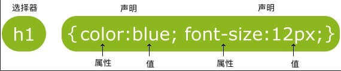
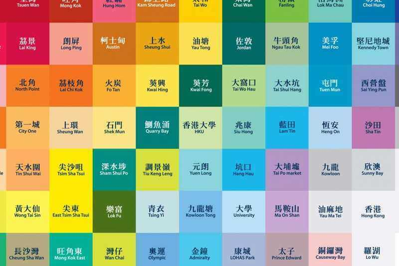

summary: 棋歌教学网 - CSS 简介
id: brief-css
categories: Web
tags: QiGe
status: Published
authors: QiGe
Feedback Link: mailto: gridwang@gmail.com

# CSS 简介

## 何为 CSS
Duration: 2

**CSS**是级联样式表（Cascading Style Sheets）的缩写。HTML 用于撰写页面的内容，而 CSS 将决定这些内容该如何在屏幕上呈现。

网页的内容是由 HTML的元素构建的，这些元素如何呈现，涉及许多方面，如整个页面的布局，元素的位置、距离、颜色、大小、是否显示、是否浮动、透明度等等。

Positive
: **提示：** 在 Internet 早期阶段（CSS大量使用之前），页面的内容和样式都由 HTML 来负责，这是一个相当糟糕的问题。

万维网联盟 W3C（World Wide Web Consortium）意识到这个问题，于1997年推出 CSS 1.0（当前最新的版本是 CSS3），正式推动了内容（HTML）和表现（CSS）的分离，人们开始可以把所有的布局和样式代码从 HTML 中移除放入到 CSS 中。

CSS 入门极其容易，但要完全掌握及合理的应用则比较困难。

下面我们就对 CSS 进行简要的学习。

## CSS 语法
Duration: 10

一条CSS样式规则由两个主要的部分构成：选择器，以`{}`包裹的一条或多条声明:



这条规则表明，页面中所有的一级标题都显示为蓝色，字体大小为12像数。
说明：

* 选择器是您需要改变样式的对象（上图的规则就一级标题生效）。
* 每条声明由一个属性和一个值组成。（无论是一条或多条声明，都需要用`{}`包裹，且声明用`;`分割）
* 属性（property）是您希望设置的样式属性（style attribute）。每个属性有一个值。属性和值被冒号分开。

再如下例所示：

```css
/* 这是CSS的注释 */
/* 建议每条申明占一行 */
p{
  color:red;
  text-align:center;  /* 文本居中 */
}
```

### 选择器

一个页面上的元素众多，选择器就用于在页面中找到/选择需要应用这个样式的对象。
除我们前示的元素选择器外，还有`id`和`class`选择器。其中`class`选择器使用非常普遍。

**id 选择器**

```css
/* 注意：id选择器前有 # 号。 */
#sky{
  color: blue;
}
```

这条规则表明，找到页面上`id`为`sky`的那个元素让它呈现蓝色，如下所示的页面，**蓝色的天空**这几个字就将会是蓝色的。

```html
<p id="sky">蓝色的天空</p>
<p id="forest">绿色的森林</p>
```

Positive
: **提示：** 你还记得HTML中，元素的id值必须唯一吗？ 所以，id 选择器适用范围只有一个元素。

**class 选择器**

```css
/* 注意：class选择器前有 . 号。 */
.center{
  text-align: center;
}
.large{
  font-size: 30px;
}
.red{
  color: red;
}
```

以上代码定义了三条规则，分别应用于页面上对应的元素，如只要页面上某元素的`class`为`red`，那么就让它呈现红色。
如下所示的页面：

```html
<p class="center">我会居中显示的</p>
<p class="red">我是红色的</p>
<p class="center large red">我又红又大还居中</p>
<p class="red">我也可以是红的</p>
```

Positive
: **提示：** 由上例可看出，元素的class值可以多个，也可以重复。因此，实际应用中，class 选择器应用非常普遍。

## CSS 如何生效
Duration: 8

上节我们学习了如何定义 CSS样式，那么如何让这些规则对页面生效？
我们一般有三种方法：外部样式表，内部样式表，内联样式

### 外部样式表

新建如下内容的一个 HTML文件（后缀为.html)：

```html
<!DOCTYPE html>
<html>
<head>
  <meta charset="utf-8">
  <!-- 注意下面这个语句，将导入外部的 mycss.css 样式表文件 -->
  <link rel="stylesheet" type="text/css" href="mycss.css">
  <title>页面标题</title>
</head>
<body>
  <h1>我是有样式的</h1>
  <hr>
  <p class="haha">还是有点丑：)</p>
</body>
</html>
```

在同一目录新建一个样式表文件mycss.css（注意后缀名为css）如下：

```css
body {
  background-color: linen;
  text-align: center;
}
h1 {
  color: red;
}
.haha {
  margin-top: 100px;
  color: chocolate;
  font-size: 50px;
}
```

在浏览器中打开这个 HTML 文件看看效果。

Positive
: **提示：** 一般我们会在项目目录下建一个文件夹如`css`专门存放样式表文件，如此我们引入样式文件时路径就变为 `./css/mycss.css`之类的。

Positive
: **提示：** 引入外部样式表是我们使用样式的主流方式，因为众多的样式规则单独放在一个文件中，与 HTML 内容分开，结构清晰。同时其它页面也可使用，达到复用的目的。

### 内部样式表

我们也可以将样式放在 HTML 文件中，这称为内部样式表。如：

```html
<!DOCTYPE html>
<html>
<head>
  <meta charset="utf-8">
  <!-- 注意下面这个语句，将导入外部的 mycss.css 样式表文件 -->
  <link rel="stylesheet" type="text/css" href="mycss.css">
  <title>页面标题</title>
  <style>
    body {
      background-color: linen;
      text-align: center;
    }
    h1 {
      color: red;
    }
    .haha {
      margin-top: 100px;
      color: chocolate;
      font-size: 50px;
    }
  </style>
</head>
<body>
  <h1>我是有样式的</h1>
  <hr>
  <p class="haha">还是有点丑：)</p>
</body>
</html>
```

该例子与上述例子一样的效果，但注意在`<head>`元素中引入了`<style>`标签，放入了样式。

Positive
: **提示：** 一般而言，只有页面的样式规则较少时可采用这种方式。

### 内联样式

所谓内联样式，就是直接把样式规则直接写到要应用的元素中，如：

```html
<h3 style="color:green;">I am a heading</h3>
```

Positive
: **提示：** 内联样式是最不灵活的一种方式，完全将内容和样式合在一起，实际应用中非常少见。

### 级联的优先级

前面我们学习了三种使用样式的方式，如果某元素如`<p>`在外部、内部及内联样式中都被设置`color:red;`、`color:green;`、`color:blue;`，那么到底是什么颜色，也即到底哪个有效呢？
这就涉及样式的优先级问题，从高到低分别是：

1. 内联样式
2. 内部样式表或外部样式表
3. 浏览器缺省样式

Positive
: **提示：** 其实，一句话可总结为哪个样式定义离元素的距离近，哪个就生效。

Negative
: **思考：** 上面优先级第2项有内部样式表和外部样式表两个，到底哪个优先？

## 颜色, 尺寸, 对齐
Duration: 6

### 颜色

颜色在网页中的重要性不言而喻。
我们可以采用颜色名称也可以使用颜色RGB16进制值，来设定前景或背景的颜色。如：

```html
<!-- 颜色名称 -->
<h3 style="background-color:Tomato;">Tomato</h3>
<h3 style="background-color:Orange;">Orange</h3>
<h3 style="background-color:DodgerBlue;">DodgerBlue</h3>
<h3 style="background-color:MediumSeaGreen;">MediumSeaGreen</h3>
<h3 style="background-color:Gray;">Gray</h3>
<h3 style="background-color:SlateBlue;">SlateBlue</h3>
<h3 style="background-color:Violet;">Violet</h3>
<h3 style="background-color:LightGray;">LightGray</h3>
<hr>
<!-- 颜色值，3个字节分别代表RGB（Red，Green，Blue）的0～255的值 -->
<h3 style="background-color:#ff0000;">#ff0000</h3>
<h3 style="background-color:#0000ff;">#0000ff</h3>
<h3 style="background-color:#3cb371;">#3cb371</h3>
<h3 style="background-color:#ee82ee;">#ee82ee</h3>
<h3 style="background-color:#ffa500;">#ffa500</h3>
<h3 style="background-color:#6a5acd;">#6a5acd</h3>
<!-- 文本颜色 -->
<h3 style="color:Tomato;">Hello World</h3>
<p style="color:DodgerBlue;">Lorem ipsum dolor sit, amet consectetur adipisicing elit.</p>
<p style="color:MediumSeaGreen;">Ad facilis est ducimus rem consectetur, corporis omnis, eveniet esse dolor molestiae numquam odio corrupti, sed obcaecati praesentium accusamus? Tempora, dolor a?</p>
```

Negative
: **注意：** 为演示方便，我们的样式采用了内联方式，实际中不能这样做！

一个网站，颜色是其重要的一个特征。如 facebook，twitter，taobao等等（我们学校的主色调是什么？）。甚至连香港地铁的各个站也使用了颜色来区分，如下图：



Positive
: 网页选用一种耐看、易用、符合心意的配色是不容易的，尤其在没有专业设计师时。幸好，即使没有美学基础，但有一些已经调配好的配色方案我们可以直接使用。去[ColorDrop](https://colordrop.io/) 或 [LOL Corlors](https://www.webdesignrankings.com/resources/lolcolors/) 挑选你网站的配色吧。

### 尺寸

我们可以用 `height` 和 `width` 设定元素内容占据的尺寸。常见的尺寸单位有：像数 `px`，百分比 `%`等。
新建如下 HTML 文件：

```html
<html>
  <head>
    <link rel="stylesheet" href="./mycss.css">
  </head>
  <body>
    <div class="example-1">
      这个元素高 200 pixels，占据全部宽度
    </div>
    <div class="example-2">
      这个元素宽200像素,高300像素
    </div>
  </body>
</html>
```

再建对应的 CSS 文件如下：

```css
.example-1 {
  width: 100%;
  height: 200px;
  background-color: powderblue;
  text-align: center;
}
.example-2 {
  height: 100px;
  width: 500px;
  background-color: rgb(73, 138, 60);
  text-align: right;
}
```

### 对齐

对于**元素中的文本**，我们可以简单的设置`text-align`属性为`left, center, right`即可（显然缺省的是左对齐），上例中已有相关的应用。
对于元素本身如何对齐，我们后面再学习。

## 盒子模型
Duration: 10

盒子模型指的是一个 HTML 元素可以看作一个盒子。从内到外，这个盒子是由**内容 content, 内边距 padding, 边框 border, 外边距 margin**构成的，如下图所示：


**说明：**

* Content 盒子的内容，如文本、图片等
* Padding 填充，也叫内边距，即内容和边框之间的区域
* Border  边框，默认不显示
* Margin  外边距，边框以外与其它元素的区域

新建如下 HTML 文件：

```html
<html>
  <head>
    <link rel="stylesheet" href="./mycss.css">
  </head>
  <body>
    <div class="box1">我是内容一，外面红色的是我的边框。注意边框的内外都有25px的距离。</div>
    <div class="box2">我是内容二，外面蓝色的是我的边框。注意与上面元素的外边距，发生了叠加，不是50px而是25px。</div>
  </body>
</html>
```

再建对应的 CSS 文件如下：

```css
.box1 {
  height: 200px;
  width: 200px;
  background-color:#615200;
  color: aliceblue;
  border: 10px solid red;
  padding: 25px;
  margin: 25px;
}
.box2 {
  height: 300px;
  width: 300px;
  background-color:#004d61;
  color: aliceblue;
  border: 10px solid blue;
  padding: 25px;
  margin: 25px;
}
```

打开浏览器看看效果。

Positive
: **提示：** 在页面上点击鼠标右键，选择**审查元素**，你可清楚看到如下图所示的布局。


留意上图，你会发现一个元素真正占据的宽度应该是：
左外边距 + 左边框宽度 + 左内边距 + 内容宽度 + 右内边距 + 右边框宽度 + 右外边距

因此，我们在用`width`属性设置元素的宽度时，实际上只设置了其内容的宽度。

Negative
: **思考：** 请想想高度该如何计算？

## 边框与边距
Duration: 6

Positive
: **提示：** 无论边框、内边距还是外边距，它们都有上下左右四个方向。

### 边框

试一试如下的代码：

```html
<p class="example-1">I have black borders on all sides.</p>
<p class="example-2">I have a blue bottom border.</p>
<p class="example-3">I have rounded grey borders.</p>
<p class="example-4">I have a purple left border.</p>
```

```css
.example-1 {
  border: 1px dotted black; /* 上下左右都相同 */
}
.example-2 {
  border-bottom: 1px solid blue; /* 只设置底部边框 */
}
.example-3 {
  border: 1px solid grey;
  border-radius: 15px; /* 边框圆角 */
}
.example-4 {
  border-left: 5px solid purple;
}
```

### 边距

下面样式说明了内边距的设置：

```css
padding: 20px; /* 上下左右都相同 */
padding-top: 20px;
padding-bottom: 100px;
padding-right: 50px;
padding-left: 80px;
padding: 25px 50px 75px 100px; /* 简写形式，按上，右，下，左顺序设置 */
padding: 25px 10px; /* 简写形式，上下为25px，左右为10px */
```

外边距与此类似。

Positive
: **提示：** 请留意简写时的顺序为上，右，下，左，或记为顺时针方向。

## 定位
Duration: 9

`position`属性用于对元素进行定位。该属性有以下一些值：

* static    静态
* relative  相对
* fixed     固定
* absolute  绝对

设置了元素的`position`属性后，我们才能使用`top, bottom, left, right`属性，否则定位无效。

### static

设置为静态定位`position: static;`，这是元素的默认定位方式，也即你设置与否，元素都将按正常的页面布局进行。
即：按照元素在 HTML出现的先后顺序从上到下，从左到右进行元素的安排。

### relative

设置为相对定位`position: relative;`，这将把元素相对于他的静态（正常）位置进行偏移
试试如下的代码：

```html
<!-- HTML -->
<div class="example-relative">我偏移了正常显示的位置。去掉我的样式对比看看？</div>
<!-- CSS -->
.example-relative {
  position: relative;
  left: 60px;
  top: 40px;
  background-color: rgb(173, 241, 241);
}
```

### fixed

设置为固定定位`position: fixed;`，这将使得元素固定不动（即使你上下左右拖动浏览器的滚动条）。
此时元素固定的位置仍由`top, bottom, left, right`属性确定，但相对的是视口（viewport，就是浏览器的屏幕可见区域）
如下的代码将会在浏览器右下角固定放置一个按钮元素：

```html
<!-- HTML -->
<div class="broad">占位区域。请将浏览器窗口改变大小，看看右下角的按钮发生了什么？</div>
<div class="example-fixed">这个按钮是固定的</div>
<!-- CSS -->
.example-fixed {
  position: fixed;
  bottom: 40px;
  right: 10px;
  padding: 6px 24px;
  border-radius: 4px;
  color: #fff;
  background-color: #9d0f0f;
  cursor: pointer;
  box-shadow: 0 3px 3px 0 rgba(0,0,0,0.3), 0 1px 5px 0 rgba(0,0,0,0.12), 0 3px 1px -2px rgba(0,0,0,0.2);
}
.broad {
  height: 5000px;
  width: 5000px;
  padding: 20px;
  background-color: darkkhaki;
}
```

### absolute

设置为绝对定位`position: absolute;`，将使元素相对于其**最近设置了定位属性（非static）的父元素**进行偏移。
如果该元素的所有父元素都没有设置定位属性，那么就相对于`<body>`这个父元素。

negative
: **注意：** 绝对定位此处可能有些混淆，请留意其是仍是相对的，不过是相对**最近的父元素**

试试如下的代码：

```html
<!-- HTML -->
<div class="example-relative">这是父元素，有 relative 定位属性
  <div class="example-absolute">
    这是子元素，有 absolute 定位属性
  </div>
</div>
<!-- CSS -->
.example-relative {
  position: relative;
  width: 400px;
  height: 200px;
  border: 3px solid rgb(87, 33, 173);
}
.example-absolute {
  position: absolute;
  top: 80px;
  right: 5px;
  width: 200px;
  height: 100px;
  border: 3px solid rgb(218, 73, 16);
}
```

## 溢出
Duration: 3

当元素内容超过其指定的区域时，我们通过溢出`overflow`属性来处理这些溢出的部分。
溢出属性有一下几个值：

* visible 默认值，溢出部分不被裁剪，在区域外面显示
* hidden  裁剪溢出部分且不可见
* scroll  裁剪溢出部分，但提供上下和左右滚动条供显示
* auto    裁剪溢出部分，视情况提供滚动条

以上内容较好理解，请自行进行验证。
关于滚动，我们还可以单独对上下或左右方向进行，如下代码所示：

```html
<!-- HTML -->
<div class="example-overflow-scroll-y">You can use the overflow property when you want to have better control of the
    layout. The overflow property specifies what happens if content overflows an element's box.
</div>
<!-- CSS -->
.example-overflow-scroll-y {
  width: 200px;
  height: 100px;
  background-color: #eee;
  overflow-y: scroll;
}
```

## 浮动
Duration: 6

在一个区域或容器内，我们可以设置`float`属性让某元素水平方向上向左或右进行移动，其周围的元素也会重新排列。
我们常用这种样式来使图像和文本进行合理布局，如我们希望有以下的效果：


让图片向右浮动即可，代码如下：

```html
<html>
<head>
  <style>
    .example-float-right {
      float: right;
    }
  </style>
</head>
<body>
  
  <p>Lorem ipsum dolor sit amet consectetur, adipisicing elit. Quidem, architecto officiis, repellendus
  corporis obcaecati, et commodi quam vitae vel laudantium omnis incidunt repellat qui eveniet fugiat totam
  modi nam vero!</p>
</body>
</html>
```

一个浮动元素会尽量向左或向右移动，直到它的外边缘碰到包含框或另一个浮动框的边框为止。
浮动元素之后的元素将围绕它。

Negative
: **试一试：** 有如下4张图片，如果没加样式的话，这几张图片将会从上到下依次显示。考虑使用左浮动，让它们水平依次显示。


一个元素浮动后，其后的元素将尽可能包围它，或者说出现在这个浮动元素的左或右方。
如果希望浮动元素后面的元素在其下方显示，可使用`clear: both`样式来进行清除。

## 不透明度
Duration: 4

我们可以用`opacity`对任何元素（不过常用于图片）设置不透明度。
值在`[0.0～1.0]`之间，值越低，透明度越高，如下图所示：


试试如下代码：

```html
<html>
<head>
  <style>
    img {
      width: 25%;
      border-radius: 10px;
      float: left;
      margin: 10px;
    }
    .opacity-2 {
      opacity: 0.2;
    }
    .opacity-5 {
      opacity: 0.5;
    }
    .opacity-10 {
      opacity: 1;
    }
  </style>
</head>
<body>
  
  
  
</body>
</html>
```

## 组合选择器
Duration: 4

前面我们学习了 CSS有三种选择器：元素、id 和 class 。但我们也可以进行组合，以得到简洁精确的选择。
下面我们介绍两种组合选择器。

### 后代选择器

以空格作为分隔，如：`.haha p` 代表在`div`元素内有`.haha`这种类的所有元素。
参见如下代码：

```html
<html>
<head>
  <style>
    .haha p {
      background-color: yellow;
    }
  </style>
</head>
<body>
  <div class="haha">
    <p>Paragraph 1 in the div .haha.</p>
    <p>Paragraph 2 in the div .haha>.</p>
    <span>
        <p>Paragraph 3 in the div .haha.</p>
    </span>
  </div>
  <p>Paragraph 4. Not in a div .haha.</p>
  <p>Paragraph 5. Not in a div .haha.</p>
</body>
</html>
```

段落1、2、3都将有黄色的背景，而段落4、5没有。

### 子选择器

也称为直接后代选择器，以`>`作为分隔，如：`.haha > p` 代表在有`.haha`类的元素内的直接`<p>`元素。
参见如下代码：

```html
<html>
<head>
  <style>
    .haha > p {
      background-color: yellow;
    }
  </style>
</head>
<body>
  <div class="haha">
    <p>Paragraph 1 in the div .haha.</p>
    <p>Paragraph 2 in the div .haha.</p>
    <span>
        <p>Paragraph 3 in the div .haha - it is descendant but not immediate child.</p>
    </span> <!-- not Child but Descendant -->
  </div>
  <p>Paragraph 4. Not in a div .haha.</p>
  <p>Paragraph 5. Not in a div .haha.</p>
</body>
</html>
```

虽然段落3在`.haha`类中，但它的直接父元素是`span`，不是`.haha`的直接后代，所以不能选择。只有段落1、2有黄色背景。

Positive
: ✎ 试一试： 如果两个选择器用`,`分隔会是什么意思

## 伪类和伪元素
Duration: 6

伪类（pseudo-class）或伪元素（pseudo-element）用于定义元素的某种特定的状态或位置等。
比如我们可能有这样的需求：

* 鼠标移到某元素上变换背景颜色
* 超链接访问前后访问后样式不同
* 离开必须填写的输入框时出现红色的外框进行警示
* 保证段落的第一行加粗，其它正常
* ...

使用伪类/伪元素的语法如下：

```css
/* 选择器后使用 : 号，再跟上某个伪类/伪元素 */
selector:pseudo-class/pseudo-element {
  property:value;
}
```

以下是常用的伪类/伪元素的简单使用：

```css
a:link {color:#FF0000;}     /* 未访问的链接 */
a:visited {color:#00FF00;}  /* 已访问的链接 */
a:hover {color:#FF00FF;}    /* 鼠标划过链接 */
/* 鼠标移到段落则改变背景颜色 */
p:hover {background-color: rgb(226, 43, 144);}
p:first-line{color:blue;}   /* 段落的第一行显示蓝色 */
p:first-letter{font-size: xx-large;}   /* 段落的第一个字超大 */

h1:before { content:url(smiley.gif); } /* 在每个一级标题前插入该图片 */
h1:after { content:url(smiley.gif); } /* 在每个一级标题后插入该图片 */
```

## 作业
Duration: 2

至此，我们对 CSS 有了基本的了解和掌握。下面我们进行一些小测验（来自菜鸟教程）：

Negative
: **测验：** [测验一](https://c.runoob.com/quiz/5596), [测验二](https://c.runoob.com/quiz/5597), [测验三](https://c.runoob.com/quiz/5598), [测验四](https://c.runoob.com/quiz/5599), [测验五](https://c.runoob.com/quiz/5600),

Negative
: **作业：** 请对自己学习和掌握的 CSS 知识进行一个总结。

Positive
: **提示：** 可考虑采用简单易用的**markdown**格式来撰写文档而不是**Word**.

你可能觉得 CSS也不过如此。的确，入门容易，用好困难。
下面推荐两本免费但质量上乘的书供你继续：[CSS权威指南](http://gdut_yy.gitee.io/doc-csstdg4/)，[CSS In Depth](http://file.allitebooks.com/20180423/CSS%20in%20Depth.pdf)

现在，请回到[棋歌教学网](https://qige.io/web/web.html)进一步学习。
