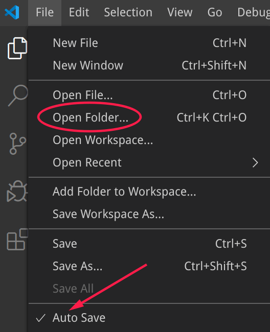
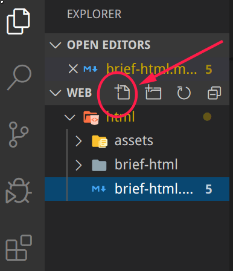
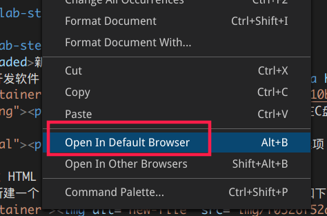
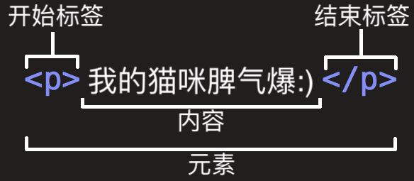

summary: 棋歌教学网 - HTML 简介
id: brief-html
categories: Web
tags: QiGe
status: Published
authors: QiGe
Feedback Link: mailto: gridwang@gmail.com

# HTML简介

## 何为HTML
Duration: 5

**HTML**是超文本标记语言（HyperText Markup Language）的缩写。我们用 HTML 来构建 Web 页面即所谓的网页。

Positive
: “超文本”（hypertext）是指连接单个网站内或多个网站间的网页的链接。链接是网络的一个基本方面。只要将内容上传到互联网，并将其与他人创建的页面相链接，你就成为了万维网的积极参与者。

**HTML** 是构成 Web 世界的一砖一瓦。它定义了网页内容的含义和结构。除 HTML 以外的其它技术则通常用来描述一个网页的表现与展示效果（如 CSS），或功能与行为（如 JavaScript）。

**HTML** 不是一门编程语言，而是一种用于**定义内容结构的标记语言**。

在浏览器中看到的任何网页背后都是一个 **HTML** 文档，只要在网页上点击鼠标右键->查看源代码（用控制台工具也可）就可看到。

Positive
: **HTML**以及我们后面将要学习的 **CSS**（Cascading Style Sheets 级联式样式表) 和 **JavaScript** 是构建广泛使用的Web程序的三剑客。

下面我们就开始学习如何撰写 HTML 文档。

## HTML文档结构
Duration: 5

### 新建工作目录

前面我们已经安装了开发软件 **code** 及其相关的插件（[code下载](https://aka.ms/win32-x64-user-stable)）。运行该软件，打开/新建一个文件夹，如下图所示：



Negative
: **注意：** 该文件夹是我们的工作目录，一般不建在C盘

Positive
: **提示:** 请把上图底部的选项 **Auto Save** 选中，这样系统会自动保存我们的代码

### 新建 HTML 文件

接下来在该文件夹下新建一个 **后缀名为html** 的文件，如下图所示：



在该文件中输入如下内容：

```html
<!DOCTYPE html>
<html>
<head>
  <meta charset="utf-8">
  <link rel="shortcut icon" href="favicon.ico" type="image/x-icon">
  <title>页面标题</title>
</head>
<body>
  <h1>我的第一个Web页</h1>
  <p>当前有点丑：)</p>
</body>
</html>
```

### 看看结果

Web 浏览器如 Chrome、 Firefox、Edge、Safari 等用来读取 HTML 文件并呈现出来。（**再次推荐使用 Chrome 或 Firefox**）

在开发工具 code 中我们已经安装了`open in browser`插件，因此在 code 的**编辑区点击鼠标右键**即可看到快捷方式将该文件在浏览器中打开。如下图所示：



Negative
: **思考：** 假设上述方式没能成功在浏览器打开，我们还有什么方法看到结果？

## HTML 文档结构分析
Duration: 5

### HTML元素（elements）

HTML 使用“标记”（markup）来注明文本、图片和其他内容，以便于在浏览器中显示。HTML 标记包含一些规定的“元素”如 `<head>，<title>，<body>，<header>，<footer>，<article>，<section>，<p>，<div>，<span>，，<aside>，<audio>，<canvas>，<datalist>，<details>，<embed>，<nav>，<output>，<progress>，<video>` 等等。

检查我们刚创建的 HTML 文档你会发现，整个 HTML 就由一个个元素组成（可以嵌套），而元素则一般由一对标签（tag）构成。

### 剖析一个 HTML 元素

如下所示的一个用于展示段落的元素：



1. 开始标签（Opening tag）：包含元素的名称（本例为 p），被左、右角括号所包围。表示元素从这里开始或者开始起作用 —— 在本例中即段落由此开始。
2. 结束标签（Closing tag）：与开始标签相似，只是其在元素名之前包含了一个斜杠。这表示着元素的结尾 —— 在本例中即段落在此结束。初学者常常会犯忘记包含结束标签的错误，这可能会产生一些奇怪的结果。
3. 内容（Content）：元素的内容，本例中就是所输入的文本本身。
4. 元素（Element）：开始标签、结束标签与内容相结合，便是一个完整的元素。

### 剖析 HTML 文档

对于我们前面创建的 HTML 文档，分析如下：

1. `<!DOCTYPE html>`: 声明文档类型。出于历史原因需要，现在可有可无。
5. `<html></html>`: `<html>`元素。这个元素包裹了整个完整的页面，是一个根元素，**其它元素都嵌套到其中**。
6. `<head></head>`: `<head>`元素。 这个元素是一个容器，它包含了所有你想包含在HTML页面中但不想在HTML页面中显示的内容。这些内容包括你想在搜索结果中出现的关键字和页面描述，CSS样式，字符集声明等等。
7. `<meta charset="utf-8">`: 这个元素设置文档使用utf-8字符集编码，utf-8字符集包含了人类大部分的文字。基本上他能识别你放上去的所有文本内容。毫无疑问要使用它，并且它能在以后避免很多其他问题。
8. `<link rel="shortcut icon" href="favicon.ico" type="image/x-icon">`: 指定页面的图标，出现在浏览器标签上。(试一试：你可随意下载一个`.ico`图标文件到工作目录中)
9. `<title></title>`: 设置页面标题，出现在浏览器标签上，当你标记/收藏页面时它可用来描述页面。
10. `<body></body>`: `<body>`元素。 包含你能在页面看到的所有内容，包括文本，图片，音频，游戏等等。

## HTML 文档相关说明
Duration: 10

### 注释

如同大部分的编程语言一样，在 HTML 中有一种可用的机制来在代码中书写注释 。

注释是被浏览器忽略的，而且是对用户不可见的，它们的目的是允许你描述你的代码是如何工作的和不同部分的代码做了什么等等。 如果你在半年后重新返回你的代码库，而且不能记起你所做的事情，或者当你处理别人的代码的时候， 那么注释是很有用的.

为了将一段 HTML 中的内容置为注释，你需要将其用特殊的记号`<!--`和`-->`包括起来， 比如：

```html
<p>我在注释外，可以显示！</p>
<!-- <p>我在注释内！浏览器将忽略我</p> -->
```

Positive
: **提示：** 在 code 软件中，输入`Ctrl + /`即可快捷的进行注释！

Positive
: **注意：** HTML 不区分标签的大小写，但建议全部使用小写！

### 空元素

一般来说，元素都拥有**开始标签，内容，结束标签**。但有一些元素只有一个开始标签，通常用来在此元素所在位置插入/嵌入一些东西，如`<br>, <hr>, <input>, , <a>`等等。我们称其为空元素，如下：

```html
<!-- 换行 -->
<p>我可以<br>换行</p> 
<!-- 水平分割线 -->
<hr>
<!-- 输入框 -->
<input>
```

Positive
: **提示:** 在上面代码中你看到`<br>`元素放到`<p>`元素之中——这被称作嵌套！

### 元素的属性

元素是可以有相关属性的。属性包含元素的额外信息，这些信息不会在浏览器中显示出来。

```html
<!-- 带属性的段落输入框 -->
<p title="这是个title属性">鼠标移上来试试！</p>
<!-- 带属性的输入框 -->
<input type="text">
<input type="password">
```

一个属性必须包含如下内容：

1. 一个空格，在属性和元素名称之间。(如果已经有一个或多个属性，就与前一个属性之间有一个空格。)
2. 属性名称，后面跟着一个 = 号。
3. 一个属性值，由一对引号 "" 引起来。

## 标题（heading）
Duration: 3

HTML 提供了从大到小6级标题，分别是：`<h1> ~ <h6>`，如下所示：

```html
<h1>This is heading 1</h1>
<p>This is some text.</p>
<hr>
<h2>This is heading 2</h2>
<p>This is some other text.</p>
<hr>
```
在页面中，标题非常重要：

1. 搜索引擎用标题来索引页面的内容
2. 用户也习惯以标题进行主要内容浏览，以决定是否查看该页面

Positive
: **提示：** 一级标题`<h1>`最醒目，应该用于页面的主标题，其次为二级标题，以此类推

Negative
: **注意：** 不要因为希望醒目，试图使用标题对正文的文字进行放大或加粗。正文文字的醒目可以使用文本格式或 CSS 进行。

## 文本格式
Duration: 5

Negative
: **注意：** 除本节介绍的这些标签可用于文本的格式外，其它标签都不建议用来进行格式的设置，如：`<font><big><center>`等标签皆为不推荐使用的。HTML 是用来表现页面内容而不是对页面进行修饰的，专门的页面美化需要使用后面将要学习的 CSS 。

我们需要知道的文本格式标签如下：

```html
<p>You can use the mark tag to <mark>highlight</mark> text.</p>
<p><del>This line of text is meant to be treated as deleted text.</del></p>
<p><s>This line of text is meant to be treated as no longer accurate.</s></p>
<p><ins>This line of text is meant to be treated as an addition to the document.</ins></p>
<p><u>This line of text will render as underlined</u></p>
<p><small>This line of text is meant to be treated as fine print.</small></p>
<p><strong>This line rendered as bold text.</strong></p>
<p><em>This line rendered as italicized text.</em></p>
```

## 超链接 a
Duration: 5

没有超链接就没有万维网（World Wide Web）。基本上，我们可以把任何东西加上超链接，不过常用的是文本、图片等。

### 超链接语法

```html
<a href="https://www.baidu.com/" target="_blank">百度一下</a>
```

说明：

1. `href`即为要跳转去的地址 URL（Uniform Resorce Locator)
2. `target`属性为`_blank`表示在新的页面打开超链接（默认是在当前页面打开即`_self`）
3. 超链接标签包含的内容（当前为文字“百度一下”）即为显示在页面上供用户点击的

### 锚点

锚点，也称为书签，用于标记页面的某个元素或位置。通过锚点，我们可以轻易的在长页面内实现跳转。

先使用`id`属性生成某元素的锚点，然后再使用超链接指向该锚点即可。

```html
<!-- 文档其余部分 -->
<h2 id="C4">第四章 论零号病人的重要性</h2>
<!-- 文档其余部分 -->
<a href="#C4">跳到第四章</a>
<!-- 文档其余部分 -->
...
```

Positive
: **注意：**
 1. 元素的`id`值必须是唯一的，也即页面不能再有其它元素的`id`值为`C4`
 2. 超链接中的地址需要有`#`符号

Negative
: **思考：** 经常在某些网站上看到一个浮动图标显示“回到页首”，它是如何实现的？

## 图片及文件路径 img
Duration: 8

### 图片

在页面插入一张图片如下：

```html

```

说明：

1. `src`属性为要显示图片文件的位置 URL，即图片文件的路径
2. `alt`属性当获取图片出现问题时显示的文字（占位符）
3. 可为图片指定高宽度，但不建议（可能导致图片变形）

Positive
: **提示：** 对于小尺寸的图片，现在可采用 **base64** 编码进行，可提高页面加载速度，提升用户体验。[可前往一试](https://c.runoob.com/front-end/59)。

### 文件路径

为获取图片文件，我们需要指定该文件位于何处，这称为文件路径。文件路径有相对路径和绝对路径两种。

上面图片的例子即为绝对路径。下面是相对路径的例子：

Column A | Column B
---------|----------
例子 | 解释
 ``          | 该图片文件与当前文档在同一目录中
 `` | 该图片文件在当前目录下的`images`目录中
 ``       | 该图片文件在上一级目录中

Negative
: **思考：** 上表中，`.`表示当前目录，`..`表示上一级目录，那么`../../imgs`是什么意思？

Negative
: **思考：** 如何用图片做成一个超链接？

Positive
: **提示：** 图片的存储大小对网页的加载有重要的影响，从而影响用户体验。因此，在不明显改变图片质量的情况下压缩图片是提高 Web站点速度的重要手段。请前往[WebsitePlanet](https://www.websiteplanet.com/zh-hans/webtools/imagecompressor/) 以及 [TinyPNG](https://tinify.cn/) 试试！

## 表格 Table
Duration: 3

有时，页面的内容需要用表格来进行呈现。我们使用`<table>`等标签即可：

```html
  <table>
    <tr>
      <th>Firstname</th>
      <th>Lastname</th>
      <th>Age</th>
    </tr>
    <tr>
      <td>Jill</td>
      <td>Smith</td>
      <td>50</td>
    </tr>
    <tr>
      <td>Eve</td>
      <td>Jackson</td>
      <td>94</td>
    </tr>
  </table>
```

代码中，`<tr>`表示行, `<td>`表示行中的单元, `<th>`是表头的单元（将会加粗显示）

Positive
: **说明：** 当前这个表格比较丑陋，有关表格的美化我们在 CSS 部分学习。

## 列表 List
Duration: 5

我们也可以使用列表来呈现内容，分为无序列表和有序列表。

### 无序列表

```html
<ul>
  <li>Coffee</li>
  <li>Tea</li>
  <li>Milk</li>
</ul>
```

无序列表使用`<ul>`标签，默认使用**实心圆点**作为每项的标志，其它的标志可以是空心圆`circle`，实心方块`square`以及不出现标志。

```html
<ul type="square">
  <li>Coffee</li>
  <li>Tea</li>
  <li>Milk</li>
</ul>
```

### 有序列表

```html
<ol>
  <li>Coffee</li>
  <li>Tea</li>
  <li>Milk</li>
</ol>
```

有序列表使用`<ol>`标签，默认使用**数字**作为每项的标志，其它的标志可以是大写字母`A`，小写字母`a`，罗马字母`i`等。

```html
<ol type="a">
  <li>Coffee</li>
  <li>Tea</li>
  <li>Milk</li>
</ol>
```

## 表单 Form
Duration: 10

当网站需要获取我们的一些信息如：用户名、密码、选择买什么、买多少、提出意见等等时，我们就需要使用表单（form）来让用户填写或选择。

请输入如下代码进行学习：

```html
<form>
  <!-- 文本框，注意有 placeholder 提示符 -->
  用户名：<br>
  <input type="text" name="name" placeholder="请输入用户名"><br>
  <!-- 密码框 -->
  密码：<br>
  <input type="password" name="ps" placeholder="请输入密码"><br>
  年龄：<br>
  <!-- 数字输入框，注意 min 和 value 属性-->
  <input type="number" name="age" min="18" value="18"><br>
  <!-- 单选按钮, 注意 checked 属性 -->
  性别：<br>
  <input type="radio" name="gender" value="male" checked> 男<br>
  <input type="radio" name="gender" value="female"> 女<br>
  <input type="radio" name="gender" value="other"> 其它<br>
  <!-- 下拉列表，注意 selected 属性 -->
  党派：<br>
  <select name="party">
    <option value="D">民主党</option>
    <option value="R" selected>共和党</option>
    <option value="N">无党派</option>
  </select><br>
  <!-- 多选框 -->
  您有哪些交通工具：<br>
  <input type="checkbox" name="vehicle1" value="Bike"> 自行车<br>
  <input type="checkbox" name="vehicle2" value="Motocycle" checked> 摩托车<br>
  <input type="checkbox" name="vehicle3" value="Car"> 轿车<br>
  <input type="checkbox" name="vehicle4" value="Jet"> 飞机<br>
  <!-- 日期选择器 -->
  您的工作日期：<br>
  <input type="date"><br>
  <!-- 文件选择器 -->
  上传您的照片:<br>
  <input type="file" name="photo"><br>
  <!-- 文本输入区域，注意 rows 和 cols 属性 -->
  您的建议：<br>
  <textarea name="message" rows="5" cols="30">
    The cat was playing in the garden.
  </textarea><br><hr>
  <!-- 表单提交/重置按钮，将表单中的数据取消或传输给服务器端进行处理 -->
  <input type="submit" value="提 交">
  <input type="reset" value="重 置">
</form>
```
Positive
: **提示：** 当提交时，表单中没有`name`属性的元素将不会提交，比如上面工作日期的选择器。有`name`属性的元素其`value`的值将提交给服务器。

## 其它
Duration: 5

HTML 的元素可以以称为**区块** 或 **内联**的方式进行显示。

### 区块元素

区块元素在浏览器显示时，通常会以**新行**来开始（和结束）。如：` <h1>, <pre>, <ul>, <table>，<div>` 等。

```html
<h2>区块元素</h2>
<div>Hello</div>
<div>World</div>
<p>单独一行</p>
```

### 内联元素

内联元素相反，他们总是一个接一个进行显示，不会新起一行。如： `<span>, <input>, <td>, <a>, `等。

```html
<h3>下面的元素将在一行中显示</h3>
<span>姓名：</span>
<input name="username">
<span>哈哈哈</span>
<a href="https://google.com/">Google</a>

```

### 预设格式

如果你想在网页中展示一首诗或一些特别格式的文本，那么请使用`pre`标签。

```html
<!-- pre标签中的内容将保持格式不变 -->
<pre>
              我如果爱你——
              绝不象攀援的凌霄花，
              借你的高枝炫耀自己；

              我如果爱你——
              绝不学痴情的鸟儿，
              为绿荫重复单调的歌曲；

              也不止像泉源，
              常年送来清凉的慰藉；

              也不止像险峰，
              增加你的高度，衬托你的威仪。

              甚至日光。
              甚至春雨。

              不，这些都还不够！
              我必须是你近旁的一株木棉，
              作为树的形象和你站在一起。

              根，紧握在地下，
              叶，相触在云里。

              每一阵风过，
              我们都互相致意，
              但没有人，
              听懂我们的言语。

              你有你的铜枝铁干，
              像刀，像剑，
              也像戟；

              我有我红硕的花朵，
              像沉重的叹息，
              又像英勇的火炬。

              我们分担寒潮、风雷、霹雳；
              我们共享雾霭、流岚、虹霓。
              仿佛永远分离，
              却又终身相依。

              这才是伟大的爱情，
              坚贞就在这里：
              爱——
              不仅爱你伟岸的身躯，
              也爱你坚持的位置，足下的土地。
</pre>
```

### 特殊字符

考虑下面的代码将显示成什么？

```html
<p>有多          远，滚                         多远！</p>
```

或者你希望在页面显示一段 HTML 的源代码，你打算用标签`<pre>`:

```html
<pre>
  <h1>这是个一级标题</h1>
  <p>这是一个段落<p>
  <a href="https://twitter.com/">眼见何事，情系何处，身处何方，心思何人</a>
<pre>
```

以上代码将得不到你想要的结果。
原因是：在 HTML 中，某些字符是预留的。
在 HTML 中不能使用小于号（<）和大于号（>），这是因为浏览器会误认为它们是标签。
如果希望正确地显示预留字符，我们必须在 HTML 源代码中使用字符实体（character entities）

```html
<p>有多&nbsp;&nbsp;&nbsp;远，滚&nbsp;&nbsp;&nbsp;&nbsp;&nbsp;&nbsp;&nbsp;多远！</p>
<hr>
<h2>test.html</h2>
<pre>
  &lt;h1&gt;这是个一级标题&lt;/h1&gt;
  &lt;p&gt;这是一个段落&lt;p&gt;
  &lt;a href="https://twitter.com/"&gt;眼见何事，情系何处，身处何方，心思何人&lt;/a&gt;
<pre>
```

特殊字符可参考[ISO-8859-1 字符实体手册](https://www.runoob.com/tags/ref-entities.html)

## 作业
Duration: 2

至此，我们对HTML有了基本的掌握。下面我们进行一些小测验（来自菜鸟教程）：

Negative
: **测验：** [测验一](https://c.runoob.com/quiz/5583), [测验二](https://c.runoob.com/quiz/5584), [测验三](https://c.runoob.com/quiz/5585), [测验四](https://c.runoob.com/quiz/5586), [测验五](https://c.runoob.com/quiz/5587),

Negative
: **作业：** 请对自己学习和掌握的 HTML 知识进行一个总结。

Positive
: **提示：** 可考虑采用简单易用的**markdown**格式来撰写文档而不是**Word**.

现在，请回到[棋歌教学网](https://qige.io/web/web.html)进一步学习。
