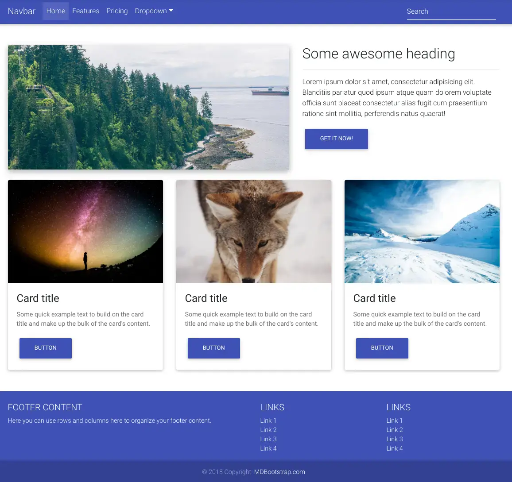
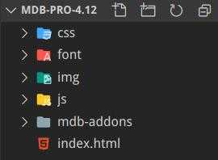
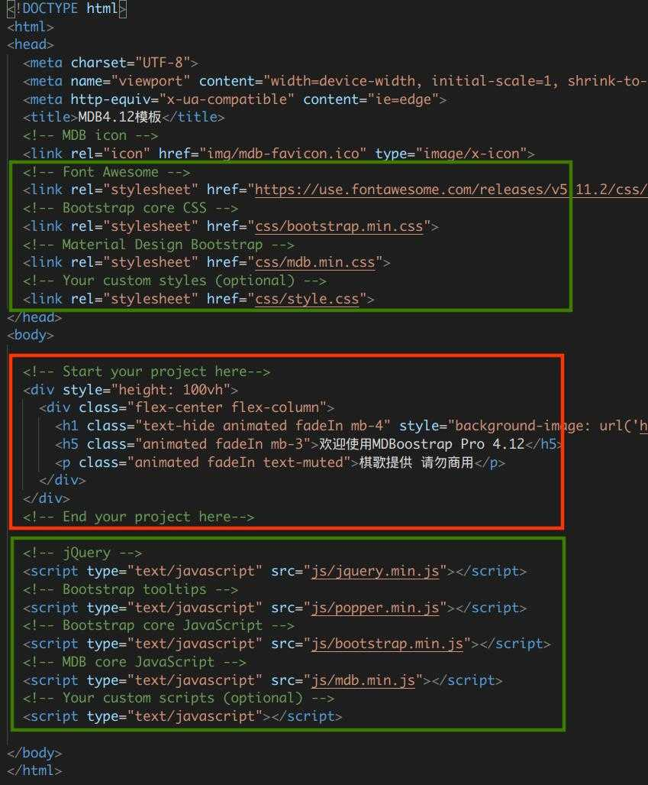

summary: 棋歌教学网 - MDB教程一
id: mdb-tutorial-1
categories: Web
tags: QiGe
status: Published
authors: QiGe
Feedback Link: mailto: gridwang@gmail.com

# 棋歌教学网 - MDB教程一

## 概述
Duration: 1

本教程将使用 MDB 构建一个简单的公司首页。我们将学习以下 MDB 常用的一些组件。

### What You’ll Learn 
- 如何使用MDB种子项目
- 基本的页面结构
- 栅格布局
- 导航条
- 特效图片
- 卡片
- 间距

构建完毕后的[最后效果](https://mdbootstrap.com/snippets/jquery/ascensus/11?action=fullscreen)如下图：



## 页面结构
Duration: 5

### MDB 模板

解压你下载的 MDB Pro 模板文件到某文件夹， code 中打开该文件夹（这是我们的工作目录），网站文件的基本结构如下图：



Positive
: **提示：** 文件夹中目录的名称也表明了其作用。我们的网站文件结构大致如此。一个网站至少有一个文件为`index.html`作为首页。

### 页面基本结构

在 code 中打开 `index.html`文件你可看到常见的 HTML 文档结构如下：



Negative
: **注意：** 上图中绿色框内是 MDB 需要的 CSS 和 JS 文件，我们不要变动它。我们需要做的就是在红色框内进行编写（看见 start/end  your project here 那个注释了吗）。

现在将红色框中的内容替换为如下代码：

```html
<!-- start your project here -->
<!--Main Navigation-->
<header>

</header>
<!--Main Navigation-->

<!--Main layout-->
<main>

</main>
<!--Main layout-->

<!--Footer-->
<footer>

</footer>
<!--Footer-->
<!-- end your project here -->
```

我们要构建的公司首页分为三个部分：

1. `header`元素放置导航
2. `main`元素是页面主要内容
3. `footer`元素是一些版权和其它链接

当然，现在浏览器中是看不到任何内容的.
至此，页面基本结构搭建完毕, 下面我们开始构建导航。

## 页面导航条 navbar
Duration: 5

将`<header>`元素替换为如下代码：

```html
<!--Main Navigation-->
<header>
  <!--Navbar-->
  <nav class="navbar navbar-expand-lg navbar-dark primary-color">
    <!-- Navbar brand -->
    <a class="navbar-brand" href="#">Navbar</a>
    <!-- Collapse button -->
    <button class="navbar-toggler" type="button" data-toggle="collapse" data-target="#basicExampleNav"
      aria-controls="basicExampleNav" aria-expanded="false" aria-label="Toggle navigation">
      <span class="navbar-toggler-icon"></span>
    </button>
    <!-- Collapsible content -->
    <div class="collapse navbar-collapse" id="basicExampleNav">
      <!-- Links -->
      <ul class="navbar-nav mr-auto">
        <li class="nav-item active">
          <a class="nav-link" href="#">Home
            <span class="sr-only">(current)</span>
          </a>
        </li>
        <li class="nav-item">
          <a class="nav-link" href="#">Features</a>
        </li>
        <li class="nav-item">
          <a class="nav-link" href="#">Pricing</a>
        </li>
        <!-- Dropdown -->
        <li class="nav-item dropdown">
          <a class="nav-link dropdown-toggle" id="navbarDropdownMenuLink" data-toggle="dropdown" aria-haspopup="true"
            aria-expanded="false">Dropdown</a>
          <div class="dropdown-menu dropdown-primary" aria-labelledby="navbarDropdownMenuLink">
            <a class="dropdown-item" href="#">Action</a>
            <a class="dropdown-item" href="#">Another action</a>
            <a class="dropdown-item" href="#">Something else here</a>
          </div>
        </li>
      </ul>
      <!-- Links -->
      <form class="form-inline">
        <div class="md-form my-0">
          <input class="form-control mr-sm-2" type="text" placeholder="Search" aria-label="Search">
        </div>
      </form>
    </div>
    <!-- Collapsible content -->
  </nav>
  <!--/.Navbar-->
</header>
```

保存文件(如果你设置了 Code 软件的自动保存就不需要了，所以推荐），在浏览器中打开／刷新`index.html`文件, 现在你应该可以看到一个天蓝色的导航条出现.

### 导航条结构

仔细观察导航条代码, 你会看到我们使用了一个`<nav>`标签, 其内部实际包含了三个部分:

* `<a>` 超链接, 用于展示公司名称或logo
* `<button>` 按钮, 当在小尺寸屏幕时会出现(你可能在浏览器中并没看到该按钮, 后面进一步解释)
* `<div>  区块, 用于放置各个导航超链接

下面我们分析一下`<nav>`标签的 CSS 样式类. 详细的**Navbar**介绍, 请访问 [MDB-Nav](https://mdbootstrap.com/docs/jquery/navigation/navbar/#basic-example)

#### `.navbar`

这是导航条必须的样式, 你可以试试去掉后发生的变化(推荐使用开发者工具!)

#### `.navbar-expand-md`

表明当处于中等屏幕及以上尺寸(>768px)时, 导航条扩展开, 否则导航超链接不显示, 而显示一个折叠按钮.

Positive
: **提示:** 在浏览器中打开开发者工具(`Ctrl+Shift+I`), 可看到开发者窗口左上方的**转换显示设备**图标, 点击它或`Ctrl+Shift+M`则可让你的页面在各种手机/平板/PC等屏幕尺寸上进行模拟显示, 从而知道最终效果. 任意调整页面的大小看看导航条会发生什么?

Positive
: **提示:** MDB将屏幕尺寸分为5类即: xs/sm/md/lg/xl(extra small/small/medium/large/extra large), 请参见[具体尺寸](https://getbootstrap.net/docs/layout/grid/#grid-options)

#### `navbar-dark`

将让导航条的背景与文字颜色自动高对比(去掉试试)

#### `primary-color`

表明导航条使用主色调(蓝色). 请参见[MBD的颜色](https://mdbootstrap.com/docs/jquery/css/colors/#mdb-colors). (修改为你中意的颜色试试)

### 内部元素分析

前面已经提及,在导航条内部有`<a>, <button>, <div>`三个标签, 下面我们分析一下包含导航链接的`<div>`标签.

Positive
: **提示:** 留意该`<div>`标签有`id`属性, 这是供`<button>`调用的.

该标签内有一个`<ul>`无序列表(放置3个导航链接及1个下拉列表)和`<form>`表单(只有一个用于搜索的`input`).

#### `navbar-nav`

表明是导航条中的导航链接, 使得`<li>`的列表项不会分布于多行(去掉试试).

#### `mr-auto`

该样式将会把其后的项(即搜索框`<form>`靠右对齐), 你去掉该样式就明白了. 参见[自浮动](https://getbootstrap.net/docs/utilities/flex/#auto-margins).

**mr** 代表 `margin-right`, 即右外边距, 有关这部分内容(代码的后面你还可以看到一个`my-0`)我们后面讲述.

#### `active`

注意这个样式, 它表明哪个超链接当前是激活的, 一般用于表明当前处于哪个活动页面.

#### `sr-only`

意思是 `screen read only`, 为盲人上网设置的. 当前你可不用管它.

## 页面主体布局: 栅格
Duration: 5

下面我们将为`<main>`标签即页面的主体进行布局. 在`<main>`标签中输入如下代码:

```html
<!--Main container-->
<div class="container">
  <!--Grid row 1-->
  <div class="row">
    <!--Grid column 1-->
    <div class="col-md-7">
      第一行,第一列, 中等尺寸屏幕及以上则宽 7/12
    </div>
    <!--Grid column-->
    <!--Grid column 2-->
    <div class="col-md-5">
      第一行,第二列, 中等尺寸屏幕及以上则宽 5/12
    </div>
    <!--Grid column-->
  </div>
  <!--Grid row-->
  <!--Grid row 2-->
  <div class="row">
    <!--Grid column 1-->
    <div class="col-lg-4 col-md-12">
      第二行,第一列, 大尺寸屏幕及以上则宽 4/12, 中等屏幕独占一行
    </div>
    <!--Grid column-->
    <!--Grid column 2-->
    <div class="col-lg-4 col-md-6">
      第二行,第二列, 大尺寸屏幕及以上则宽 4/12, 中等屏幕占6/12
    </div>
    <!--Grid column-->
    <!--Grid column 3-->
    <div class="col-lg-4 col-md-6">
      第二行,第三列, 大尺寸屏幕及以上则宽 4/12, 中等屏幕占6/12
    </div>
    <!--Grid column-->
  </div>
  <!--Grid row-->
</div>
<!--Main container-->
```

刷新你的浏览器, 可以看到结果, 这是因为 Bootstrap 采用了非常简单和灵活的弹性盒子(Flexbox) 和栅格布局(12列).

Positive
: **注意:** 栅格用行-row 和列-col 来规划, 一行分为**12**列, 通过 col 后跟的数字来确定占比. 且需要放在容器(container)中才能生效

请参考 Bootstrap中文网 的 [container容器](https://getbootstrap.net/docs/layout/overview/#containers)以及[栅格](https://getbootstrap.net/docs/layout/grid/). 下面我们开始对页面内容进行添加.

## 页面主体 main
Duration: 5

### 第一行

在页面主体`<main>`的第一行中，我们设置了两列。
第一列放置一张出彩的图像(可能会吸引我们的访问者)。第二列将用于放置标题，简短说明和按钮。

#### 第一列

将第一行的第一列(即`col-md-7`)替换为如下代码:

```html
<!--Grid column 1-->
<div class="col-md-7">
  <div class="view overlay z-depth-1-half">
    
    <div class="mask rgba-white-light"></div>
  </div>
</div>
<!--Grid column-->
```

我们在这一列放置了一张带波纹特效( 鼠标移到图片上时呈现)的图片(`.view .overlay`), 并让图片有阴影效果(`.z-depth-1-half`). 详细学习请参考 [MDB 图片](https://mdbootstrap.com/docs/jquery/content/images/), 以及[阴影效果](https://mdbootstrap.com/docs/jquery/css/shadows/)

#### 第二列

第二列将给出一下文字介绍, 将第一行的第二列(即`col-md-5`)替换为如下代码:

```html
<!--Grid column 2-->
<div class="col-md-5">
  <h2>Some awesome heading</h2>
  <hr>
  <p>Lorem ipsum dolor sit amet, consectetur adipisicing elit. Blanditiis pariatur quod ipsum atque quam dolorem
    voluptate officia sunt placeat consectetur alias fugit cum praesentium ratione sint mollitia, perferendis
    natus quaerat!</p>
  <a href="#" class="btn btn-primary">Get it now!</a>
</div>
<!--Grid column-->
```

以上无需更多解释. 但请注意: 超链接`<a>`呈现出按钮的样式, 详情请参考[MDB按钮](https://mdbootstrap.com/docs/jquery/components/buttons/)

刷新页面看看当前效果.

Negative
: **思考:** 当前这个超链接即按钮左对齐, 可否让其居中显示? (请参考[对齐](https://mdbootstrap.com/docs/jquery/utilities/text/#text-alignment))

### 第二行

在第二行, 我们使用卡片这种方式来放置一些我们站点的详细信息.

Positive
: **提示:** 用卡片的形式来向用户呈现信息非常实用, 也使用广泛. 看看 `Google, Facebook, LinkedIn` 等公司的设计就知道了.

将整个第二行的(即`row`)替换为如下代码:

```html
<!--Grid row 2-->
<div class="row">

  <!--Grid column-->
  <div class="col-lg-4 col-md-12">

    <!--Card-->
    <div class="card">

      <!--Card image-->
      <div class="view overlay">
        
        <a href="#">
          <div class="mask rgba-white-slight"></div>
        </a>
      </div>

      <!--Card content-->
      <div class="card-body">
        <!--Title-->
        <h4 class="card-title">Card title</h4>
        <!--Text-->
        <p class="card-text">Some quick example text to build on the card title and make up the bulk of the card's
          content.</p>
        <a href="#!" class="btn btn-primary">Button</a>
      </div>

    </div>
    <!--/.Card-->

  </div>
  <!--Grid column-->

  <!--Grid column-->
  <div class="col-lg-4 col-md-6">

    <!--Card-->
    <div class="card">

      <!--Card image-->
      <div class="view overlay">
        
        <a href="#">
          <div class="mask rgba-white-slight"></div>
        </a>
      </div>

      <!--Card content-->
      <div class="card-body">
        <!--Title-->
        <h4 class="card-title">Card title</h4>
        <!--Text-->
        <p class="card-text">Some quick example text to build on the card title and make up the bulk of the card's
          content.</p>
        <a href="#" class="btn btn-primary">Button</a>
      </div>

    </div>
    <!--/.Card-->

  </div>
  <!--Grid column-->

  <!--Grid column-->
  <div class="col-lg-4 col-md-6">

    <!--Card-->
    <div class="card">

      <!--Card image-->
      <div class="view overlay">
        
        <a href="#">
          <div class="mask rgba-white-slight"></div>
        </a>
      </div>

      <!--Card content-->
      <div class="card-body">
        <!--Title-->
        <h4 class="card-title">Card title</h4>
        <!--Text-->
        <p class="card-text">Some quick example text to build on the card title and make up the bulk of the card's
          content.</p>
        <a href="#" class="btn btn-primary">Button</a>
      </div>

    </div>
    <!--/.Card-->

  </div>
  <!--Grid column-->

</div>
<!--Grid row-->
```

先刷新浏览器看看结果. 我们可以看到整个第二行有三张卡片(除图片不同外都相似), 任使用了波纹效果.
对上面的代码我们不进行详细解释, 请参考 MDB [卡片](https://mdbootstrap.com/docs/jquery/components/cards/#waves-effect) 

Negative
: **思考:** 上面关于列的布局有`col-lg-4 col-md-12`两个样式类, 它们是什么意思? 为何需要两个列宽度布局?

接下来我们将最终完成我们的设计.

## 页面底部及相关调整
Duration: 5

### 页面底部 footer

将页面底部的`<footer>`部分替换为如下代码:

```html
<!-- Footer -->
<footer class="page-footer font-small blue pt-4 mt-4">

  <!-- Footer Links -->
  <div class="container-fluid text-center text-md-left">

    <!-- Grid row -->
    <div class="row">

      <!-- Grid column -->
      <div class="col-md-6 mt-md-0 mt-3">

        <!-- Content -->
        <h5 class="text-uppercase">Footer Content</h5>
        <p>Here you can use rows and columns here to organize your footer content.</p>

      </div>
      <!-- Grid column -->

      <hr class="clearfix w-100 d-md-none pb-3">

      <!-- Grid column -->
      <div class="col-md-3 mb-md-0 mb-3">

        <!-- Links -->
        <h5 class="text-uppercase">Links</h5>

        <ul class="list-unstyled">
          <li>
            <a href="#!">Link 1</a>
          </li>
          <li>
            <a href="#!">Link 2</a>
          </li>
          <li>
            <a href="#!">Link 3</a>
          </li>
          <li>
            <a href="#!">Link 4</a>
          </li>
        </ul>

      </div>
      <!-- Grid column -->

      <!-- Grid column -->
      <div class="col-md-3 mb-md-0 mb-3">

        <!-- Links -->
        <h5 class="text-uppercase">Links</h5>

        <ul class="list-unstyled">
          <li>
            <a href="#!">Link 1</a>
          </li>
          <li>
            <a href="#!">Link 2</a>
          </li>
          <li>
            <a href="#!">Link 3</a>
          </li>
          <li>
            <a href="#!">Link 4</a>
          </li>
        </ul>

      </div>
      <!-- Grid column -->

    </div>
    <!-- Grid row -->

  </div>
  <!-- Footer Links -->

  <!-- Copyright -->
  <div class="footer-copyright text-center py-3">© 2018 Copyright:
    <a href="https://mdbootstrap.com/education/bootstrap/"> MDBootstrap.com</a>
  </div>
  <!-- Copyright -->

</footer>
<!-- Footer -->I
  ```

一般, 页面的底部我们会放置一些版权和链接之类的. 整个底部分为上下两个部分(`div`), 上部又分成`6-3-3`比例的3列.
MDB 有专门的页面底部组件, 请参考[页面底部文档](https://mdbootstrap.com/docs/jquery/navigation/footer/#basic)
我们对上面的样式类简单说明一下:

* `blue` 蓝色背景, MDB 已经预定义了[300多种漂亮的颜色](https://mdbootstrap.com/docs/jquery/navigation/footer/#basic)供使用.
* `pt-4 mt-4` 内边距和外边距为 1.5个 rem. MDB规定, `1 rem = 16 px`, `1`表示0.25个rem, `2`表示0.5个rem, `3`表示1个rem, `4`表示1.5个rem, `5`表示3个rem. 总共有5个距离级别. 详情请前往 [spacing](https://mdbootstrap.com/docs/jquery/utilities/spacing/)查看.
* `.text-center .text-md-left` 中等尺寸屏幕及以上左对齐, 否则居中
* `list-unstyled` 无需列表项前的装饰圆点

至此, 我们整个页面完成.刷新浏览器看看结果. 但有一些小问题, 如: 顶底的颜色不大一致, 主体内容太靠近导航条等. 下面我们对这些小细节进行处理.

### 细节调整

#### 边界一致

你会发现导航条和底部的内容比主体内容更靠左一些. 查看底部的代码`<div class="container-fluid text-center text-md-left">`,你会发现有`container-fluid`类, 这将占用整个可用的宽度.

将其改为`container`, 刷新浏览器, 你将会发现与主体内容对齐了, 且更美观.

同样, 请将导航条的内容(就是我们前面说的三个部分)也用`container`容器包裹起来, 如下所示:

```html
<header>
    <!--Navbar-->
    <nav class="navbar navbar-expand-md navbar-dark primary-color">
      <div class="container">  <!-- 请注意, 这是额外加的 div 开始标签 -->
        <!-- Navbar brand -->
        <a class="navbar-brand" href="#">Navbar</a>
        ...   <!-- 其它代码省略 -->
      </div>  <!-- 请注意, 这是额外加的 div 结束标签 -->
```

Positive
: **提示:** 在 Code 中, 你粘贴了代码后, 可能使代码变乱, 可使用`Ctrl+Shite+I`快速格式化代码.

#### 颜色一致

将导航,底部,以及那几个按钮的颜色都调为`indigo`(靛青色), 代码如下:

```html
<!--Navbar-->
<nav class="navbar navbar-expand-lg navbar-dark indigo">

<!-- Footer -->
<footer class="page-footer font-small indigo pt-4 mt-4">
<!-- ---- -->
<a href="#" class="btn btn-indigo">Button</a>
```

#### 调整间距

我们让页面主体的顶部离导航条稍微远一点, 加顶外边距`mt-5`即可:

```html
<!--Main layout-->
<main class="mt-5">
```

然后, 我们让页面主体第一行与下一行分开一点, 分别设置第一行的两列, 加底外边距`mb-4`即可:

```html
<!--Grid column 1-->
<div class="col-md-7 mb-4">
<!--Grid column 2-->
<div class="col-md-5 mb-4">
```

刷新试试.

Negative
: **思考:** 为何不直接将`mb-4`加到第一行, 而要分别加到第一行的两列? 提示: 我们的页面是响应式的. 考虑一下小屏幕(<768px时)上会发生什么.

同样的, 我们也为第二行的三列各自加上底外边距`mb-4`, 让其离底部稍远一点:

```html
<!--注意: 第二行的三列都如此-->
<div class="col-lg-4 col-md-12 mb-4">
```

大功告成. 现在看看你的最终页面. 如果有什么问题, 请参考下一节的完整代码.

## 最终参考代码
Duration: 2

```html
<!DOCTYPE html>
<html>

<head>
  <meta charset="UTF-8">
  <meta name="viewport" content="width=device-width, initial-scale=1, shrink-to-fit=no">
  <meta http-equiv="x-ua-compatible" content="ie=edge">
  <title>MDB4.12模板</title>
  <!-- MDB icon -->
  <link rel="icon" href="img/mdb-favicon.ico" type="image/x-icon">
  <!-- Font Awesome -->
  <link rel="stylesheet" href="https://use.fontawesome.com/releases/v5.11.2/css/all.css">
  <!-- Bootstrap core CSS -->
  <link rel="stylesheet" href="css/bootstrap.min.css">
  <!-- Material Design Bootstrap -->
  <link rel="stylesheet" href="css/mdb.min.css">
  <!-- Your custom styles (optional) -->
  <link rel="stylesheet" href="css/style.css">
</head>

<body>
  <!--Main Navigation-->
  <header>
    <!--Navbar-->
    <nav class="navbar navbar-expand-md navbar-dark indigo">
      <div class="container">
        <!-- Navbar brand -->
        <a class="navbar-brand" href="#">Navbar</a>
        <!-- Collapse button -->
        <button class="navbar-toggler" type="button" data-toggle="collapse" data-target="#basicExampleNav"
          aria-controls="basicExampleNav" aria-expanded="false" aria-label="Toggle navigation">
          <span class="navbar-toggler-icon"></span>
        </button>
        <!-- Collapsible content -->
        <div class="collapse navbar-collapse" id="basicExampleNav">
          <!-- Links -->
          <ul class="navbar-nav mr-auto">
            <li class="nav-item active">
              <a class="nav-link" href="#">Home
                <span class="sr-only">(current)</span>
              </a>
            </li>
            <li class="nav-item">
              <a class="nav-link" href="#">Features</a>
            </li>
            <li class="nav-item">
              <a class="nav-link" href="#">Pricing</a>
            </li>
            <!-- Dropdown -->
            <li class="nav-item dropdown">
              <a class="nav-link dropdown-toggle" id="navbarDropdownMenuLink" data-toggle="dropdown"
                aria-haspopup="true" aria-expanded="false">Dropdown</a>
              <div class="dropdown-menu dropdown-primary" aria-labelledby="navbarDropdownMenuLink">
                <a class="dropdown-item" href="#">Action</a>
                <a class="dropdown-item" href="#">Another action</a>
                <a class="dropdown-item" href="#">Something else here</a>
              </div>
            </li>
          </ul>
          <!-- Links -->
          <form class="form-inline">
            <div class="md-form my-0">
              <input class="form-control mr-sm-2" type="text" placeholder="Search" aria-label="Search">
            </div>
          </form>
        </div>
        <!-- Collapsible content -->
      </div>
    </nav>
    <!--/.Navbar-->
  </header>
  <!--Main Navigation-->

  <main class="mt-5">
    <!--Main container-->
    <div class="container">
      <!--Grid row 1-->
      <div class="row">
        <!--Grid column 1-->
        <div class="col-md-7 mb-4">
          <div class="view overlay z-depth-1-half">
            
            <div class="mask rgba-white-light"></div>
          </div>
        </div>
        <!--Grid column-->
        <!--Grid column 2-->
        <div class="col-md-5 mb-4">
          <h2>Some awesome heading</h2>
          <hr>
          <p>Lorem ipsum dolor sit amet, consectetur adipisicing elit. Blanditiis pariatur quod ipsum atque quam dolorem
            voluptate officia sunt placeat consectetur alias fugit cum praesentium ratione sint mollitia, perferendis
            natus quaerat!</p>
          <a href="#" class="btn btn-indigo">Get it now!</a>
        </div>
        <!--Grid column-->
      </div>
      <!--Grid row-->
      <!--Grid row 2-->
      <div class="row">

        <!--Grid column-->
        <div class="col-lg-4 col-md-12 mb-4">

          <!--Card-->
          <div class="card">

            <!--Card image-->
            <div class="view overlay">
              
              <a href="#">
                <div class="mask rgba-white-slight"></div>
              </a>
            </div>

            <!--Card content-->
            <div class="card-body">
              <!--Title-->
              <h4 class="card-title">Card title</h4>
              <!--Text-->
              <p class="card-text">Some quick example text to build on the card title and make up the bulk of the card's
                content.</p>
              <a href="#!" class="btn btn-indigo">Button</a>
            </div>

          </div>
          <!--/.Card-->

        </div>
        <!--Grid column-->

        <!--Grid column-->
        <div class="col-lg-4 col-md-6 mb-4">

          <!--Card-->
          <div class="card">

            <!--Card image-->
            <div class="view overlay">
              
              <a href="#">
                <div class="mask rgba-white-slight"></div>
              </a>
            </div>

            <!--Card content-->
            <div class="card-body">
              <!--Title-->
              <h4 class="card-title">Card title</h4>
              <!--Text-->
              <p class="card-text">Some quick example text to build on the card title and make up the bulk of the card's
                content.</p>
              <a href="#" class="btn btn-indigo">Button</a>
            </div>

          </div>
          <!--/.Card-->

        </div>
        <!--Grid column-->

        <!--Grid column-->
        <div class="col-lg-4 col-md-6 mb-4">

          <!--Card-->
          <div class="card">

            <!--Card image-->
            <div class="view overlay">
              
              <a href="#">
                <div class="mask rgba-white-slight"></div>
              </a>
            </div>

            <!--Card content-->
            <div class="card-body">
              <!--Title-->
              <h4 class="card-title">Card title</h4>
              <!--Text-->
              <p class="card-text">Some quick example text to build on the card title and make up the bulk of the card's
                content.</p>
              <a href="#" class="btn btn-indigo">Button</a>
            </div>

          </div>
          <!--/.Card-->

        </div>
        <!--Grid column-->

      </div>
      <!--Grid row-->
    </div>
    <!--Main container-->
  </main>

  <!-- Footer -->
  <footer class="page-footer indigo pt-4 mt-4">

    <!-- Footer Links -->
    <div class="container text-center text-md-left">

      <!-- Grid row -->
      <div class="row">

        <!-- Grid column -->
        <div class="col-md-6 mt-md-0 mt-3">

          <!-- Content -->
          <h5 class="text-uppercase">Footer Content</h5>
          <p>Here you can use rows and columns here to organize your footer content.</p>

        </div>
        <!-- Grid column -->

        <hr class="clearfix w-100 d-md-none pb-3">

        <!-- Grid column -->
        <div class="col-md-3 mb-md-0 mb-3">

          <!-- Links -->
          <h5 class="text-uppercase">Links</h5>

          <ul class="list-unstyled">
            <li>
              <a href="#!">Link 1</a>
            </li>
            <li>
              <a href="#!">Link 2</a>
            </li>
            <li>
              <a href="#!">Link 3</a>
            </li>
            <li>
              <a href="#!">Link 4</a>
            </li>
          </ul>

        </div>
        <!-- Grid column -->

        <!-- Grid column -->
        <div class="col-md-3 mb-md-0 mb-3">

          <!-- Links -->
          <h5 class="text-uppercase">Links</h5>

          <ul class="list-unstyled">
            <li>
              <a href="#!">Link 1</a>
            </li>
            <li>
              <a href="#!">Link 2</a>
            </li>
            <li>
              <a href="#!">Link 3</a>
            </li>
            <li>
              <a href="#!">Link 4</a>
            </li>
          </ul>

        </div>
        <!-- Grid column -->

      </div>
      <!-- Grid row -->

    </div>
    <!-- Footer Links -->

    <!-- Copyright -->
    <div class="footer-copyright text-center py-3">© 2018 Copyright:
      <a href="https://mdbootstrap.com/education/bootstrap/"> MDBootstrap.com</a>
    </div>
    <!-- Copyright -->

  </footer>
  <!-- Footer -->I

  <!-- jQuery -->
  <script type="text/javascript" src="js/jquery.min.js"></script>
  <!-- Bootstrap tooltips -->
  <script type="text/javascript" src="js/popper.min.js"></script>
  <!-- Bootstrap core JavaScript -->
  <script type="text/javascript" src="js/bootstrap.min.js"></script>
  <!-- MDB core JavaScript -->
  <script type="text/javascript" src="js/mdb.min.js"></script>
  <!-- Your custom scripts (optional) -->
  <script type="text/javascript"></script>

</body>

</html>
```
