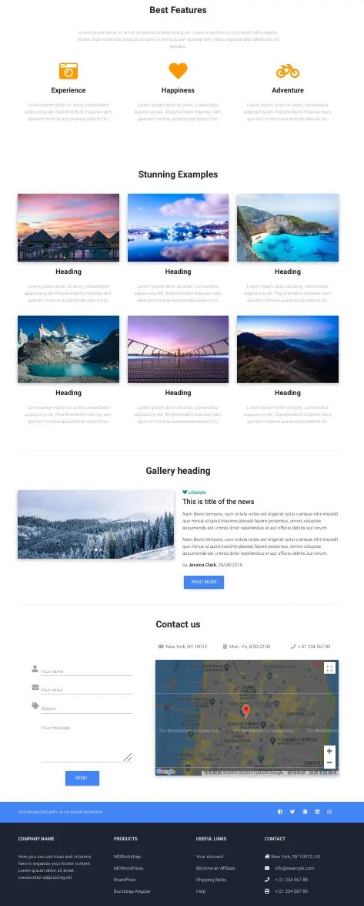

summary: 棋歌教学网 - MDB教程二
id: mdb-tutorial-2
categories: Web
tags: QiGe
status: Published
authors: QiGe
Feedback Link: mailto: gridwang@gmail.com

# 棋歌教学网 - MDB教程二

## 概述
Duration: 2

本教程将构建一个所谓的单页应用SPA(Single Page App), 即内容都在一个页面, 不会发生跳转。
我们将涉及以下内容:

### What You’ll Learn 
- 全屏页面 
- 遮罩和阴影
- 动画
- 字体
- Sogou/Google/高德地图
- 图标/表单
- 轮播/幻灯片
- 使用自定义样式
  
建设完毕后的效果[在线查看](https://mdbootstrap.com/snippets/jquery/ascensus/28?action=fullscreen),或如下图：



## 导航及全屏图片背景
Duration: 5

### 导航条

解压你下载的 MDB Pro 模板文件到某文件夹， code 中打开该文件夹（这是我们的工作目录）.
类似上一个教程, 打开`index.html`文件, 在`<body>`中写入如下页面结构代码:

```html
<!-- start your project here -->
<!--Main Navigation-->
<header>

</header>
<!--Main Navigation-->

<!--Main layout-->
<main>

</main>
<!--Main layout-->

<!--Footer-->
<footer>

</footer>
<!--Footer-->
<!-- end your project here -->
```

[导航条](https://mdbootstrap.com/docs/jquery/navigation/navbar/#basic-example)我们已经在[教程一](../mdb-tutorial-1/index.html#2)中介绍过, 此处不再累述. 在`<header>`中写入如下代码构建导航条:

```html
<!--Navbar-->
<nav class="navbar navbar-expand-lg navbar-dark primary-color">

  <div class="container">

    <!-- Navbar brand -->
    <a class="navbar-brand" href="#">Navbar</a>

    <!-- Collapse button -->
    <button class="navbar-toggler" type="button" data-toggle="collapse" data-target="#basicExampleNav"
      aria-controls="basicExampleNav" aria-expanded="false" aria-label="Toggle navigation">
      <span class="navbar-toggler-icon"></span>
    </button>

    <!-- Collapsible content -->
    <div class="collapse navbar-collapse" id="basicExampleNav">

      <!-- Links -->
      <ul class="navbar-nav mr-auto">
        <li class="nav-item active">
          <a class="nav-link" href="#">Home
            <span class="sr-only">(current)</span>
          </a>
        </li>
        <li class="nav-item">
          <a class="nav-link" href="#">Features</a>
        </li>
        <li class="nav-item">
          <a class="nav-link" href="#">Pricing</a>
        </li>

        <!-- Dropdown -->
        <li class="nav-item dropdown">
          <a class="nav-link dropdown-toggle" id="navbarDropdownMenuLink" data-toggle="dropdown" aria-haspopup="true"
            aria-expanded="false">Dropdown</a>
          <div class="dropdown-menu dropdown-primary" aria-labelledby="navbarDropdownMenuLink">
            <a class="dropdown-item" href="#">Action</a>
            <a class="dropdown-item" href="#">Another action</a>
            <a class="dropdown-item" href="#">Something else here</a>
          </div>
        </li>

      </ul>
      <!-- Links -->

      <form class="form-inline">
        <div class="md-form my-0">
          <input class="form-control mr-sm-2" type="text" placeholder="Search" aria-label="Search">
        </div>
      </form>
    </div>
    <!-- Collapsible content -->

  </div>

</nav>
<!--/.Navbar-->
```

我们稍微做点改变, 希望导航条能固定在页面顶部, 简单的添加`.fixed-top`类即可.

```html
<!--Navbar-->
<nav class="navbar navbar-expand-lg navbar-dark primary-color fixed-top">
```

Negative
: **思考:** 刷新页面似乎看不到变化? 想想如何能看到固定的导航条?

### 全屏幕图像背景

我们现在来构建一个以图片作为整个背景的页面.
添加如下代码在`<header>`标签中, `<nav>`标签之后(注意添加位置):

```html
<!--Mask-->
<div id="intro" class="view">

  <div class="mask">

  </div>

</div>
<!--/.Mask-->
```

解释如下:
-  `.view` 是我们背景图片的封装器, 同时使我们可以对图片进行明暗等效果的遮罩.
-  `.mask` 是一个有绝对定位的元素, 它将以某种效果覆盖图片(通常我们将添加一些文字).
-  `id="intro"` 这是`.view`元素的ID, 我们稍后将会用到.

不过, 如果你刷新页面看不到任何改变, 因为我们没有引入图片. 添加如下 CSS 代码到`css/style.css`文件中.

Positive
: **提示:** 除了大量使用 MDB 预定义的样式类外, 我们也可以使用自定义的样式, 一般放在`style.css`文件中.

```html
html,
body,
header,
#intro {
    height: 100%;
}

#intro {
    background: url("https://mdbootstrap.com/img/Photos/Horizontal/Nature/full%20page/img%20%283%29.jpg")no-repeat center center fixed;
    -webkit-background-size: cover; /* 针对Chrome, Safari, Edge等浏览器 */
    -moz-background-size: cover;    /* 针对Firefox浏览器 */
    -o-background-size: cover;      /* 针对Operallq */
    background-size: cover;         /* 通用 */
}
```

说明:
- 我们将背景图像的所有父元素高度设置为100％，只有这样，图像才能覆盖整个屏幕
- 我们通过ID(`intro`)为该元素设置的背景图像的 URL. 请注意, 这也是我们显示图片的常用方式(这种情况下, 我们就不能通过在页面图片上点击右键来另存为...之类的了)
- 我们使用了`cover`来设置背景的尺寸, 它将覆盖屏幕所有可用的空间
- 另外, `-webkit-, -moz- , -o-`前缀是为了确保在所有浏览器都正常工作. 不过现代浏览器都支持了, 所以不用也没什么问题(就放弃老旧的浏览器市场吧)

Positive
: **提示:** 背景图片一般需要 `1920px * 1280px`以上的分辨率, 最好采用`JPG, Webp`等压缩格式, 因为其是属于`重量级`元素!

Positive
: **提示:** 图片压缩可考虑[CompresJPG](http://compressjpeg.com/), [TinyFY](https://tinify.cn/), [Website Planet](https://www.websiteplanet.com/zh-hans/webtools/imagecompressor/)等等. 另外, 请一定关注 Goolge 提出的新的图片格式 `Webp`, 有非常高的压缩率且质量上乘, 当前已被主流浏览器支持了. 请访问[Webp官网](https://developers.google.com/speed/webp)

刷新浏览器, 你将看到全屏图像出现了. 此时你应该看到[这样的结果](https://mdbootstrap.com/snippets/jquery/ascensus/16?action=fullscreen)

## 遮罩和弹性盒子布局
Duration: 5

### 遮罩 Mask

虽然一个全屏的图像让人印象不错, 但它不是我们的重点. 它应该暗淡一点, 应该有些文字.
简单的添加一个强暗黑遮罩效果`rgba-black-strong`就好了.

```html
<div class="mask rgba-black-strong">
```

刷新浏览器即可看到不同的效果. 进一步学习, 请参考MDB的 [mask](https://mdbootstrap.com/docs/jquery/css/masks/)文档.

暗黑的背景上当然需要添加一些东西. 添加如下代码在`.mask .rgba-black-strong`元素内:

```html
<div class="mask rgba-black-strong">

  <!-- Heading -->
  <h2 class="display-4 font-weight-bold white-text pt-5 mb-2">Travel</h2>

  <!-- Divider -->
  <hr class="hr-light">

  <!-- Description -->
  <h4 class="white-text my-4">Lorem ipsum dolor sit amet, consectetur adipisicing elit. Deleniti consequuntur.</h4>
  <button type="button" class="btn btn-outline-white">Read more<i class="fas fa-book ml-2"></i></button>

</div>
```

我们添加了一个二级标题, 一条分割线, 一点描述文字和一个按钮在页面上.
说明:
- `display-4` 一个好看的大标题. 参见 MDB版式 [Typography](https://mdbootstrap.com/docs/jquery/content/typography/#display-headings)文档.
- `font-weight-bold` 文本加粗. 参见 MDB文本工具 [Text Utilities](https://mdbootstrap.com/docs/jquery/content/typography/#display-headings)文档.
- `white-color` 白色文本. 参见 MDB 颜色[Color](https://mdbootstrap.com/docs/jquery/css/colors/#text-colors)文档.
-  `hr-light` 一条白色分割线.
-  `btn-outline-white` 一个白色的透明轮廓按钮. 参见 MDB 按钮[Buttons](https://mdbootstrap.com/docs/jquery/components/buttons/#outline-buttons)文档.
-  `fa-book` 一个书本样的图标(注意不是图片而是特殊字体). MDB 提供了众多的图标供我们使用, 参见图标[Icons](https://mdbootstrap.com/docs/jquery/content/icons-list/)文档.

刷新浏览器看看结果. 你可能对页面上内容的布局不太满意. 下面我们对这些元素进行合理的布局.

### 弹性盒子布局 Flexbox

通常我们希望这些内容居中显示. 将这四个内容(标题, 分割线, 文字, 按钮)用一个`div`包裹起来并加上一些样式如下:

```html
<div class="mask rgba-black-strong">
  <!-- 新添加的div -->
  <div class="d-flex align-items-center h-100">

    <!-- Heading -->
    <h2 class="display-4 font-weight-bold white-text pt-5 mb-2">Travel</h2>

    <!-- Divider -->
    <hr class="hr-light">

    <!-- Description -->
    <h4 class="white-text my-4">Lorem ipsum dolor sit amet, consectetur adipisicing elit. Deleniti consequuntur.</h4>
    <button type="button" class="btn btn-outline-white">Read more<i class="fas fa-book ml-2"></i></button>

  </div>

</div>
```

说明:
- `d-flex` 使得元素以 `flex`即弹性模式显示(相当于 CSS的`display: flex;`)属性.
- `align-items-center` 必须与`d-flex`一起使用才能生效, 将使内容在其父元素中垂直居中.
- `h-100` 使元素占用全部(100%)可用高度. 请参见 MDB 尺寸[Sizing](https://mdbootstrap.com/docs/jquery/utilities/sizing/)文档.

Positive
: **提示:** `Flex Box`是现代 CSS流行及强大的布局方式, 请尽可能掌握. 参见 MDB 弹性布局[Flexbox](https://mdbootstrap.com/docs/jquery/utilities/flexbox/#overview)文档.

当前你应该看到[如此结果](https://mdbootstrap.com/snippets/jquery/ascensus/17?action=fullscreen)

所有内容虽然垂直居中了, 似乎水平还没有, 且显得拥挤, 不怎么美观, 下面我们进一步进行调整.

为避免出错, 请将整个`<div id="intro" class="view">`的内容替换如下:

```html
<!--Mask-->
<div id="intro" class="view">

  <div class="mask rgba-black-strong">
    <!-- 添加了.container-fluid 容器以利用栅格进行布局 -->
    <div class="container-fluid d-flex align-items-center justify-content-center h-100">
      <!-- 新添加的 div, 表示栅格中的行 -->
      <div class="row d-flex justify-content-center text-center">
        <!-- 新添加的 div, 表示栅格中的列 -->
        <div class="col-md-10">

          <!-- Heading -->
          <h2 class="display-4 font-weight-bold white-text pt-5 mb-2">Travel</h2>

          <!-- Divider -->
          <hr class="hr-light">

          <!-- Description -->
          <h4 class="white-text my-4">Lorem ipsum dolor sit amet, consectetur adipisicing elit. Deleniti consequuntur.</h4>
          <button type="button" class="btn btn-outline-white">Read more<i class="fas fa-book ml-2"></i></button>

        </div>

      </div>

      </div>

  </div>

</div>
<!--/.Mask-->
```

上面代码出现了些新的样式, 也有一些新的`div`, 下面我们进行解释.
- 添加了`.container-fluid` 容器以利用栅格进行布局. 我们使用栅格系统的构建方式一般为`.container or .container-fluid > .row > column `. 另外我们添加了`justify-content-center`来保证元素水平居中.
- 根据上面的规则, 我们将四个元素(标题, 分割线, 文字, 按钮)再用两个`div`(分别是行和列)进行包裹.
- 在行元素`.row`上, 我们再次应用了弹性布局及其`justify-content-center`样式来保证行内的列元素水平居中. 同时我们使用了`text-center`样式保证个元素内的文本居中.

Negative
: **试一试:** 请将行元素上的`justify-content-center`样式去掉看看发生什么?

- 在列元素`.col-md-10`上, 我们没有使用全部宽度(你应该还记得10/12), 这会使得在大屏幕上内容不会被拉得很长.

刷新浏览器, 现在你应该可以看到一个较好的有[全屏图像背景的页面](https://mdbootstrap.com/snippets/jquery/ascensus/19?action=fullscreen).
接下来, 我们将进一步添加一下新的元素到我们的页面.

## 页面主体-结构及 Best Features章节
Duration: 5

### 主体结构

现在是时候添加页面的具体内容了. 将`<main>`标签用如下代码替换:

```html
<!--Main layout-->
<main class="mt-5">
  <div class="container">

    <!--Section: Best Features-->
    <section id="best-features">


    </section>
    <!--Section: Best Features-->

    <hr class="my-5">

    <!--Section: Examples-->
    <section id="examples">


    </section>
    <!--Section: Examples-->

    <hr class="my-5">

    <!--Section: Gallery-->
    <section id="gallery">


    </section>
    <!--Section: Gallery-->

    <hr class="my-5">

    <!--Section: Contact-->
    <section id="contact">


    </section>
    <!--Section: Contact-->

  </div>
</main>
<!--Main layout-->
```

`<main>`标签包含我们绝大多数的内容, 我们应用了`container`容器来来使用栅格系统.

同时, 我们将内容用`<section>`标签分为了4个部分. `section`之间还添加了分割线, 并且上下(`my-5`)都留了不少间距.
`section`标签没有任何具体的显示效果, 我们使用它是为了代码的干净与可读性.

另外, 你会发现每个`section`都设置了 ID, 我们将在页面导航/跳转时用到它.

Negative
: **注意:** 在一个 HTML 文档中, ID 用来标识某元素, 必须是唯一的. 多个元素如果使用相同的 ID 值将导致严重的问题.

Positive
: **提示:** 目前为止, 你应该看到我们的代码中有不少注释, 这是一个非常好的习惯. 当项目变大或时间久远时, 这些注释对你自己或者你的小伙伴都无比有益. 请习得.

### 第一 section

下面我们为第一个章节`Best Features`添加如下内容:

```html
<!--Section: Best Features-->
<section id="best-features" class="text-center">

  <!-- Heading -->
  <h2 class="mb-5">Best Features</h2>

  <!--Grid row-->
  <div class="row d-flex justify-content-center mb-4">

    <!--Grid column-->
    <div class="col-md-8">

      <!-- Description -->
      <p>Lorem ipsum dolor sit amet, consectetur adipisicing elit. Quasi voluptate hic provident nulla repellat
          facere esse molestiae ipsa labore porro minima quam quaerat rem, natus repudiandae debitis est
          sit pariatur.</p>

    </div>
    <!--Grid column-->

  </div>
  <!--Grid row-->

  <!--Grid row-->
  <div class="row">

    <!--Grid column-->
    <div class="col-md-4 mb-1">
      <i class="fas fa-camera-retro"></i>
      <h4 class="my-4">Experience</h4>
      <p>Lorem ipsum dolor sit amet, consectetur adipisicing elit. Reprehenderit maiores nam, aperiam minima
          assumenda deleniti hic.</p>
    </div>
    <!--Grid column-->

    <!--Grid column-->
    <div class="col-md-4 mb-1">
      <i class="fas fa-heart"></i>
      <h4 class="my-4">Happiness</h4>
      <p>Lorem ipsum dolor sit amet, consectetur adipisicing elit. Reprehenderit maiores nam, aperiam minima
          assumenda deleniti hic.</p>
    </div>
    <!--Grid column-->

    <!--Grid column-->
    <div class="col-md-4 mb-1">
      <i class="fas fa-bicycle"></i>
      <h4 class="my-4">Adventure</h4>
      <p>Lorem ipsum dolor sit amet, consectetur adipisicing elit. Reprehenderit maiores nam, aperiam minima
          assumenda deleniti hic.</p>
    </div>
    <!--Grid column-->

  </div>
  <!--Grid row-->

</section>
<!--Section: Best Features-->
```

该章节有三个部分: 标题和两个`div`(第一行有一列, 第二行有三列).
整个代码应该没什么需要解释的. 不过我们可以调整得更专业一些:

- 将标题再加粗一点

```html
<!-- Heading -->
<h2 class="mb-5 font-weight-bold">Best Features</h2>
```

- 调整一下图标的颜色和大小
  
```html
<i class="fas fa-camera-retro fa-4x orange-text"></i>
```

- 将正文颜色变淡一点

```html
<!-- Description -->
<p class="grey-text">Lorem ipsum dolor sit amet, consectetur adipisicing elit. Quasi voluptate hic provident nulla repellat facere esse molestiae ipsa labore porro minima quam quaerat rem, natus repudiandae debitis est sit ariatur.</p>
```

OK, 目前你应该看到[这样的结果](https://mdbootstrap.com/snippets/jquery/ascensus/21?action=fullscreen).

## 页面主体- Example 章节
Duration: 5

本`section`我们将应用一些图片的效果. 我们将其分为2行3列的单元格, 每个单元显示一张图片及其介绍. 代码如下:

```html
<!--Section: Examples-->
<section id="examples" class="text-center">

  <!-- heading -->
  <h2 class="mb-5 font-weight-bold">Stunning Examples</h2>

  <!--Grid row-->
  <div class="row">

    <!--Grid column-->
    <div class="col-lg-4 col-md-12 mb-4">

      <div class="view overlay z-depth-1-half">
        
        <a href="#!">
          <div class="mask rgba-white-slight"></div>
        </a>
      </div>

      <h4 class="my-4 font-weight-bold">Heading</h4>
      <p class="grey-text">Lorem ipsum dolor sit amet, consectetur adipisicing elit. Reprehenderit maiores nam,
        aperiam minima
        assumenda deleniti hic.</p>

    </div>
    <!--Grid column-->

    <!--Grid column-->
    <div class="col-lg-4 col-md-6 mb-4">

      <div class="view overlay z-depth-1-half">
        
        <a href="#!">
          <div class="mask rgba-white-slight"></div>
        </a>
      </div>

      <h4 class="my-4 font-weight-bold">Heading</h4>
      <p class="grey-text">Lorem ipsum dolor sit amet, consectetur adipisicing elit. Reprehenderit maiores nam,
        aperiam minima
        assumenda deleniti hic.</p>

    </div>
    <!--Grid column-->

    <!--Grid column-->
    <div class="col-lg-4 col-md-6 mb-4">

      <div class="view overlay z-depth-1-half">
        
        <a href="#!">
          <div class="mask rgba-white-slight"></div>
        </a>
      </div>

      <h4 class="my-4 font-weight-bold">Heading</h4>
      <p class="grey-text">Lorem ipsum dolor sit amet, consectetur adipisicing elit. Reprehenderit maiores nam,
        aperiam minima
        assumenda deleniti hic.</p>

    </div>
    <!--Grid column-->

  </div>
  <!--Grid row-->

  <!--Grid row-->
  <div class="row">

    <!--Grid column-->
    <div class="col-lg-4 col-md-12 mb-4">

      <div class="view overlay z-depth-1-half">
        
        <a href="#!">
          <div class="mask rgba-white-slight"></div>
        </a>
      </div>

      <h4 class="my-4 font-weight-bold">Heading</h4>
      <p class="grey-text">Lorem ipsum dolor sit amet, consectetur adipisicing elit. Reprehenderit maiores nam,
        aperiam minima
        assumenda deleniti hic.</p>

    </div>
    <!--Grid column-->

    <!--Grid column-->
    <div class="col-lg-4 col-md-6 mb-4">

      <div class="view overlay z-depth-1-half">
        
        <a href="#!">
          <div class="mask rgba-white-slight"></div>
        </a>
      </div>

      <h4 class="my-4 font-weight-bold">Heading</h4>
      <p class="grey-text">Lorem ipsum dolor sit amet, consectetur adipisicing elit. Reprehenderit maiores nam,
        aperiam minima
        assumenda deleniti hic.</p>

    </div>
    <!--Grid column-->

    <!--Grid column-->
    <div class="col-lg-4 col-md-6 mb-4">

      <div class="view overlay z-depth-1-half">
        
        <a href="#!">
          <div class="mask rgba-white-slight"></div>
        </a>
      </div>

      <h4 class="my-4 font-weight-bold">Heading</h4>
      <p class="grey-text">Lorem ipsum dolor sit amet, consectetur adipisicing elit. Reprehenderit maiores nam,
        aperiam minima
        assumenda deleniti hic.</p>

    </div>
    <!--Grid column-->

  </div>
  <!--Grid row-->

</section>
<!--Section: Examples-->
```

请注意, 我们在每张图片的遮罩上都添加了超链接:

```html
<a href="#!">
  <div class="mask rgba-white-slight"></div>
</a>
```

此外, 我们使用

- `z-depth-1-half` 使图片有阴影效果. 参见MDB [Shadows](https://mdbootstrap.com/docs/jquery/css/shadows/)文档.
- `view overlay` 点击时有波纹效果. MDB 默认为遮罩/按钮/导航条等提供波纹效果, 参见 MDB [Waves Effect](https://mdbootstrap.com/docs/jquery/javascript/waves-effect/)文档.
- `mask rgba-white-slight` 鼠标移上图片时(`hover`)有变色效果. 参见 MDB [Hover Effects](https://mdbootstrap.com/docs/jquery/css/hover-effects/)文档.

至此, 第二个section构建完毕. 当前你应该看到[这样的效果](https://mdbootstrap.com/snippets/jquery/ascensus/23?action=fullscreen).

## 页面主体- Gallery 章节
Duration: 5

我们将在`Gallery`章节使用轮播(Carousel)来进行类似幻灯片的展示. 该节除标题外还有包含两列的行, 代码如下:

```html
<!--Section: Gallery-->
<section id="gallery">

  <!-- Heading -->
  <h2 class="mb-5 font-weight-bold text-center">Gallery heading</h2>

  <!--Grid row-->
  <div class="row">

    <!--Grid column-->
    <div class="col-md-6 mb-4">


    </div>
    <!--Grid column-->

    <!--Grid column-->
    <div class="col-md-6">


    </div>
    <!--Grid column-->

  </div>
  <!--Grid row-->

</section>
<!--Section: Gallery-->
```

我们的轮播内容将放到左边那一列. 代码如下:

```html
<!--Grid column-->
<div class="col-md-6 mb-4">

  <!--Carousel Wrapper-->
<div id="carousel-example-2" class="carousel slide carousel-fade" data-ride="carousel">
  <!--Indicators-->
  <ol class="carousel-indicators">
    <li data-target="#carousel-example-2" data-slide-to="0" class="active"></li>
    <li data-target="#carousel-example-2" data-slide-to="1"></li>
    <li data-target="#carousel-example-2" data-slide-to="2"></li>
  </ol>
  <!--/.Indicators-->
  <!--Slides-->
  <div class="carousel-inner" role="listbox">
    <div class="carousel-item active">
      <div class="view">
        
        <div class="mask rgba-black-light"></div>
      </div>
      <div class="carousel-caption">
        <h3 class="h3-responsive">Light mask</h3>
        <p>First text</p>
      </div>
    </div>
    <div class="carousel-item">
      <!--Mask color-->
      <div class="view">
        
        <div class="mask rgba-black-strong"></div>
      </div>
      <div class="carousel-caption">
        <h3 class="h3-responsive">Strong mask</h3>
        <p>Secondary text</p>
      </div>
    </div>
    <div class="carousel-item">
      <!--Mask color-->
      <div class="view">
        
        <div class="mask rgba-black-slight"></div>
      </div>
      <div class="carousel-caption">
        <h3 class="h3-responsive">Slight mask</h3>
        <p>Third text</p>
      </div>
    </div>
  </div>
  <!--/.Slides-->
  <!--Controls-->
  <a class="carousel-control-prev" href="#carousel-example-2" role="button" data-slide="prev">
    <span class="carousel-control-prev-icon" aria-hidden="true"></span>
    <span class="sr-only">Previous</span>
  </a>
  <a class="carousel-control-next" href="#carousel-example-2" role="button" data-slide="next">
    <span class="carousel-control-next-icon" aria-hidden="true"></span>
    <span class="sr-only">Next</span>
  </a>
  <!--/.Controls-->
</div>
<!--/.Carousel Wrapper-->

</div>
<!--Grid column-->
```

有关轮播的使用, 请查看 MDB 轮播[Carousel](https://mdbootstrap.com/docs/jquery/javascript/carousel/#example)文档, 相信大家依样画瓢应该没有问题的.

但如果需要控制轮播的一些选项如: 间隔时间/轮播方向/是否循环等等则需要 JavaScrip 的支持. 下面我们简单介绍一下.

基本思路是: 找到轮播元素(通过id), 传递相关参数对象给它. 将如下代码添加到靠近底部自定义 JS 代码块中 :

```javascript
<!-- Your custom scripts (optional) -->
<script type="text/javascript">
  // Carousel options
  $('#carousel-example-2').carousel({
    interval: 2000, // 间隔时间, 默认5000毫秒, 如果设置为false则不会自动播放
    pause: false,   // 鼠标移上后是否暂停, 默认暂停
    wrap: false,    // 是否循环轮播, 默认循环
  })
</script>
  ```

刷新页面试试.

Positive
: **提示:** 当前我们还没有学习 JS, 这些内容可不必深究, 待学习 JS 之后再理解即可.

最后, 我们将以下代码添加到第二列中:

```html
<!--Grid column-->
<div class="col-md-6">

  <!--Excerpt-->
  <a href="" class="teal-text">
      <h6 class="pb-1"><i class="fas fa-heart"></i><strong> Lifestyle </strong></h6>
  </a>
  <h4 class="mb-3"><strong>This is title of the news</strong></h4>
  <p>Nam libero tempore, cum soluta nobis est eligendi optio cumque nihil impedit quo minus id quod maxime
      placeat facere possimus, omnis voluptas assumenda est, omnis dolor repellendus et aut officiis
      debitis aut rerum.</p>

  <p>Nam libero tempore, cum soluta nobis est eligendi optio cumque nihil impedit quo minus id quod maxime
      placeat facere possimus, omnis voluptas assumenda est, omnis dolor repellendus et aut officiis
      debitis aut rerum.</p>
  <p>by <a><strong>Jessica Clark</strong></a>, 26/08/2016</p>
  <a class="btn btn-primary btn-md">Read more</a>

</div>
<!--Grid column-->
```

至此, `Gallery`章节完毕. 现在你应该看到[这样的效果](https://mdbootstrap.com/snippets/jquery/ascensus/24?action=fullscreen)

## 页面主体- Contact 章节
Duration: 5

`Contact`章节是我们页面主体的最后一个章节. 我们依然把它分为两列, 左边放置输入表单(Form), 右边放置一个在线地图. 结构如下:

```html
<!--Section: Contact-->
<section id="contact">

  <!-- Heading -->
  <h2 class="mb-5 font-weight-bold text-center">Contact us</h2>

  <!--Grid row-->
  <div class="row">

  <!--Grid column-->
  <div class="col-lg-5 col-md-12">


  </div>
  <!--Grid column-->

  <!--Grid column-->
  <div class="col-lg-7 col-md-12">


  </div>
  <!--Grid column-->

  </div>
  <!--Grid row-->

</section>
<!--Section: Contact-->
```

### 联系表单

将以下代码放在第一列(左边):

```html
<!--Grid column-->
<div class="col-lg-5 col-md-12">
  <!-- Form contact -->
  <form class="p-5 grey-text">
    <div class="md-form form-sm"> <i class="fas fa-user prefix"></i>
      <input type="text" id="form1" class="form-control form-control-sm">
      <label for="form1">Your name</label>
    </div>
    <div class="md-form form-sm"> <i class="fas fa-envelope prefix"></i>
      <input type="text" id="form2" class="form-control form-control-sm">
      <label for="form2">Your email</label>
    </div>
    <div class="md-form form-sm"> <i class="fas fa-tag prefix"></i>
      <input type="text" id="form3" class="form-control form-control-sm">
      <label for="form3">Subject</label>
    </div>
    <div class="md-form form-sm"> <i class="fas fa-pencil-alt prefix"></i>
      <textarea type="text" id="form4" class="md-textarea form-control form-control-sm" rows="4"></textarea>
      <label for="form4">Your message</label>
    </div>
    <div class="text-center mt-4">
      <button class="btn btn-primary">Send <i class="far fa-paper-planeml-1"></i></button>
    </div>
  </form>
  <!-- Form contact -->
</div>
<!--Grid column-->
```

我们通常使用表单(form)来收集用户输入的数据(一般会通过检查后送到远程服务器进一步处理, 目前我们不会涉及).
下面我们将表单中使用的样式说明如下:

- `md-form` 提供 Material Design 风格的输入元素.
- `form-sm , form-control-sm` 使得我们的输入稍微小一点. 你可去掉试试.
- `prefix` 使得图标成为输入元素的前缀, 当用户点击该元素时激活. 你可去掉试试.
- `label` 是输入元素的标签, 相当于输入提示(placeholder). 但请注意, 每个标签都设置了`for`属性对应其输入元素的`id`, 如此, 当点击标签时它会平滑的上移并缩小. 你可去掉试试.

进一步学习, 可参考 MDB 提供的输入[Inputs](https://mdbootstrap.com/components/inputs/)文档和表单[Forms](https://mdbootstrap.com/docs/jquery/forms/basic/)文档.

当前, 你应该看到[这样的结果](https://mdbootstrap.com/snippets/jquery/ascensus/25?action=fullscreen).

### 在线地图

接下来我们将在第二列(右边)放置一些联系信息及在线地图. 代码如下:

Positive
: **提示:** 现在, 依托地图的应用非常多. 最好用的首推地图的鼻祖 Google Map. 但由于你懂的原因, 我不得不使用国内的地图(以简单点的Sogou为例).
仍然的, 此部分涉及 JS, 请简单的跟随好了.

```html
<div class="col-lg-7 col-md-12">

<!--Grid row-->
  <div class="row text-center">

    <!--Grid column-->
    <div class="col-lg-4 col-md-12 mb-3">

        <p><i class="fas fa-map fa-1x mr-2 grey-text"></i>New York, NY 10012</p>

    </div>
    <!--Grid column-->

    <!--Grid column-->
    <div class="col-lg-4 col-md-6 mb-3">

        <p><i class="fas fa-building fa-1x mr-2 grey-text"></i>Mon - Fri, 8:00-22:00</p>

    </div>
    <!--Grid column-->

    <!--Grid column-->
    <div class="col-lg-4 col-md-6 mb-3">

        <p><i class="fas fa-phone fa-1x mr-2 grey-text"></i>+ 01 234 567 89</p>

    </div>
    <!--Grid column-->

  </div>
  <!--Grid row-->

  <!--Sogou 地图-->
  <div id="map-container" class="z-depth-1-half map-container mb-5" style="height: 400px"></div>

</div>
<!--Grid column-->
```

注意代码底部放置地图的区域(`<div id="map-container" ...>`), 我们设置了其高度为`400px`.

接下来导入 Sogou地图 API库. 在页面底部放置其它 JS文件的后面添加, 如下代码所示:

```html
<!-- jQuery -->
<script type="text/javascript" src="js/jquery.min.js"></script>
<!-- Bootstrap tooltips -->
<script type="text/javascript" src="js/popper.min.js"></script>
<!-- Bootstrap core JavaScript -->
<script type="text/javascript" src="js/bootstrap.min.js"></script>
<!-- MDB core JavaScript -->
<script type="text/javascript" src="js/mdb.min.js"></script>
<!-- 导入 Sogou Map API, 注意: 以上是已有的代码,下面这句是新增的 -->
<script type="text/javascript" src="//api.map.sogou.com/maps/js/api_v2.5.1.js"></script>
```

然后在自定义 JS 脚本中写入如下代码:

```javascript
<!-- Your custom scripts (optional) -->
  <script type="text/javascript">
    // Carousel options
    $('#carousel-example-2').carousel({
      interval: 2000, // 间隔时间, 默认5000毫秒, 如果设置为false则不会自动播放
      pause: false,   // 鼠标移上后是否暂停, 默认暂停
      wrap: false,    // 是否循环轮播, 默认循环
    });
//-------以下代码是新增的--------//
    /* 定义函数, 加载指定坐标的地图 */
    function showMap() {
      var myLatlng = new sogou.maps.LatLng(29.4902, 106.5714);
      var myOptions = {
          zoom: 13,
          center: myLatlng,
          mapTypeId: sogou.maps.MapTypeId.ROADMAP
      };
      map = new sogou.maps.Map(document.getElementById("map-container"), myOptions);
      marker = new sogou.maps.Marker({position:myLatlng, map:map, title:"重庆交通大学"});
    }
    // 设置事件侦听器, 当窗口加载时调用 showMap 函数
    sogou.maps.event.addDomListener(window, 'load', showMap);
  </script>

```

至此, `Contact` 章节OK. 你应该有[这样的结果](https://mdbootstrap.com/snippets/jquery/ascensus/26?action=fullscreen). 当然, Google地图为白色, 需要科学上网.

## 页面底部及导航调整
Duration: 5

### 页面底部

现在我们来完成页面的底部. 先替换为如下的代码:

```html
<!-- Footer -->
<footer class="page-footer font-small blue pt-4">

  <!-- Footer Links -->
  <div class="container-fluid text-center text-md-left">

    <!-- Grid row -->
    <div class="row">

      <!-- Grid column -->
      <div class="col-md-6 mt-md-0 mt-3">

        <!-- Content -->
        <h5 class="text-uppercase">Footer Content</h5>
        <p>Here you can use rows and columns here to organize your footer content.</p>

      </div>
      <!-- Grid column -->

      <hr class="clearfix w-100 d-md-none pb-3">

      <!-- Grid column -->
      <div class="col-md-3 mb-md-0 mb-3">

        <!-- Links -->
        <h5 class="text-uppercase">Links</h5>

        <ul class="list-unstyled">
          <li>
            <a href="#!">Link 1</a>
          </li>
          <li>
            <a href="#!">Link 2</a>
          </li>
          <li>
            <a href="#!">Link 3</a>
          </li>
          <li>
            <a href="#!">Link 4</a>
          </li>
        </ul>

      </div>
      <!-- Grid column -->

      <!-- Grid column -->
      <div class="col-md-3 mb-md-0 mb-3">

        <!-- Links -->
        <h5 class="text-uppercase">Links</h5>

        <ul class="list-unstyled">
          <li>
            <a href="#!">Link 1</a>
          </li>
          <li>
            <a href="#!">Link 2</a>
          </li>
          <li>
            <a href="#!">Link 3</a>
          </li>
          <li>
            <a href="#!">Link 4</a>
          </li>
        </ul>

      </div>
      <!-- Grid column -->

    </div>
    <!-- Grid row -->

  </div>
  <!-- Footer Links -->

  <!-- Copyright -->
  <div class="footer-copyright text-center py-3">© 2018 Copyright:
    <a href="https://mdbootstrap.com/education/bootstrap/"> MDBootstrap.com</a>
  </div>
  <!-- Copyright -->

</footer>
<!-- Footer -->
  ```

这是直接从 MDB [Footer](https://mdbootstrap.com/docs/jquery/navigation/footer/#basic)文档的实例代码中复制过来的. 目前有两个部分, 一些假的链接和版权申明, 有蓝色的底色. 它有改善的空间.

我们先将那些假的链接修正一下. 找到`footer`中的一个叫`Footer Links`的`div`, 替换为如下代码:

```html
<!--Footer Links-->
<div class="container mt-5 mb-4 text-center text-md-left">
  <div class="row mt-3">

    <!--First column-->
    <div class="col-md-3 col-lg-4 col-xl-3 mb-4">
      <h6 class="text-uppercase font-weight-bold">
        <strong>Company name</strong>
      </h6>
      <hr class="deep-purple accent-2 mb-4 mt-0 d-inline-block mx-auto" style="width: 60px;">
      <p>Here you can use rows and columns here to organize your footer content. Lorem ipsum dolor sit
        amet, consectetur adipisicing elit.</p>
    </div>
    <!--/.First column-->

    <!--Second column-->
    <div class="col-md-2 col-lg-2 col-xl-2 mx-auto mb-4">
      <h6 class="text-uppercase font-weight-bold">
        <strong>Products</strong>
      </h6>
      <hr class="deep-purple accent-2 mb-4 mt-0 d-inline-block mx-auto" style="width: 60px;">
      <p>
        <a href="#!">MDBootstrap</a>
      </p>
      <p>
        <a href="#!">MDWordPress</a>
      </p>
      <p>
        <a href="#!">BrandFlow</a>
      </p>
      <p>
        <a href="#!">Bootstrap Angular</a>
      </p>
    </div>
    <!--/.Second column-->

    <!--Third column-->
    <div class="col-md-3 col-lg-2 col-xl-2 mx-auto mb-4">
      <h6 class="text-uppercase font-weight-bold">
        <strong>Useful links</strong>
      </h6>
      <hr class="deep-purple accent-2 mb-4 mt-0 d-inline-block mx-auto" style="width: 60px;">
      <p>
        <a href="#!">Your Account</a>
      </p>
      <p>
        <a href="#!">Become an Affiliate</a>
      </p>
      <p>
        <a href="#!">Shipping Rates</a>
      </p>
      <p>
        <a href="#!">Help</a>
      </p>
    </div>
    <!--/.Third column-->

    <!--Fourth column-->
    <div class="col-md-4 col-lg-3 col-xl-3">
      <h6 class="text-uppercase font-weight-bold">
        <strong>Contact</strong>
      </h6>
      <hr class="deep-purple accent-2 mb-4 mt-0 d-inline-block mx-auto" style="width: 60px;">
      <p>
        <i class="fas fa-home  mr-3"></i> New York, NY 10012, US</p>
      <p>
        <i class="fas fa-envelope mr-3"></i> info@example.com</p>
      <p>
        <i class="fas fa-phone mr-3"></i> + 01 234 567 88</p>
      <p>
        <i class="fas fa-print mr-3"></i> + 01 234 567 89</p>
    </div>
    <!--/.Fourth column-->

  </div>
</div>
<!--/.Footer Links-->
```

新的链接部分内容更丰富, 我们分为了四列进行展示.

- 使用`container`替换了`container-fluid`容器, 使得内容不会扩展到边界
- 总共给出四列来分别展示文字,产品,推荐和联系方式
- 每一列都有一个突出的标题, 且其下给了一条紫色的分割线(给了固定宽度为:`60px`)

Negative
: **思考:** 刷新页面, 你应该会觉得标题小的分割线长度和标题不协调. 想想怎么改进一下.

我们还打算在`footer`中添加一个部分用于放置社交媒体链接. 也即, 现在页面的`footer`由3个部分组成: 社交媒体链接, 公司信息, 版权信息.

将如下代码添加到我们刚刚才改造过的 Footer Links 这个`div`前(注意添加的位置).

```html
<!-- Social buttons -->
<div class="primary-color">
  <div class="container">
    <!--Grid row-->
    <div class="row py-4 d-flex align-items-center">

      <!--Grid column-->
      <div class="col-md-6 col-lg-5 text-center text-md-left mb-4 mb-md-0">
        <h6 class="mb-0 white-text">Get connected with us on social networks!</h6>
      </div>
      <!--Grid column-->

      <!--Grid column-->
      <div class="col-md-6 col-lg-7 text-center text-md-right">
        <!--Facebook-->
        <a class="fb-ic ml-0">
          <i class="fab fa-facebook-f white-text mr-4"> </i>
        </a>
        <!--Twitter-->
        <a class="tw-ic">
          <i class="fab fa-twitter white-text mr-4"> </i>
        </a>
        <!--Google +-->
        <a class="gplus-ic">
          <i class="fab fa-google-plus-g white-text mr-4"> </i>
        </a>
        <!--Linkedin-->
        <a class="li-ic">
          <i class="fab fa-linkedin-in white-text mr-4"> </i>
        </a>
        <!--Instagram-->
        <a class="ins-ic">
          <i class="fab fa-instagram white-text mr-lg-4"> </i>
        </a>
      </div>
      <!--Grid column-->

    </div>
    <!--Grid row-->
  </div>
</div>
<!-- Social buttons -->
```

刷新后, 你会觉得新添加的这部分不大和谐, 似乎是硬插入的, 文字也有点小. 简单的修正如下即可:

```html
<!-- Footer -->
<footer class="page-footer unique-color-dark">
```

在看看, 应该美观多了. 你现在可以看到[这样的效果](https://mdbootstrap.com/snippets/jquery/ascensus/27?action=fullscreen)

下面, 我们进行最后的调整和提升.

### 导航调整

#### 让导航生效

你应该会发现导航条中的导航似乎与我们页面的内容不匹配的, 将导航条中的`Links`部分用下面的代码修正:

```html
<!-- Links -->
<ul class="navbar-nav mr-auto">
  <li class="nav-item">
    <a class="nav-link" href="#intro">Home</a>
  </li>
  <li class="nav-item">
    <a class="nav-link" href="#best-features">Features</a>
  </li>
  <li class="nav-item">
    <a class="nav-link" href="#examples">Examples</a>
  </li>
  <li class="nav-item">
    <a class="nav-link" href="#gallery">Gallery</a>
  </li>
  <li class="nav-item">
    <a class="nav-link" href="#contact">Contact</a>
  </li>
</ul>
<!-- Links -->
```

现在点击各个导航, 页面将跳到定义好的相应位置(即各`section`, 你应该知道这是通过 `id`进行的页内导航).

#### 滚动平滑

当点击导航超链接时, 页面瞬间定位到指定位置. 其实我们可以让其优雅一点的. 简单的使用`smooth-scroll`则OK:

```html
<!-- Links -->
<ul class="navbar-nav mr-auto smooth-scroll">
```

试试看.

#### 取消搜索

我们打算在导航条中搜索的位置放置社交图标, 用下面的代码替换`form`标签:

```html
<!-- Social Icon  -->
<ul class="navbar-nav nav-flex-icons">
  <li class="nav-item">
    <a class="nav-link"><i class="fab fa-facebook-f"></i></a>
  </li>
  <li class="nav-item">
    <a class="nav-link"><i class="fab fa-twitter"></i></a>
  </li>
  <li class="nav-item">
    <a class="nav-link"><i class="fab fa-instagram"></i></a>
  </li>
</ul>
```

#### 导航条透明及动感

最后, 我们让导航条更动感一点. 添加`scrolling-navbar`类, 去掉`primary-color`类:

```html
<!--Navbar-->
<nav class="navbar navbar-expand-lg navbar-dark fixed-top scrolling-navbar">
```

刷新后, 你会发现导航条透明了, 也有一定的动画效果(赞!). 不过当向上滚动时有问题.
打开我们自定义的样式文件`css/style.css`, 添加如下样式:

```css
.top-nav-collapse {
  background-color: #24355C;
}
```

我们为`.top-nav-collapse`自定义了样式, 即设置了背景. 不过你找遍了整个 HTML, 也不会看到那个元素在使用这个样式类.
那么, 我们定义它又怎么能生效呢? 解释如下:

- 当我们没有设置导航条的颜色如刚才去掉了`primary-color`, 那么导航条将是透明的
- `scrolling-navbar`是 MDB 定义的一个特殊的样式类. 当感知到用户在滚动页面时, MDB 将自动运行一段 JS 代码, 将`.top-nav-collapse`这个样式类添加给`.navbar`即导航条. 因此, 拥有这个样式类的元素的背景颜色即刻发生改变.

Positive
: **提示:** 不滚动时没有这个样式, 滚动时动态添加. 这是非常聪明的做法, 在现代前端中大量的应用了, 如 Angular.

#### 大功告成

现在看看你的[最终页面](https://mdbootstrap.com/snippets/jquery/ascensus/28?action=fullscreen). 如果有什么问题, 请参考下一节的完整代码.

## 最终参考代码
Duration: 2

### index.html 参考代码

```html
<!DOCTYPE html>
<html>

<head>
  <meta charset="UTF-8">
  <meta name="viewport" content="width=device-width, initial-scale=1, shrink-to-fit=no">
  <meta http-equiv="x-ua-compatible" content="ie=edge">
  <title>MDB4.12模板</title>
  <!-- MDB icon -->
  <link rel="icon" href="img/mdb-favicon.ico" type="image/x-icon">
  <!-- Font Awesome -->
  <link rel="stylesheet" href="https://use.fontawesome.com/releases/v5.11.2/css/all.css">
  <!-- Bootstrap core CSS -->
  <link rel="stylesheet" href="css/bootstrap.min.css">
  <!-- Material Design Bootstrap -->
  <link rel="stylesheet" href="css/mdb.min.css">
  <!-- Your custom styles (optional) -->
  <link rel="stylesheet" href="css/style.css">
</head>

<body>
  <!--Main Navigation-->
  <header>
    <!--Navbar-->
    <nav class="navbar navbar-expand-lg navbar-dark scrolling-navbar fixed-top">

      <div class="container">

        <!-- Navbar brand -->
        <a class="navbar-brand" href="#">Navbar</a>

        <!-- Collapse button -->
        <button class="navbar-toggler" type="button" data-toggle="collapse" data-target="#basicExampleNav"
          aria-controls="basicExampleNav" aria-expanded="false" aria-label="Toggle navigation">
          <span class="navbar-toggler-icon"></span>
        </button>

        <!-- Collapsible content -->
        <div class="collapse navbar-collapse" id="basicExampleNav">

          <!-- Links -->
          <ul class="navbar-nav mr-auto smooth-scroll">
            <li class="nav-item">
              <a class="nav-link" href="#intro">Home</a>
            </li>
            <li class="nav-item">
              <a class="nav-link" href="#best-features">Features</a>
            </li>
            <li class="nav-item">
              <a class="nav-link" href="#examples">Examples</a>
            </li>
            <li class="nav-item">
              <a class="nav-link" href="#gallery">Gallery</a>
            </li>
            <li class="nav-item">
              <a class="nav-link" href="#contact">Contact</a>
            </li>
          </ul>
          <!-- Links -->

          <!-- Social Icon  -->
          <ul class="navbar-nav nav-flex-icons">
            <li class="nav-item">
              <a class="nav-link"><i class="fab fa-facebook-f"></i></a>
            </li>
            <li class="nav-item">
              <a class="nav-link"><i class="fab fa-twitter"></i></a>
            </li>
            <li class="nav-item">
              <a class="nav-link"><i class="fab fa-instagram"></i></a>
            </li>
          </ul>
        </div>
        <!-- Collapsible content -->

      </div>

    </nav>
    <!--/.Navbar-->
    <!--Mask-->
    <div id="intro" class="view">

      <div class="mask rgba-black-strong">

        <div class="container-fluid d-flex align-items-center justify-content-center h-100">

          <div class="row d-flex justify-content-center text-center">

            <div class="col-md-10">

              <!-- Heading -->
              <h2 class="display-4 font-weight-bold white-text pt-5 mb-2">Travel</h2>

              <!-- Divider -->
              <hr class="hr-light">

              <!-- Description -->
              <h4 class="white-text my-4">Lorem ipsum dolor sit amet, consectetur adipisicing elit. Deleniti
                consequuntur.</h4>
              <button type="button" class="btn btn-outline-white">Read more<i class="fas fa-book ml-2"></i></button>

            </div>

          </div>

        </div>

      </div>

    </div>
    <!--/.Mask-->
  </header>
  <!--Main Navigation-->

  <!--Main layout-->
  <main class="mt-5">
    <div class="container">

      <!--Section: Best Features-->
      <section id="best-features" class="text-center">

        <!-- Heading -->
        <h2 class="mb-5 font-weight-bold">Best Features</h2>

        <!--Grid row-->
        <div class="row d-flex justify-content-center mb-4">

          <!--Grid column-->
          <div class="col-md-8">

            <!-- Description -->
            <p class="grey-text">Lorem ipsum dolor sit amet, consectetur adipisicing elit. Quasi voluptate hic provident
              nulla repellat
              facere esse molestiae ipsa labore porro minima quam quaerat rem, natus repudiandae debitis est
              sit pariatur.</p>

          </div>
          <!--Grid column-->

        </div>
        <!--Grid row-->

        <!--Grid row-->
        <div class="row">

          <!--Grid column-->
          <div class="col-md-4 mb-1">
            <i class="fas fa-camera-retro fa-4x orange-text"></i>
            <h4 class="my-4">Experience</h4>
            <p class="grey-text">Lorem ipsum dolor sit amet, consectetur adipisicing elit. Reprehenderit maiores nam,
              aperiam minima
              assumenda deleniti hic.</p>
          </div>
          <!--Grid column-->

          <!--Grid column-->
          <div class="col-md-4 mb-1">
            <i class="fas fa-heart fa-4x orange-text"></i>
            <h4 class="my-4">Happiness</h4>
            <p class="grey-text">Lorem ipsum dolor sit amet, consectetur adipisicing elit. Reprehenderit maiores nam,
              aperiam minima
              assumenda deleniti hic.</p>
          </div>
          <!--Grid column-->

          <!--Grid column-->
          <div class="col-md-4 mb-1">
            <i class="fas fa-bicycle fa-4x orange-text"></i>
            <h4 class="my-4">Adventure</h4>
            <p class="grey-text">Lorem ipsum dolor sit amet, consectetur adipisicing elit. Reprehenderit maiores nam,
              aperiam minima
              assumenda deleniti hic.</p>
          </div>
          <!--Grid column-->

        </div>
        <!--Grid row-->

      </section>
      <!--Section: Best Features-->

      <hr class="my-5">

      <!--Section: Examples-->
      <section id="examples" class="text-center">

        <!-- heading -->
        <h2 class="mb-5 font-weight-bold">Stunning Examples</h2>

        <!--Grid row-->
        <div class="row">

          <!--Grid column-->
          <div class="col-lg-4 col-md-12 mb-4">

            <div class="view overlay z-depth-1-half">
              
              <a href="#!">
                <div class="mask rgba-white-slight"></div>
              </a>
            </div>

            <h4 class="my-4 font-weight-bold">Heading</h4>
            <p class="grey-text">Lorem ipsum dolor sit amet, consectetur adipisicing elit. Reprehenderit maiores nam,
              aperiam minima
              assumenda deleniti hic.</p>

          </div>
          <!--Grid column-->

          <!--Grid column-->
          <div class="col-lg-4 col-md-6 mb-4">

            <div class="view overlay z-depth-1-half">
              
              <a href="#!">
                <div class="mask rgba-white-slight"></div>
              </a>
            </div>

            <h4 class="my-4 font-weight-bold">Heading</h4>
            <p class="grey-text">Lorem ipsum dolor sit amet, consectetur adipisicing elit. Reprehenderit maiores nam,
              aperiam minima
              assumenda deleniti hic.</p>

          </div>
          <!--Grid column-->

          <!--Grid column-->
          <div class="col-lg-4 col-md-6 mb-4">

            <div class="view overlay z-depth-1-half">
              
              <a href="#!">
                <div class="mask rgba-white-slight"></div>
              </a>
            </div>

            <h4 class="my-4 font-weight-bold">Heading</h4>
            <p class="grey-text">Lorem ipsum dolor sit amet, consectetur adipisicing elit. Reprehenderit maiores nam,
              aperiam minima
              assumenda deleniti hic.</p>

          </div>
          <!--Grid column-->

        </div>
        <!--Grid row-->

        <!--Grid row-->
        <div class="row">

          <!--Grid column-->
          <div class="col-lg-4 col-md-12 mb-4">

            <div class="view overlay z-depth-1-half">
              
              <a href="#!">
                <div class="mask rgba-white-slight"></div>
              </a>
            </div>

            <h4 class="my-4 font-weight-bold">Heading</h4>
            <p class="grey-text">Lorem ipsum dolor sit amet, consectetur adipisicing elit. Reprehenderit maiores nam,
              aperiam minima
              assumenda deleniti hic.</p>

          </div>
          <!--Grid column-->

          <!--Grid column-->
          <div class="col-lg-4 col-md-6 mb-4">

            <div class="view overlay z-depth-1-half">
              
              <a href="#!">
                <div class="mask rgba-white-slight"></div>
              </a>
            </div>

            <h4 class="my-4 font-weight-bold">Heading</h4>
            <p class="grey-text">Lorem ipsum dolor sit amet, consectetur adipisicing elit. Reprehenderit maiores nam,
              aperiam minima
              assumenda deleniti hic.</p>

          </div>
          <!--Grid column-->

          <!--Grid column-->
          <div class="col-lg-4 col-md-6 mb-4">

            <div class="view overlay z-depth-1-half">
              
              <a href="#!">
                <div class="mask rgba-white-slight"></div>
              </a>
            </div>

            <h4 class="my-4 font-weight-bold">Heading</h4>
            <p class="grey-text">Lorem ipsum dolor sit amet, consectetur adipisicing elit. Reprehenderit maiores nam,
              aperiam minima
              assumenda deleniti hic.</p>

          </div>
          <!--Grid column-->

        </div>
        <!--Grid row-->

      </section>
      <!--Section: Examples-->

      <hr class="my-5">

      <!--Section: Gallery-->
      <section id="gallery">

        <!-- Heading -->
        <h2 class="mb-5 font-weight-bold text-center">Gallery heading</h2>

        <!--Grid row-->
        <div class="row">

          <!--Grid column-->
          <div class="col-md-6 mb-4">

            <!--Carousel Wrapper-->
            <div id="carousel-example-2" class="carousel slide carousel-fade" data-ride="carousel">
              <!--Indicators-->
              <ol class="carousel-indicators">
                <li data-target="#carousel-example-2" data-slide-to="0" class="active"></li>
                <li data-target="#carousel-example-2" data-slide-to="1"></li>
                <li data-target="#carousel-example-2" data-slide-to="2"></li>
              </ol>
              <!--/.Indicators-->
              <!--Slides-->
              <div class="carousel-inner" role="listbox">
                <div class="carousel-item active">
                  <div class="view">
                    
                    <div class="mask rgba-black-light"></div>
                  </div>
                  <div class="carousel-caption">
                    <h3 class="h3-responsive">Light mask</h3>
                    <p>First text</p>
                  </div>
                </div>
                <div class="carousel-item">
                  <!--Mask color-->
                  <div class="view">
                    
                    <div class="mask rgba-black-strong"></div>
                  </div>
                  <div class="carousel-caption">
                    <h3 class="h3-responsive">Strong mask</h3>
                    <p>Secondary text</p>
                  </div>
                </div>
                <div class="carousel-item">
                  <!--Mask color-->
                  <div class="view">
                    
                    <div class="mask rgba-black-slight"></div>
                  </div>
                  <div class="carousel-caption">
                    <h3 class="h3-responsive">Slight mask</h3>
                    <p>Third text</p>
                  </div>
                </div>
              </div>
              <!--/.Slides-->
              <!--Controls-->
              <a class="carousel-control-prev" href="#carousel-example-2" role="button" data-slide="prev">
                <span class="carousel-control-prev-icon" aria-hidden="true"></span>
                <span class="sr-only">Previous</span>
              </a>
              <a class="carousel-control-next" href="#carousel-example-2" role="button" data-slide="next">
                <span class="carousel-control-next-icon" aria-hidden="true"></span>
                <span class="sr-only">Next</span>
              </a>
              <!--/.Controls-->
            </div>
            <!--/.Carousel Wrapper-->

          </div>
          <!--Grid column-->

          <!--Grid column-->
          <div class="col-md-6">

            <!--Excerpt-->
            <a href="" class="teal-text">
              <h6 class="pb-1"><i class="fas fa-heart"></i><strong> Lifestyle </strong></h6>
            </a>
            <h4 class="mb-3"><strong>This is title of the news</strong></h4>
            <p>Nam libero tempore, cum soluta nobis est eligendi optio cumque nihil impedit quo minus id quod maxime
              placeat facere possimus, omnis voluptas assumenda est, omnis dolor repellendus et aut officiis
              debitis aut rerum.</p>

            <p>Nam libero tempore, cum soluta nobis est eligendi optio cumque nihil impedit quo minus id quod maxime
              placeat facere possimus, omnis voluptas assumenda est, omnis dolor repellendus et aut officiis
              debitis aut rerum.</p>
            <p>by <a><strong>Jessica Clark</strong></a>, 26/08/2016</p>
            <a class="btn btn-primary btn-md">Read more</a>

          </div>
          <!--Grid column-->

        </div>
        <!--Grid row-->

      </section>
      <!--Section: Gallery-->

      <hr class="my-5">

      <!--Section: Contact-->
      <section id="contact">

        <!-- Heading -->
        <h2 class="mb-5 font-weight-bold text-center">Contact us</h2>

        <!--Grid row-->
        <div class="row">

          <!--Grid column-->
          <div class="col-lg-5 col-md-12">
            <!-- Form contact -->
            <form class="p-5 grey-text">
              <div class="md-form form-sm"> <i class="fas fa-user prefix"></i>
                <input type="text" id="form1" class="form-control form-control-sm">
                <label for="form1">Your name</label>
              </div>
              <div class="md-form form-sm"> <i class="fas fa-envelope prefix"></i>
                <input type="text" id="form2" class="form-control form-control-sm">
                <label for="form2">Your email</label>
              </div>
              <div class="md-form form-sm"> <i class="fas fa-tag prefix"></i>
                <input type="text" id="form3" class="form-control form-control-sm">
                <label for="form3">Subject</label>
              </div>
              <div class="md-form form-sm"> <i class="fas fa-pencil-alt prefix"></i>
                <textarea type="text" id="form4" class="md-textarea form-control form-control-sm" rows="4"></textarea>
                <label for="form4">Your message</label>
              </div>
              <div class="text-center mt-4">
                <button class="btn btn-primary">Send <i class="far fa-paper-planeml-1"></i></button>
              </div>
            </form>
            <!-- Form contact -->
          </div>
          <!--Grid column-->

          <!--Grid column-->
          <div class="col-lg-7 col-md-12">

            <!--Grid row-->
            <div class="row text-center">

              <!--Grid column-->
              <div class="col-lg-4 col-md-12 mb-3">

                <p><i class="fas fa-map fa-1x mr-2 grey-text"></i>New York, NY 10012</p>

              </div>
              <!--Grid column-->

              <!--Grid column-->
              <div class="col-lg-4 col-md-6 mb-3">

                <p><i class="fas fa-building fa-1x mr-2 grey-text"></i>Mon - Fri, 8:00-22:00</p>

              </div>
              <!--Grid column-->

              <!--Grid column-->
              <div class="col-lg-4 col-md-6 mb-3">

                <p><i class="fas fa-phone fa-1x mr-2 grey-text"></i>+ 01 234 567 89</p>

              </div>
              <!--Grid column-->

            </div>
            <!--Grid row-->

            <!--Sogou 地图-->
            <div id="map-container" class="z-depth-1-half map-container mb-5" style="height: 400px"></div>

          </div>
          <!--Grid column-->

        </div>
        <!--Grid row-->

      </section>
      <!--Section: Contact-->
    </div>
  </main>
  <!--Main layout-->

  <!-- Footer -->
  <footer class="page-footer unique-color-dark">

    <!-- Social buttons -->
    <div class="primary-color">
      <div class="container">
        <!--Grid row-->
        <div class="row py-4 d-flex align-items-center">

          <!--Grid column-->
          <div class="col-md-6 col-lg-5 text-center text-md-left mb-4 mb-md-0">
            <h6 class="mb-0 white-text">Get connected with us on social networks!</h6>
          </div>
          <!--Grid column-->

          <!--Grid column-->
          <div class="col-md-6 col-lg-7 text-center text-md-right">
            <!--Facebook-->
            <a class="fb-ic ml-0">
              <i class="fab fa-facebook-f white-text mr-4"> </i>
            </a>
            <!--Twitter-->
            <a class="tw-ic">
              <i class="fab fa-twitter white-text mr-4"> </i>
            </a>
            <!--Google +-->
            <a class="gplus-ic">
              <i class="fab fa-google-plus-g white-text mr-4"> </i>
            </a>
            <!--Linkedin-->
            <a class="li-ic">
              <i class="fab fa-linkedin-in white-text mr-4"> </i>
            </a>
            <!--Instagram-->
            <a class="ins-ic">
              <i class="fab fa-instagram white-text mr-lg-4"> </i>
            </a>
          </div>
          <!--Grid column-->

        </div>
        <!--Grid row-->
      </div>
    </div>
    <!-- Social buttons -->

    <!--Footer Links-->
    <div class="container mt-5 mb-4 text-center text-md-left">
      <div class="row mt-3">

        <!--First column-->
        <div class="col-md-3 col-lg-4 col-xl-3 mb-4">
          <h6 class="text-uppercase font-weight-bold">
            <strong>Company name</strong>
          </h6>
          <hr class="deep-purple accent-2 mb-4 mt-0 d-inline-block mx-auto" style="width: 60px;">
          <p>Here you can use rows and columns here to organize your footer content. Lorem ipsum dolor sit
            amet, consectetur adipisicing elit.</p>
        </div>
        <!--/.First column-->

        <!--Second column-->
        <div class="col-md-2 col-lg-2 col-xl-2 mx-auto mb-4">
          <h6 class="text-uppercase font-weight-bold">
            <strong>Products</strong>
          </h6>
          <hr class="deep-purple accent-2 mb-4 mt-0 d-inline-block mx-auto" style="width: 60px;">
          <p>
            <a href="#!">MDBootstrap</a>
          </p>
          <p>
            <a href="#!">MDWordPress</a>
          </p>
          <p>
            <a href="#!">BrandFlow</a>
          </p>
          <p>
            <a href="#!">Bootstrap Angular</a>
          </p>
        </div>
        <!--/.Second column-->

        <!--Third column-->
        <div class="col-md-3 col-lg-2 col-xl-2 mx-auto mb-4">
          <h6 class="text-uppercase font-weight-bold">
            <strong>Useful links</strong>
          </h6>
          <hr class="deep-purple accent-2 mb-4 mt-0 d-inline-block mx-auto" style="width: 60px;">
          <p>
            <a href="#!">Your Account</a>
          </p>
          <p>
            <a href="#!">Become an Affiliate</a>
          </p>
          <p>
            <a href="#!">Shipping Rates</a>
          </p>
          <p>
            <a href="#!">Help</a>
          </p>
        </div>
        <!--/.Third column-->

        <!--Fourth column-->
        <div class="col-md-4 col-lg-3 col-xl-3">
          <h6 class="text-uppercase font-weight-bold">
            <strong>Contact</strong>
          </h6>
          <hr class="deep-purple accent-2 mb-4 mt-0 d-inline-block mx-auto" style="width: 60px;">
          <p>
            <i class="fas fa-home  mr-3"></i> New York, NY 10012, US</p>
          <p>
            <i class="fas fa-envelope mr-3"></i> info@example.com</p>
          <p>
            <i class="fas fa-phone mr-3"></i> + 01 234 567 88</p>
          <p>
            <i class="fas fa-print mr-3"></i> + 01 234 567 89</p>
        </div>
        <!--/.Fourth column-->

      </div>
    </div>
    <!--/.Footer Links-->

    <!-- Copyright -->
    <div class="footer-copyright text-center py-3">© 2018 Copyright:
      <a href="https://mdbootstrap.com/education/bootstrap/"> MDBootstrap.com</a>
    </div>
    <!-- Copyright -->

  </footer>
  <!-- Footer -->

  <!-- jQuery -->
  <script type="text/javascript" src="js/jquery.min.js"></script>
  <!-- Bootstrap tooltips -->
  <script type="text/javascript" src="js/popper.min.js"></script>
  <!-- Bootstrap core JavaScript -->
  <script type="text/javascript" src="js/bootstrap.min.js"></script>
  <!-- MDB core JavaScript -->
  <script type="text/javascript" src="js/mdb.min.js"></script>
  <!-- 导入 Sogou Map API -->
  <script type="text/javascript" src="https://api.go2map.com/maps/js/api_v2.5.1.js"></script>
  <!-- Your custom scripts (optional) -->
  <script type="text/javascript">
    // Carousel options
    $('#carousel-example-2').carousel({
      interval: 2000, // 间隔时间, 默认5000毫秒, 如果设置为false则不会自动播放
      pause: false, // 鼠标移上后是否暂停, 默认暂停
      wrap: false, // 是否循环轮播, 默认循环
    });

    /** 定义函数, 加载指定坐标的地图 */
    function showMap() {
      var myLatlng = new sogou.maps.LatLng(29.4902, 106.5714);
      var myOptions = {
        zoom: 13,
        center: myLatlng,
        mapTypeId: sogou.maps.MapTypeId.ROADMAP
      };
      map = new sogou.maps.Map(document.getElementById("map-container"), myOptions);
      marker = new sogou.maps.Marker({
        position: myLatlng,
        map: map,
        title: "重庆交通大学"
      });
    }
    // 设置事件侦听器, 当窗口加载时调用 showMap 函数
    sogou.maps.event.addDomListener(window, 'load', showMap);
  </script>

</body>

</html>
```

### style.css 参考代码

```css
html,
body,
header,
#intro {
    height: 100%;
}

#intro {
    background: url("https://mdbootstrap.com/img/Photos/Horizontal/Nature/full%20page/img%20%283%29.jpg")no-repeat center center fixed;
    -webkit-background-size: cover; /* 针对Chrome, Safari, Edge等浏览器 */
    -moz-background-size: cover;    /* 针对Firefox浏览器 */
    -o-background-size: cover;      /* 针对Operallq */
    background-size: cover;         /* 通用 */
}

.top-nav-collapse {
  background-color: #24355C;
}
```
