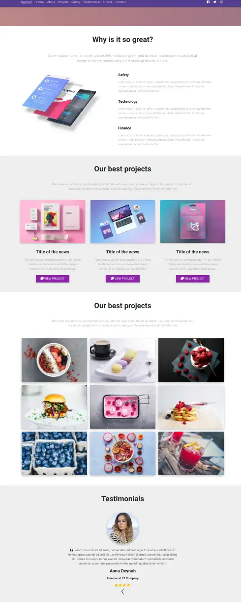
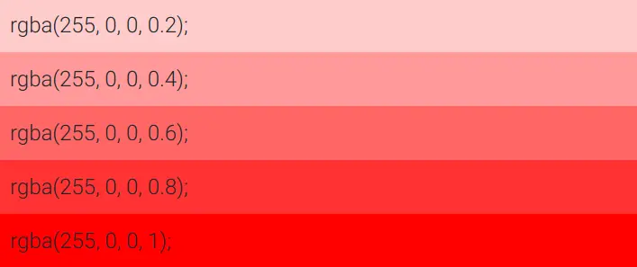

summary: 棋歌教学网 - MDB教程三
id: mdb-tutorial-3
categories: Web
tags: QiGe
status: Published
authors: QiGe
Feedback Link: mailto: gridwang@gmail.com

# 棋歌教学网 - MDB教程三

## 概述

Duration: 2

本教程将构建一个全屏的, 现代的, 用于展示作品的网站, 几乎所有的组件都需要 MDB Pro的支持。
我们将涉及以下内容:

### What You’ll Learn

- 全屏视频背景
- Features和Projects
- 灯箱图片集
- 字体
- Sogou/Google/高德地图
- 图标/表单
- 轮播/幻灯片
- 使用自定义样式
  
建设完毕后的效果[🌏在线查看](https://mdbootstrap.com/snippets/jquery/ascensus/28?action=fullscreen), 或如下图(部分效果)：



## 页面结构及全屏视频背景

Duration: 5

### 页面基本结构

解压你下载的 MDB Pro 模板文件到某文件夹， code 中打开该文件夹（这是我们的工作目录）.
跟上一个教程一样, 打开`index.html`文件, 在`<body>`中写入如下页面结构代码:

```html
<!-- start your project here -->
<!--Main Navigation-->
<header>

</header>
<!--Main Navigation-->

<!--Main layout-->
<main>

</main>
<!--Main layout-->

<!--Footer-->
<footer>

</footer>
<!--Footer-->
<!-- end your project here -->
```

全屏页面展示我们已经在[教程二](../mdb-tutorial-2/index.html)中较详细的介绍过, 此处不再累述.
MDB还提供了更精致漂亮的全屏页面让我们直接使用. 前往MDB [Intros](https://mdbootstrap.com/docs/jquery/sections/intros/#v-6)文档查看, 选择某种你中意的模板即可.

将`<header>`改变成如下代码:

```html
<!-- Main navigation -->
<header>
  <!-- Navbar -->
  <nav class="navbar navbar-expand-lg navbar-dark fixed-top scrolling-navbar">
    <div class="container">
      <a class="navbar-brand" href="#">Navbar</a>
      <button class="navbar-toggler" type="button" data-toggle="collapse" data-target="#navbarTogglerDemo02"
        aria-controls="navbarTogglerDemo02" aria-expanded="false" aria-label="Toggle navigation">
        <span class="navbar-toggler-icon"></span>
      </button>
      <div class="collapse navbar-collapse" id="navbarTogglerDemo02">
        <ul class="navbar-nav mr-auto smooth-scroll">
          <li class="nav-item">
            <a class="nav-link" href="#home">Home
              <span class="sr-only">(current)</span>
            </a>
          </li>
          <li class="nav-item">
            <a class="nav-link" href="#about" data-offset="90">About</a>
          </li>
          <li class="nav-item">
            <a class="nav-link" href="#features" data-offset="90">Features</a>
          </li>
          <li class="nav-item">
            <a class="nav-link" href="#services" data-offset="90">Services</a>
          </li>
          <li class="nav-item">
            <a class="nav-link" href="#opinions" data-offset="30">Opinions</a>
          </li>
          <li class="nav-item">
            <a class="nav-link" href="#team" data-offset="90">Team</a>
          </li>
          <li class="nav-item">
            <a class="nav-link" href="#contact" data-offset="90">Contact</a>
          </li>
        </ul>
        <!-- Social Icon  -->
        <ul class="navbar-nav nav-flex-icons">
          <li class="nav-item">
            <a class="nav-link">
              <i class="fab fa-facebook-f light-green-text-2"></i>
            </a>
          </li>
          <li class="nav-item">
            <a class="nav-link">
              <i class="fab fa-twitter light-green-text-2"></i>
            </a>
          </li>
          <li class="nav-item">
            <a class="nav-link">
              <i class="fab fa-instagram light-green-text-2"></i>
            </a>
          </li>
        </ul>
      </div>
    </div>
  </nav>
  <!-- Navbar -->
  <!-- Full Page Intro -->
  <div class="view">
    <video class="video-intro" poster="https://mdbootstrap.com/img/Photos/Others/background.jpg" playsinline autoplay
      muted loop>
      <source src="https://mdbootstrap.com/img/video/animation.mp4" type="video/mp4">
    </video>
    <!-- Mask & flexbox options-->
    <div class="mask rgba-gradient d-flex justify-content-center align-items-center">
      <!-- Content -->
      <div class="container px-md-3 px-sm-0">
        <!--Grid row-->
        <div class="row wow fadeIn">
          <!--Grid column-->
          <div class="col-md-12 mb-4 white-text text-center wow fadeIn">
            <h3 class="display-3 font-weight-bold white-text mb-0 pt-md-5 pt-5">Creative Agency</h3>
            <hr class="hr-light my-4 w-75">
            <h4 class="subtext-header mt-2 mb-4">Lorem ipsum dolor sit amet, consectetur adipisicing elit deleniti
              consequuntur nihil.</h4>
            <a href="#!" class="btn btn-rounded btn-outline-white">
              <i class="fas fa-home "></i> Visit us
            </a>
          </div>
          <!--Grid column-->
        </div>
        <!--Grid row-->
      </div>
      <!-- Content -->
    </div>
    <!-- Mask & flexbox options-->
  </div>
  <!-- Full Page Intro -->
</header>
<!--Main layout-->
```

现在刷新页面, 你会发现有些问题, 如不是全屏等. 我们需要添加些样式在`style.css` 文件中:

```css
/* Required for full background image */
html,
body,
header,
.view {
  height: 100%;
}

@media (max-width: 740px) {
  html,
  body,
  header,
  .view {
    height: 100vh;
  }
}

.top-nav-collapse {
  background-color: #563e91 !important;
}

.navbar:not(.top-nav-collapse) {
  background: transparent !important;
}

@media (max-width: 991px) {
  .navbar:not(.top-nav-collapse) {
    background: #563e91 !important;
  }
}

.rgba-gradient {
  background: -moz-linear-gradient(45deg, rgba(213, 15, 61, 0.6), rgba(13, 17, 198, 0.69) 100%);
  background: -webkit-linear-gradient(45deg, rgba(213, 15, 61, 0.6), rgba(13, 17, 198, 0.69) 100%);
  background: linear-gradient(to 45deg, rgba(213, 15, 61, 0.6), rgba(13, 17, 198, 0.69) 100%);
}
```

现在再试试. 现在页面背景上有动感的线条变换.

#### video元素

注意一下`<video>`元素, 它会指定视频的源文件, 另外注意其有个属性`poster`即海报, 用于当某种原因视频不能呈现时显示该图片.

Positive
: ✍ 请留意: 无论哪种格式的视频, 都是属于页面中的重量级元素, 即获取它们是很耗时间的, 不能影响用户的体验.
🌏 推荐一个免费的高质量图片和视频网站[Pexel Videos](https://www.pexels.com/videos/), 绝对值得你关注!

#### RGBA与渐变

留意样式表中的`.rgba-gradient{}`样式, 我们采用了45度的方向的两种 RGBA 颜色的渐变作为对背景的遮罩.

`RGBA`颜色即带透明通道的 RGB颜色搭配, 如下图展示了带透明度的红色:



CSS的渐变(gradient)展示了在两种颜色间的平滑过渡, 有两种方式:

- 线性渐变(Linear): 上下, 左右, 对角线渐变
- 中心渐变(Radial): 以中心径向渐变

Positive
: 🌏 一个非常方便的, 颜色搭配和谐的在线渐变生成器[uiGradients](https://uigradients.com/#VisionsofGrandeur)值得你前往!

#### 更改页面的渐变

将我们样式表的`.rgba-gradient{}`样式改为如下:

```css
.rgba-gradient {
    /* fallback for old browsers */
    background: rgba(35, 7, 77, 0.6);
    /* Chrome 10-25, Safari 5.1-6 */
    background: -webkit-linear-gradient(to right, rgba(204, 83, 51, 0.6), rgba(35, 7, 77, 0.6));
    /* W3C, IE 10+/ Edge, Firefox 16+, Chrome 26+, Opera 12+, Safari 7+ */
    background: linear-gradient(to right, rgba(204, 83, 51, 0.6), rgba(35, 7, 77, 0.6));
}
```

### 更改导航条

下面我们把导航条中的`<ul>`的超链接改为跟我们页面相符的内容.

```html
<ul class="navbar-nav mr-auto smooth-scroll">
  <li class="nav-item">
    <a class="nav-link" href="#intro">Home
    </a>
  </li>
  <li class="nav-item">
    <a class="nav-link" href="#about" data-offset="90">About</a>
  </li>
  <li class="nav-item">
    <a class="nav-link" href="#projects" data-offset="90">Projects</a>
  </li>
  <li class="nav-item">
    <a class="nav-link" href="#gallery" data-offset="90">Gallery</a>
  </li>
  <li class="nav-item">
    <a class="nav-link" href="#testimonials" data-offset="30">Testimonials</a>
  </li>
  <li class="nav-item">
    <a class="nav-link" href="#articles" data-offset="90">Articles</a>
  </li>
  <li class="nav-item">
    <a class="nav-link" href="#contact" data-offset="90">Contact</a>
  </li>
</ul>
```

现在, 你应该看到[🌏这样的效果](https://mdbootstrap.com/snippets/jquery/ascensus/11149?action=fullscreen)
接下来, 我们进行页面主体内容的构建.

## 页面主体-章节/Features/Projects

Duration: 5

### 主体结构

我们先来构建页面主体的章节结构. 将`<main>`元素替换为如下代码:

```html
<!--Main layout-->
<main>

  <!--Section: about-->
  <section id="about" class="py-5">

    <!-- Container -->
    <div class="container">
      <!-- Section heading -->
      <h2 class="h1-responsive font-weight-bold text-center mb-5">Why is it so great?</h2>
      <!-- Section description -->
      <p class="lead grey-text text-center w-responsive mx-auto mb-5">Lorem ipsum dolor sit amet,
        consectetur adipiscing elit, sed do eiusmod tempor incididunt ut labore et dolore magna aliqua. Ut enimad minim veniam.
      </p>
    </div>
    <!-- Container -->

  </section>
  <!--Section: about-->

  <!--Section: projects-->
  <section id="projects" class="text-center py-5" style="background-color: #eee;">

    <!-- Container -->
    <div class="container">

      <!-- Section heading -->
      <h2 class="h1-responsive font-weight-bold mb-5">Our best projects</h2>
      <!-- Section description -->
      <p class="grey-text w-responsive mx-auto mb-5">Duis aute irure dolor in reprehenderit in
        voluptate velit esse cillum dolore eu fugiat nulla pariatur. Excepteur sint occaecat
        cupidatat non proident, sunt in culpa qui officia deserunt mollit est laborum.</p>

    </div>
    <!-- Container -->

  </section>
  <!--Section: projects-->

  <!--Section: gallery-->
  <section id="gallery" class="text-center py-5">

    <!-- Container -->
    <div class="container">

      <!-- Section heading -->
      <h2 class="h1-responsive font-weight-bold mb-5">Gallery</h2>
      <!-- Section description -->
      <p class="grey-text w-responsive mx-auto mb-5">Duis aute irure dolor in reprehenderit in
        voluptate velit esse cillum dolore eu fugiat nulla pariatur. Excepteur sint occaecat
        cupidatat non proident, sunt in culpa qui officia deserunt mollit est laborum.</p>

    </div>
    <!-- Container -->

  </section>
  <!--Section: gallery-->

  <!--Section: testimonials-->
  <section id="testimonials" class="text-center py-5" style="background-color: #eee;">

    <!-- Container -->
    <div class="container">

      <!-- Section heading -->
      <h2 class="h1-responsive font-weight-bold mb-5">Testimonials</h2>

    </div>
    <!-- Container -->

  </section>
  <!--Section: testimonials-->

  <!--Section: call to action-->
  <section id="">


  </section>
  <!--Section: call to action-->

  <!--Section: articles-->
  <section id="articles" class="text-center py-5">

    <!-- Container -->
    <div class="container">

      <!-- Section heading -->
      <h2 class="h1-responsive font-weight-bold mb-5">Articles</h2>

    </div>
    <!-- Container -->

  </section>
  <!--Section: articles-->

  <!--Section: contact-->
  <section id="contact" class="py-5" style="background-color: #eee;">

    <div class="container">

    </div>

  </section>
  <!--Section: contact-->

</main>
<!--Main layout-->
```

刷新页面看看.

说明如下:

- 我们使用`<section>`将页面主题总共分为`About/Projects/Gallery/Testimonials/Articles/Contact`六个部分, 与导航条对应.
- 为每个`<section>`都设置了 ID, 以能够进行页内导航
- 在`<section>`之间我们设置了`py-5`上下内边距
- 我们通过`style="background-color: #eee;"`内联样式为偶数的`section`设置了灰色背景以区分
- 每个`section`中我们都使用了`container`, 拟使用Bootstrap的网格系统来进行布局

Negative:
: ✎ 试一试: 上面的代码中我们总共为3个`section`设置了内联样式, 你有没有简便一点的方法能减少这种重复代码?

### Features章节

MDB Pro版提供了很多的[Features Sections](https://mdbootstrap.com/docs/jquery/sections/features/#v-3)文档. 将`about`章节替换为如下代码:

```html
<!--Section: about-->
<section id="about" class="py-5">

  <!-- Container -->
  <div class="container">
    <!-- Section heading -->
    <h2 class="h1-responsive font-weight-bold text-center mb-5">Why is it so great?</h2>
    <!-- Section description -->
    <p class="lead grey-text text-center w-responsive mx-auto mb-5">Lorem ipsum dolor sit amet,
      consectetur adipiscing elit, sed do eiusmod tempor incididunt ut labore et dolore magna aliqua. Ut enim
      adminim veniam.
    </p>
    <!-- Grid row -->
    <div class="row">

      <!-- Grid column -->
      <div class="col-lg-5 text-center text-lg-left">
        
      </div>
      <!-- Grid column -->

      <!-- Grid column -->
      <div class="col-lg-7">

        <!-- Grid row -->
        <div class="row mb-3">

          <!-- Grid column -->
          <div class="col-1">
            <i class="fas fa-share fa-lg indigo-text"></i>
          </div>
          <!-- Grid column -->

          <!-- Grid column -->
          <div class="col-xl-10 col-md-11 col-10">
            <h5 class="font-weight-bold mb-3">Safety</h5>
            <p class="grey-text">Lorem ipsum dolor sit amet, consectetur adipisicing elit enim ad minima veniam,
              quis
              nostrum exercitationem ullam. Reprehenderit maiores aperiam assumenda deleniti hic.</p>
          </div>
          <!-- Grid column -->

        </div>
        <!-- Grid row -->

        <!-- Grid row -->
        <div class="row mb-3">

          <!-- Grid column -->
          <div class="col-1">
            <i class="fas fa-share fa-lg indigo-text"></i>
          </div>
          <!-- Grid column -->

          <!-- Grid column -->
          <div class="col-xl-10 col-md-11 col-10">
            <h5 class="font-weight-bold mb-3">Technology</h5>
            <p class="grey-text">Lorem ipsum dolor sit amet, consectetur adipisicing elit enim ad minima veniam,
              quis
              nostrum exercitationem ullam. Reprehenderit maiores aperiam assumenda deleniti hic.</p>
          </div>
          <!-- Grid column -->

        </div>
        <!-- Grid row -->

        <!--Grid row-->
        <div class="row">

          <!-- Grid column -->
          <div class="col-1">
            <i class="fas fa-share fa-lg indigo-text"></i>
          </div>
          <!-- Grid column -->

          <!-- Grid column -->
          <div class="col-xl-10 col-md-11 col-10">
            <h5 class="font-weight-bold mb-3">Finance</h5>
            <p class="grey-text mb-0">Lorem ipsum dolor sit amet, consectetur adipisicing elit enim ad minima
              veniam,
              quis nostrum exercitationem ullam. Reprehenderit maiores aperiam assumenda deleniti hic.</p>
          </div>
          <!-- Grid column -->

        </div>
        <!--Grid row-->

      </div>
      <!--Grid column-->

    </div>
    <!-- Grid row -->

  </div>
  <!-- Container -->

</section>
<!--Section: about-->
```

为保证颜色的一致性, 将三个图标的颜色更改为紫色:的

```html
<i class="fas fa-share fa-lg purple-text"></i>
```

### Projects章节

下面我们来构建下一个章节. MDB Pro版提供了不少的[Projects Sections](https://mdbootstrap.com/docs/jquery/sections/projects/#v-1)文档. 替换页面的`Projects`章节为如下代码:

```html
<!--Section: projects-->
<section id="projects" class="text-center py-5" style="background-color: #eee;">

  <!-- Container -->
  <div class="container">

    <!-- Section heading -->
    <h2 class="h1-responsive font-weight-bold mb-5">Our best projects</h2>
    <!-- Section description -->
    <p class="grey-text w-responsive mx-auto mb-5">Duis aute irure dolor in reprehenderit in
      voluptate velit esse cillum dolore eu fugiat nulla pariatur. Excepteur sint occaecat
      cupidatat non proident, sunt in culpa qui officia deserunt mollit est laborum.</p>

    <!-- Grid row -->
    <div class="row text-center">

      <!-- Grid column -->
      <div class="col-lg-4 col-md-12 mb-lg-0 mb-4">
        <!--Featured image-->
        <div class="view overlay rounded z-depth-1">
          
          <a>
            <div class="mask rgba-white-slight"></div>
          </a>
          <!--Excerpt-->
          <div class="card-body pb-2">
            <h4 class="font-weight-bold my-3">Title of the news</h4>
            <p class="grey-text">Temporibus autem quibusdam et aut officiis debitis aut rerum
              necessitatibus saepe eveniet ut et voluptates repudiandae.
            </p>
            <a class="btn btn-purple btn-sm"><i class="fas fa-clone left"></i> View project</a>
          </div>
        </div>
      </div>
      <!-- Grid column -->

      <!-- Grid column -->
      <div class="col-lg-4 col-md-6 mb-md-0 mb-4">
        <!--Featured image-->
        <div class="view overlay rounded z-depth-1">
          
          <a>
            <div class="mask rgba-white-slight"></div>
          </a>
          <!--Excerpt-->
          <div class="card-body pb-2">
            <h4 class="font-weight-bold my-3">Title of the news</h4>
            <p class="grey-text">Temporibus autem quibusdam et aut officiis debitis aut rerum
              necessitatibus saepe eveniet ut et voluptates repudiandae.
            </p>
            <a class="btn btn-purple btn-sm"><i class="fas fa-clone left"></i> View project</a>
          </div>
        </div>
      </div>
      <!-- Grid column -->

      <!-- Grid column -->
      <div class="col-lg-4 col-md-6">
        <!--Featured image-->
        <div class="view overlay rounded z-depth-1">
          
          <a>
            <div class="mask rgba-white-slight"></div>
          </a>
          <!--Excerpt-->
          <div class="card-body pb-2">
            <h4 class="font-weight-bold my-3">Title of the news</h4>
            <p class="grey-text">Temporibus autem quibusdam et aut officiis debitis aut rerum
              necessitatibus saepe eveniet ut et voluptates repudiandae.
            </p>
            <a class="btn btn-purple btn-sm"><i class="fas fa-clone left"></i> View project</a>
          </div>
        </div>
      </div>
      <!-- Grid column -->

    </div>
    <!-- Grid row -->

  </div>
  <!-- Container -->

</section>
<!--Section: projects-->
```

目前你的页面应该是[🌏这样的效果](https://mdbootstrap.com/snippets/jquery/ascensus/11948?action=fullscreen)

接下来我们将构建灯箱图片集.

## 页面主体-LightBox gallery

Duration: 5

MDB Pro版给我们提供了多种灯箱效果的图片展示方式. 所谓灯箱效果([LightBox](https://mdbootstrap.com/docs/jquery/javascript/lightbox/#lightbox-margins)), 即首先展示的是缩略图, 点击后才显示大图.
替换页面`Gallery`章节代码如下:

```html
<!--Section: gallery-->
<section id="gallery" class="text-center py-5">

  <!-- Container -->
  <div class="container">

    <!-- Section heading -->
    <h2 class="h1-responsive font-weight-bold mb-5">LightBox Gallery</h2>
    <!-- Section description -->
    <p class="grey-text w-responsive mx-auto mb-5">Duis aute irure dolor in reprehenderit in
      voluptate velit esse cillum dolore eu fugiat nulla pariatur. Excepteur sint occaecat
      cupidatat non proident, sunt in culpa qui officia deserunt mollit est laborum.</p>

    <div class="row">
      <div class="col-md-12">

        <div id="mdb-lightbox-ui"></div>

        <div class="mdb-lightbox">

          <figure class="col-md-4">
            <a href="https://mdbootstrap.com/img/Photos/Lightbox/Original/img%20(145).jpg" data-size="1600x1067">
              
            </a>
          </figure>

          <figure class="col-md-4">
            <a href="https://mdbootstrap.com/img/Photos/Lightbox/Original/img%20(150).jpg" data-size="1600x1067">
              
            </a>
          </figure>

          <figure class="col-md-4">
            <a href="https://mdbootstrap.com/img/Photos/Lightbox/Original/img%20(152).jpg" data-size="1600x1067">
              
            </a>
          </figure>

          <figure class="col-md-4">
            <a href="https://mdbootstrap.com/img/Photos/Lightbox/Original/img%20(42).jpg" data-size="1600x1067">
              
            </a>
          </figure>

          <figure class="col-md-4">
            <a href="https://mdbootstrap.com/img/Photos/Lightbox/Original/img%20(151).jpg" data-size="1600x1067">
              
            </a>
          </figure>

          <figure class="col-md-4">
            <a href="https://mdbootstrap.com/img/Photos/Lightbox/Original/img%20(40).jpg" data-size="1600x1067">
              
            </a>
          </figure>

          <figure class="col-md-4">
            <a href="https://mdbootstrap.com/img/Photos/Lightbox/Original/img%20(148).jpg" data-size="1600x1067">
              
            </a>
          </figure>

          <figure class="col-md-4">
            <a href="https://mdbootstrap.com/img/Photos/Lightbox/Original/img%20(147).jpg" data-size="1600x1067">
              
            </a>
          </figure>

          <figure class="col-md-4">
            <a href="https://mdbootstrap.com/img/Photos/Lightbox/Original/img%20(149).jpg" data-size="1600x1067">
              
            </a>
          </figure>

        </div>

      </div>
    </div>

  </div>
  <!-- Container -->

</section>
<!--Section: gallery-->
```

代码中有关图片的代码如下:

```html
<figure class="col-md-4">
    <a href="https://mdbootstrap.com/img/Photos/Lightbox/Original/img%20(145).jpg"
        data-size="1600x1067">
        
    </a>
</figure>
```

你会发现我们提供了两种尺寸的图片:

- 大的, 高质量的图片(原始图)
- 小的, 低分辨率的缩略图(thumbnail)

这种方式现在非常常见, 主要是为了页面性能考虑. 用户需要查看时才获取该图片, 而不是全部都下载, 提高了页面加载速度.

然而, 刷新页面, 点击某缩略图, 你发现了问题: 大图不能显示?
这是因为这种操作一定需要跟`JavaScript`代码结合才能生效. 将下面代码添加到页面底部自定义JS区域:

```javascript
<!-- Your custom scripts (optional) -->
  <script type="text/javascript">
    // MDB Lightbox Init
    $(function () {
      $("#mdb-lightbox-ui").load("mdb-addons/mdb-lightbox-ui.html");
    });
  </script>
```

刷新, 你仍然没看到大图! `Ctrl+Shift+C`打开浏览器控制台, 在`Console`面板, 你一定会看到如下错误信息:

```bash
Cross origin requests are only supported for protocol schemes: http, data, chrome, chrome-extension, https.
```

什么意思呢? 简单的说, 当前我们的页面是以文件的形式打开的, 为安全考虑, 浏览器禁止了这种跨源请求行为.
我们需要部署网站到Web服务器中!

### 超强的Web服务器-Nginx

在Nginx官网下载最新的版本[Nginx1.17](http://nginx.org/download/nginx-1.17.9.zip). 这是一个压缩文件, 解压到非C盘即可如`D:\nginx`, 打开该目录, 你看看到有一个文件夹`html`, 这就是你网站文件所在.

假设你的项目文件夹名为`myMDB`, 复制该文件夹到`html`即可.
当前的路径结构应该是`D:\nginx\html\myMDB`, 双击Nginx的安装目录下的`nginx.exe`文件, 那么你就在本地运行了一个Web服务器.

现在浏览器地址栏中输入`localhost/myMDB/`, 你应该看到我们开发的页面. 试试大图是否可以打开了.

Positive
: ✘ 如果你理解以上内容有些困难, 暂时忽略它吧.

到此为止, 你应该看到[🌏这样的效果](https://mdbootstrap.com/snippets/jquery/ascensus/14589?action=fullscreen)
下一节我们将构建感言(testimonials)章节.

## 页面主体-Testimonials

Duration: 5

MDB Pro版给我们提供了不同种类的感言[Testimonials](https://mdbootstrap.com/docs/jquery/sections/testimonials/#v-2). 将页面中`Testimonials`章节替换为如下代码:

```html
<!-- Section: Testimonials v.4 -->
<section id="testimonials" class="text-center py-5" style="background-color: #eee;">

  <!-- Section heading -->
  <h2 class="h1-responsive font-weight-bold my-5">Testimonials v.4</h2>

  <!-- Grid row -->
  <div class="row">

    <!--Carousel Wrapper-->
    <div id="multi-item-example" class="carousel testimonial-carousel slide carousel-multi-item mb-5"
      data-ride="carousel">

      <!--Controls-->
      <div class="controls-top">
        <a class="btn-floating light-blue darken-4" href="#multi-item-example" data-slide="prev"><i
            class="fas fa-chevron-left"></i></a>
        <a class="btn-floating light-blue darken-4" href="#multi-item-example" data-slide="next"><i
            class="fas fa-chevron-right"></i></a>
      </div>
      <!--Controls-->

      <!--Indicators-->
      <ol class="carousel-indicators">
        <li data-target="#multi-item-example" data-slide-to="0" class="active light-blue darken-4"></li>
        <li data-target="#multi-item-example" data-slide-to="1" class="light-blue darken-4"></li>
        <li data-target="#multi-item-example" data-slide-to="2" class="light-blue darken-4"></li>
      </ol>
      <!--Indicators-->

      <!--Slides-->
      <div class="carousel-inner" role="listbox">

        <!--First slide-->
        <div class="carousel-item active">

          <!--Grid column-->
          <div class="col-md-4">
            <div class="testimonial">
              <!--Avatar-->
              <div class="avatar mx-auto">
                
              </div>
              <!--Content-->
              <h4 class="font-weight-bold mt-4">Anna Deynah</h4>
              <h6 class="blue-text font-weight-bold my-3">Web Designer</h6>
              <p class="font-weight-normal"><i class="fas fa-quote-left pr-2"></i>Lorem ipsum dolor sit amet,
                consectetur adipisicing elit. Quod eos id officiis hic tenetur.</p>
              <!--Review-->
              <div class="grey-text">
                <i class="fas fa-star"> </i>
                <i class="fas fa-star"> </i>
                <i class="fas fa-star"> </i>
                <i class="fas fa-star"> </i>
                <i class="fas fa-star-half-alt"> </i>
              </div>
            </div>
          </div>
          <!--Grid column-->

          <!--Grid column-->
          <div class="col-md-4 clearfix d-none d-md-block">
            <div class="testimonial">
              <!--Avatar-->
              <div class="avatar mx-auto">
                
              </div>
              <!--Content-->
              <h4 class="font-weight-bold mt-4">John Doe</h4>
              <h6 class="blue-text font-weight-bold my-3">Web Developer</h6>
              <p class="font-weight-normal"><i class="fas fa-quote-left pr-2"></i>Ut enim ad minima veniam,
                quis
                nostrum exercitationem ullam corporis laboriosam.</p>
              <!--Review-->
              <div class="grey-text">
                <i class="fas fa-star"> </i>
                <i class="fas fa-star"> </i>
                <i class="fas fa-star"> </i>
                <i class="fas fa-star"> </i>
                <i class="fas fa-star"> </i>
              </div>
            </div>
          </div>
          <!--Grid column-->

          <!--Grid column-->
          <div class="col-md-4 clearfix d-none d-md-block">
            <div class="testimonial">
              <!--Avatar-->
              <div class="avatar mx-auto">
                
              </div>
              <!--Content-->
              <h4 class="font-weight-bold mt-4">Abbey Clark</h4>
              <h6 class="blue-text font-weight-bold my-3">Photographer</h6>
              <p class="font-weight-normal"><i class="fas fa-quote-left pr-2"></i>Quis autem vel eum iure
                reprehenderit qui in ea voluptate velit esse quam nihil molestiae.</p>
              <!--Review-->
              <div class="grey-text">
                <i class="fas fa-star"> </i>
                <i class="fas fa-star"> </i>
                <i class="fas fa-star"> </i>
                <i class="fas fa-star"> </i>
                <i class="far fa-star"> </i>
              </div>
            </div>
          </div>
          <!--Grid column-->

        </div>
        <!--First slide-->

        <!--Second slide-->
        <div class="carousel-item">

          <!--Grid column-->
          <div class="col-md-4">
            <div class="testimonial">
              <!--Avatar-->
              <div class="avatar mx-auto">
                
              </div>
              <!--Content-->
              <h4 class="font-weight-bold mt-4">Blake Dabney</h4>
              <h6 class="blue-text font-weight-bold my-3">Web Designer</h6>
              <p class="font-weight-normal"><i class="fas fa-quote-left pr-2"></i>Ut enim ad minima veniam,
                quis
                nostrum exercitationem ullam corporis laboriosam.</p>
              <!--Review-->
              <div class="grey-text">
                <i class="fas fa-star"> </i>
                <i class="fas fa-star"> </i>
                <i class="fas fa-star"> </i>
                <i class="fas fa-star"> </i>
                <i class="fas fa-star-half-alt"> </i>
              </div>
            </div>
          </div>
          <!--Grid column-->

          <!--Grid column-->
          <div class="col-md-4 clearfix d-none d-md-block">
            <div class="testimonial">
              <!--Avatar-->
              <div class="avatar mx-auto">
                
              </div>
              <!--Content-->
              <h4 class="font-weight-bold mt-4">Andrea Clay</h4>
              <h6 class="blue-text font-weight-bold my-3">Front-end developer</h6>
              <p class="font-weight-normal"><i class="fas fa-quote-left pr-2"></i>Lorem ipsum dolor sit amet,
                consectetur adipisicing elit. Quod eos id officiis hic tenetur quae.</p>
              <!--Review-->
              <div class="grey-text">
                <i class="fas fa-star"> </i>
                <i class="fas fa-star"> </i>
                <i class="fas fa-star"> </i>
                <i class="fas fa-star"> </i>
                <i class="fas fa-star"> </i>
              </div>
            </div>
          </div>
          <!--Grid column-->

          <!--Grid column-->
          <div class="col-md-4 clearfix d-none d-md-block">
            <div class="testimonial">
              <!--Avatar-->
              <div class="avatar mx-auto">
                
              </div>
              <!--Content-->
              <h4 class="font-weight-bold mt-4">Cami Gosse</h4>
              <h6 class="blue-text font-weight-bold my-3">Phtographer</h6>
              <p class="font-weight-normal"><i class="fas fa-quote-left pr-2"></i>At vero eos et accusamus et
                iusto odio dignissimos ducimus qui blanditiis praesentium.</p>
              <!--Review-->
              <div class="grey-text">
                <i class="fas fa-star"> </i>
                <i class="fas fa-star"> </i>
                <i class="fas fa-star"> </i>
                <i class="fas fa-star"> </i>
                <i class="far fa-star"> </i>
              </div>
            </div>
          </div>
          <!--Grid column-->

        </div>
        <!--Second slide-->

        <!--Third slide-->
        <div class="carousel-item">

          <!--Grid column-->
          <div class="col-md-4">
            <div class="testimonial">
              <!--Avatar-->
              <div class="avatar mx-auto">
                
              </div>
              <!--Content-->
              <h4 class="font-weight-bold mt-4">Bobby Haley</h4>
              <h6 class="blue-text font-weight-bold my-3">Web Developer</h6>
              <p class="font-weight-normal"><i class="fas fa-quote-left pr-2"></i>Lorem ipsum dolor sit amet,
                consectetur adipisicing elit. Quod eos id officiis hic tenetur quae.</p>
              <!--Review-->
              <div class="grey-text">
                <i class="fas fa-star"> </i>
                <i class="fas fa-star"> </i>
                <i class="fas fa-star"> </i>
                <i class="fas fa-star"> </i>
                <i class="fas fa-star"> </i>
              </div>
            </div>
          </div>
          <!--Grid column-->

          <!--Grid column-->
          <div class="col-md-4 clearfix d-none d-md-block">
            <div class="testimonial">
              <!--Avatar-->
              <div class="avatar mx-auto">
                
              </div>
              <!--Content-->
              <h4 class="font-weight-bold mt-4">Elisa Janson</h4>
              <h6 class="blue-text font-weight-bold my-3">Marketer</h6>
              <p class="font-weight-normal"><i class="fas fa-quote-left pr-2"></i>At vero eos et accusamus et
                iusto odio dignissimos ducimus qui blanditiis praesentium.</p>
              <!--Review-->
              <div class="grey-text">
                <i class="fas fa-star"> </i>
                <i class="fas fa-star"> </i>
                <i class="fas fa-star"> </i>
                <i class="fas fa-star"> </i>
                <i class="fas fa-star-half-alt"> </i>
              </div>
            </div>
          </div>
          <!--Grid column-->

          <!--Grid column-->
          <div class="col-md-4 clearfix d-none d-md-block">
            <div class="testimonial">
              <!--Avatar-->
              <div class="avatar mx-auto">
                
              </div>
              <!--Content-->
              <h4 class="font-weight-bold mt-4">Rob Jacobs</h4>
              <h6 class="blue-text font-weight-bold my-3">Front-end developer</h6>
              <p class="font-weight-normal"><i class="fas fa-quote-left pr-2"></i>Ut enim ad minima veniam,
                quis
                nostrum exercitationem ullam corporis laboriosam.</p>
              <!--Review-->
              <div class="grey-text">
                <i class="fas fa-star"> </i>
                <i class="fas fa-star"> </i>
                <i class="fas fa-star"> </i>
                <i class="fas fa-star"> </i>
                <i class="far fa-star"> </i>
              </div>
            </div>
          </div>
          <!--Grid column-->

        </div>
        <!--Third slide-->

      </div>
      <!--Slides-->

    </div>
    <!--Carousel Wrapper-->

  </div>
  <!-- Grid row -->

</section>
<!-- Section: Testimonials v.4 -->
```

刷新页面, 你会看到漂亮的[轮播](https://mdbootstrap.com/docs/jquery/javascript/carousel/)感言出现.

Negative
: ✎ 试一试: 感言底部的打分当前是`grey`, 你也可以用[其它颜色](https://mdbootstrap.com/docs/jquery/css/text-color/)如`amber-text`等. 然后再看看空星/半星怎么来的.

除此外, 你可能注意到在感言章节和文章章节之间有一个`<!--Section: call to action-->`章节, 这是我们额外放置的一个, 让`Jobs`激励一下我们吧.
将`<!--Section: call to action-->`代码替换如下:

```html
<!--Section: call to action-->
<div class="streak streak-md streak-photo"
  style="background-image:url('https://mdbootstrap.com/img/Photos/Horizontal/Nature/12-col/img(115).jpg')">
  <div class="flex-center white-text rgba-black-light pattern-1">
    <ul class="mb-0 list-unstyled">
      <li>
        <h2 class="h2-responsive"><i class="fas fa-quote-left" aria-hidden="true"></i> The people who
          are
          crazy enough to think they can change the world are the ones who do. <i class="fas fa-quote-right"
            aria-hidden="true"></i></h2>
      </li>
      <li class="mb-0">
        <h5 class="text-center font-italic mb-0">~ Steve Jobs</h5>
      </li>
    </ul>
  </div>
</div>
<!--Section: call to action-->
```

注意到`.pattern-1`样式类了吗? 它提供了一种特殊的点状遮罩效果. 看参考MDB [Mask](https://mdbootstrap.com/docs/jquery/css/masks/)文档

然后在自定义样式表文件`style.css`中添加如下代码, 让背景图片固定:

```css
.streak.streak-photo {
  background-attachment: fixed;
}
```

现在刷新页面看看, 你会有[🌏这样的效果](https://mdbootstrap.com/snippets/jquery/ascensus/15217?action=fullscreen)

## 页面主体-Articles

Duration: 5

在`Articles`章节我们将使用MDB Pro版提供的[卡片](https://mdbootstrap.com/docs/jquery/components/cards/#cascading-cards). 
将`Articles`章节的代码替换如下:

```html
<!--Section: articles-->
<section id="articles" class="text-center py-5">

  <!-- Container -->
  <div class="container">

    <!-- Section heading -->
    <h2 class="h1-responsive font-weight-bold mb-5">Articles</h2>

    <!--Grid row-->
    <div class="row">

      <!--Grid column-->
      <div class="col-lg-4 col-md-12 mb-4">

        <!-- Card Narrower -->
        <div class="card card-cascade narrower">

          <!-- Card image -->
          <div class="view view-cascade overlay">
            
            <a>
              <div class="mask rgba-white-slight"></div>
            </a>
          </div>

          <!-- Card content -->
          <div class="card-body card-body-cascade">

            <!-- Label -->
            <h5 class="pink-text pb-2 pt-1"><i class="fas fa-utensils"></i> Culinary</h5>
            <!-- Title -->
            <h4 class="font-weight-bold card-title">Cheat day inspirations</h4>
            <!-- Text -->
            <p class="card-text">Ut enim ad minima veniam, quis nostrum exercitationem ullam
              corporis suscipit laboriosam, nisi ut aliquid ex ea commodi.</p>
            <!-- Button -->
            <a class="btn btn-unique">Button</a>

          </div>

        </div>
        <!-- Card Narrower -->

      </div>
      <!--Grid column-->

      <!--Grid column-->
      <div class="col-lg-4 col-md-6 mb-4">

        <!-- Card Narrower -->
        <div class="card card-cascade narrower">

          <!-- Card image -->
          <div class="view view-cascade overlay">
            
            <a>
              <div class="mask rgba-white-slight"></div>
            </a>
          </div>

          <!-- Card content -->
          <div class="card-body card-body-cascade">

            <!-- Label -->
            <h5 class="pink-text pb-2 pt-1"><i class="fas fa-utensils"></i> Culinary</h5>
            <!-- Title -->
            <h4 class="font-weight-bold card-title">Cheat day inspirations</h4>
            <!-- Text -->
            <p class="card-text">Ut enim ad minima veniam, quis nostrum exercitationem ullam
              corporis suscipit laboriosam, nisi ut aliquid ex ea commodi.</p>
            <!-- Button -->
            <a class="btn btn-unique">Button</a>

          </div>

        </div>
        <!-- Card Narrower -->

      </div>
      <!--Grid column-->

      <!--Grid column-->
      <div class="col-lg-4 col-md-6 mb-4">

        <!-- Card Narrower -->
        <div class="card card-cascade narrower">

          <!-- Card image -->
          <div class="view view-cascade overlay">
            
            <a>
              <div class="mask rgba-white-slight"></div>
            </a>
          </div>

          <!-- Card content -->
          <div class="card-body card-body-cascade">

            <!-- Label -->
            <h5 class="pink-text pb-2 pt-1"><i class="fas fa-utensils"></i> Culinary</h5>
            <!-- Title -->
            <h4 class="font-weight-bold card-title">Cheat day inspirations</h4>
            <!-- Text -->
            <p class="card-text">Ut enim ad minima veniam, quis nostrum exercitationem ullam
              corporis suscipit laboriosam, nisi ut aliquid ex ea commodi.</p>
            <!-- Button -->
            <a class="btn btn-unique">Button</a>

          </div>

        </div>
        <!-- Card Narrower -->

      </div>
      <!--Grid column-->

    </div>
    <!--Grid row-->

  </div>
  <!-- Container -->

</section>
<!--Section: articles-->
```

Negative
:  ✎ 试一试: MDB官网的英文版本还对图像做了渐变处理, 你可跟着实践一下.

刷新浏览器, 你当前应该是[🌏这样的效果](https://mdbootstrap.com/snippets/jquery/ascensus/16253?action=fullscreen)

下面我们来完成`Contact`章节.

## 页面主体-Contact/Footer

Duration: 5

### Contact

查看MDB Pro版提供的[Contatcts](https://mdbootstrap.com/docs/jquery/sections/contact/)文档. 替换页面的`Contacts`章节如下:

```html
<!--Section: contact-->
<section id="contact" class="py-5" style="background-color: #eee;">

  <div class="container">

    <!-- Section heading -->
    <h2 class="h1-responsive font-weight-bold text-center mb-5">Contact us</h2>
    <!-- Section description -->
    <p class="text-center w-responsive mx-auto mb-5">Lorem ipsum dolor sit amet, consectetur adipisicing elit.
      Fugit, error amet numquam iure provident voluptate esse quasi, veritatis totam voluptas nostrum quisquam eum
      porro a pariatur veniam.</p>

    <!-- Grid row -->
    <div class="row">

      <!-- Grid column -->
      <div class="col-md-9 mb-md-0 mb-5">

        <form>

          <!-- Grid row -->
          <div class="row">

            <!-- Grid column -->
            <div class="col-md-6">
              <div class="md-form mb-0">
                <input type="text" id="contact-name" class="form-control">
                <label for="contact-name" class="">Your name</label>
              </div>
            </div>
            <!-- Grid column -->

            <!-- Grid column -->
            <div class="col-md-6">
              <div class="md-form mb-0">
                <input type="text" id="contact-email" class="form-control">
                <label for="contact-email" class="">Your email</label>
              </div>
            </div>
            <!-- Grid column -->

          </div>
          <!-- Grid row -->

          <!-- Grid row -->
          <div class="row">

            <!-- Grid column -->
            <div class="col-md-12">
              <div class="md-form mb-0">
                <input type="text" id="contact-Subject" class="form-control">
                <label for="contact-Subject" class="">Subject</label>
              </div>
            </div>
            <!-- Grid column -->

          </div>
          <!-- Grid row -->

          <!-- Grid row -->
          <div class="row">

            <!-- Grid column -->
            <div class="col-md-12">
              <div class="md-form">
                <textarea type="text" id="contact-message" class="form-control md-textarea" rows="3"></textarea>
                <label for="contact-message">Your message</label>
              </div>
            </div>
            <!-- Grid column -->

          </div>
          <!-- Grid row -->

        </form>

        <div class="text-center text-md-left">
          <a class="btn btn-purple btn-md">Send</a>
        </div>

      </div>
      <!-- Grid column -->

      <!-- Grid column -->
      <div class="col-md-3 text-center">
        <ul class="list-unstyled mb-0">
          <li>
            <i class="fas fa-map-marker-alt fa-2x purple-text"></i>
            <p>San Francisco, CA 94126, USA</p>
          </li>
          <li>
            <i class="fas fa-phone fa-2x mt-4 purple-text"></i>
            <p>+ 01 234 567 89</p>
          </li>
          <li>
            <i class="fas fa-envelope fa-2x mt-4 purple-text"></i>
            <p class="mb-0">contact@example.com</p>
          </li>
        </ul>
      </div>
      <!-- Grid column -->

    </div>
    <!-- Grid row -->

  </div>

</section>
<!--Section: contact-->
```

### Footer

下面我们替换`Footer`代码如下:

```html
<!-- Footer -->
<footer class="page-footer font-small pt-4">

  <!-- Footer Elements -->
  <div class="container">

    <!-- Social buttons -->
    <ul class="list-unstyled list-inline text-center">
      <li class="list-inline-item">
        <a class="btn-floating btn-fb mx-1">
          <i class="fab fa-facebook-f"> </i>
        </a>
      </li>
      <li class="list-inline-item">
        <a class="btn-floating btn-tw mx-1">
          <i class="fab fa-twitter"> </i>
        </a>
      </li>
      <li class="list-inline-item">
        <a class="btn-floating btn-gplus mx-1">
          <i class="fab fa-google-plus-g"> </i>
        </a>
      </li>
      <li class="list-inline-item">
        <a class="btn-floating btn-li mx-1">
          <i class="fab fa-linkedin-in"> </i>
        </a>
      </li>
      <li class="list-inline-item">
        <a class="btn-floating btn-dribbble mx-1">
          <i class="fab fa-dribbble"> </i>
        </a>
      </li>
    </ul>
    <!-- Social buttons -->

  </div>
  <!-- Footer Elements -->

  <!-- Copyright -->
  <div class="footer-copyright text-center py-3">© 2018 Copyright:
    <a href="https://mdbootstrap.com/education/bootstrap/"> MDBootstrap.com</a>
  </div>
  <!-- Copyright -->

</footer>
<!-- Footer -->
```

为了让低顶的颜色一致, 打开`style.css`文件, 找到`.top-nav-collapse`类, 修改如下:

```css
.top-nav-collapse, .page-footer {
    background-color: #563e91 !important;
}
```

Positive
: ✍ 注意: `!important`表明该样式具有最高的优先级. 还记得CSS的优先级么?

现在你的页面应该如此效果(https://mdbootstrap.com/snippets/jquery/ascensus/16408?action=fullscreen)

### 动画

最后, 让我们为页面的每个章节添加点动画效果吧.

在MDB中, 为元素添加点动画(共70+种)非常简单, 请参见 MDB [Animations](https://mdbootstrap.com/docs/jquery/css/animations/)文档.
我们采用一种不同的方法来自动给页面上的每个`<section>`添加动画效果, 从而减轻工作量.
将页面底部的自定义`JavaScript`脚本区修改为如下代码:

```javascript
<!-- Your custom scripts (optional) -->
<script type="text/javascript">
  // MDB Lightbox Init
  $(function () {
    $("#mdb-lightbox-ui").load("mdb-addons/mdb-lightbox-ui.html");
  });
  // 以下为动画效果新添加的两条语句
  // Adding animations to the sections, 使用的是淡入, 你也可以试试zoomIn等动画
  $("section").addClass("wow fadeIn");
  // Animations Init, 注意必须放在ready方法中以防WOW对象没能加载成功
  $(document).ready(function () {
    new WOW().init();
  });
</script>
```

至此, 大功告成, 刷新页面看看, 你应该有[如此效果](https://mdbootstrap.com/snippets/jquery/ascensus/16512?action=fullscreen)

## 参考代码

Positive
: 🌏 提示: 站点的图标是重要标志logo, 你可前往[MDB Logo generator](https://mdbootstrap.com/material-design-logo-generator/)制作属于你的专用图标, It's FREE!

完整的HTML代码如下:

```html
<!DOCTYPE html>
<html>

<head>
  <meta charset="UTF-8">
  <meta name="viewport" content="width=device-width, initial-scale=1, shrink-to-fit=no">
  <meta http-equiv="x-ua-compatible" content="ie=edge">
  <title>MDB4.12模板</title>
  <!-- MDB icon -->
  <link rel="icon" href="img/mdb-favicon.ico" type="image/x-icon">
  <!-- Font Awesome -->
  <link rel="stylesheet" href="https://use.fontawesome.com/releases/v5.11.2/css/all.css">
  <!-- Bootstrap core CSS -->
  <link rel="stylesheet" href="css/bootstrap.min.css">
  <!-- Material Design Bootstrap -->
  <link rel="stylesheet" href="css/mdb.min.css">
  <!-- Your custom styles (optional) -->
  <link rel="stylesheet" href="css/style.css">
</head>

<body>
  <!-- Main navigation -->
  <header>
    <!-- Navbar -->
    <nav class="navbar navbar-expand-lg navbar-dark fixed-top scrolling-navbar">
      <div class="container">
        <a class="navbar-brand" href="#">Navbar</a>
        <button class="navbar-toggler" type="button" data-toggle="collapse" data-target="#navbarTogglerDemo02"
          aria-controls="navbarTogglerDemo02" aria-expanded="false" aria-label="Toggle navigation">
          <span class="navbar-toggler-icon"></span>
        </button>
        <div class="collapse navbar-collapse" id="navbarTogglerDemo02">
          <ul class="navbar-nav mr-auto smooth-scroll">
            <li class="nav-item">
              <a class="nav-link" href="#intro">Home
              </a>
            </li>
            <li class="nav-item">
              <a class="nav-link" href="#about" data-offset="90">About</a>
            </li>
            <li class="nav-item">
              <a class="nav-link" href="#projects" data-offset="90">Projects</a>
            </li>
            <li class="nav-item">
              <a class="nav-link" href="#gallery" data-offset="90">Gallery</a>
            </li>
            <li class="nav-item">
              <a class="nav-link" href="#testimonials" data-offset="30">Testimonials</a>
            </li>
            <li class="nav-item">
              <a class="nav-link" href="#articles" data-offset="90">Articles</a>
            </li>
            <li class="nav-item">
              <a class="nav-link" href="#contact" data-offset="90">Contact</a>
            </li>
          </ul>
          <!-- Social Icon  -->
          <ul class="navbar-nav nav-flex-icons">
            <li class="nav-item">
              <a class="nav-link">
                <i class="fab fa-facebook-f light-green-text-2"></i>
              </a>
            </li>
            <li class="nav-item">
              <a class="nav-link">
                <i class="fab fa-twitter light-green-text-2"></i>
              </a>
            </li>
            <li class="nav-item">
              <a class="nav-link">
                <i class="fab fa-instagram light-green-text-2"></i>
              </a>
            </li>
          </ul>
        </div>
      </div>
    </nav>
    <!-- Navbar -->
    <!-- Full Page Intro -->
    <div class="view">
      <video class="video-intro" poster="https://mdbootstrap.com/img/Photos/Others/background.jpg" playsinline autoplay
        muted loop>
        <source src="https://mdbootstrap.com/img/video/animation.mp4" type="video/mp4">
      </video>
      <!-- Mask & flexbox options-->
      <div class="mask rgba-gradient d-flex justify-content-center align-items-center">
        <!-- Content -->
        <div class="container px-md-3 px-sm-0">
          <!--Grid row-->
          <div class="row wow fadeIn">
            <!--Grid column-->
            <div class="col-md-12 mb-4 white-text text-center wow fadeIn">
              <h3 class="display-3 font-weight-bold white-text mb-0 pt-md-5 pt-5">Creative Agency</h3>
              <hr class="hr-light my-4 w-75">
              <h4 class="subtext-header mt-2 mb-4">Lorem ipsum dolor sit amet, consectetur adipisicing elit deleniti
                consequuntur nihil.</h4>
              <a href="#!" class="btn btn-rounded btn-outline-white">
                <i class="fas fa-home "></i> Visit us
              </a>
            </div>
            <!--Grid column-->
          </div>
          <!--Grid row-->
        </div>
        <!-- Content -->
      </div>
      <!-- Mask & flexbox options-->
    </div>
    <!-- Full Page Intro -->
  </header>
  <!--Main layout-->
  <main>

    <!--Section: about-->
    <section id="about" class="py-5">

      <!-- Container -->
      <div class="container">
        <!-- Section heading -->
        <h2 class="h1-responsive font-weight-bold text-center mb-5">Why is it so great?</h2>
        <!-- Section description -->
        <p class="lead grey-text text-center w-responsive mx-auto mb-5">Lorem ipsum dolor sit amet,
          consectetur adipiscing elit, sed do eiusmod tempor incididunt ut labore et dolore magna aliqua. Ut enim
          adminim veniam.
        </p>
        <!-- Grid row -->
        <div class="row">

          <!-- Grid column -->
          <div class="col-lg-5 text-center text-lg-left">
            
          </div>
          <!-- Grid column -->

          <!-- Grid column -->
          <div class="col-lg-7">

            <!-- Grid row -->
            <div class="row mb-3">

              <!-- Grid column -->
              <div class="col-1">
                <i class="fas fa-share fa-lg purple-text"></i>
              </div>
              <!-- Grid column -->

              <!-- Grid column -->
              <div class="col-xl-10 col-md-11 col-10">
                <h5 class="font-weight-bold mb-3">Safety</h5>
                <p class="grey-text">Lorem ipsum dolor sit amet, consectetur adipisicing elit enim ad minima veniam,
                  quis
                  nostrum exercitationem ullam. Reprehenderit maiores aperiam assumenda deleniti hic.</p>
              </div>
              <!-- Grid column -->

            </div>
            <!-- Grid row -->

            <!-- Grid row -->
            <div class="row mb-3">

              <!-- Grid column -->
              <div class="col-1">
                <i class="fas fa-share fa-lg purple-text"></i>
              </div>
              <!-- Grid column -->

              <!-- Grid column -->
              <div class="col-xl-10 col-md-11 col-10">
                <h5 class="font-weight-bold mb-3">Technology</h5>
                <p class="grey-text">Lorem ipsum dolor sit amet, consectetur adipisicing elit enim ad minima veniam,
                  quis
                  nostrum exercitationem ullam. Reprehenderit maiores aperiam assumenda deleniti hic.</p>
              </div>
              <!-- Grid column -->

            </div>
            <!-- Grid row -->

            <!--Grid row-->
            <div class="row">

              <!-- Grid column -->
              <div class="col-1">
                <i class="fas fa-share fa-lg purple-text"></i>
              </div>
              <!-- Grid column -->

              <!-- Grid column -->
              <div class="col-xl-10 col-md-11 col-10">
                <h5 class="font-weight-bold mb-3">Finance</h5>
                <p class="grey-text mb-0">Lorem ipsum dolor sit amet, consectetur adipisicing elit enim ad minima
                  veniam,
                  quis nostrum exercitationem ullam. Reprehenderit maiores aperiam assumenda deleniti hic.</p>
              </div>
              <!-- Grid column -->

            </div>
            <!--Grid row-->

          </div>
          <!--Grid column-->

        </div>
        <!-- Grid row -->

      </div>
      <!-- Container -->

    </section>
    <!--Section: about-->

    <!--Section: projects-->
    <section id="projects" class="text-center py-5" style="background-color: #eee;">

      <!-- Container -->
      <div class="container">

        <!-- Section heading -->
        <h2 class="h1-responsive font-weight-bold mb-5">Our best projects</h2>
        <!-- Section description -->
        <p class="grey-text w-responsive mx-auto mb-5">Duis aute irure dolor in reprehenderit in
          voluptate velit esse cillum dolore eu fugiat nulla pariatur. Excepteur sint occaecat
          cupidatat non proident, sunt in culpa qui officia deserunt mollit est laborum.</p>

        <!-- Grid row -->
        <div class="row text-center">

          <!-- Grid column -->
          <div class="col-lg-4 col-md-12 mb-lg-0 mb-4">
            <!--Featured image-->
            <div class="view overlay rounded z-depth-1">
              
              <a>
                <div class="mask rgba-white-slight"></div>
              </a>
              <!--Excerpt-->
              <div class="card-body pb-2">
                <h4 class="font-weight-bold my-3">Title of the news</h4>
                <p class="grey-text">Temporibus autem quibusdam et aut officiis debitis aut rerum
                  necessitatibus saepe eveniet ut et voluptates repudiandae.
                </p>
                <a class="btn btn-purple btn-sm"><i class="fas fa-clone left"></i> View project</a>
              </div>
            </div>
          </div>
          <!-- Grid column -->

          <!-- Grid column -->
          <div class="col-lg-4 col-md-6 mb-md-0 mb-4">
            <!--Featured image-->
            <div class="view overlay rounded z-depth-1">
              
              <a>
                <div class="mask rgba-white-slight"></div>
              </a>
              <!--Excerpt-->
              <div class="card-body pb-2">
                <h4 class="font-weight-bold my-3">Title of the news</h4>
                <p class="grey-text">Temporibus autem quibusdam et aut officiis debitis aut rerum
                  necessitatibus saepe eveniet ut et voluptates repudiandae.
                </p>
                <a class="btn btn-purple btn-sm"><i class="fas fa-clone left"></i> View project</a>
              </div>
            </div>
          </div>
          <!-- Grid column -->

          <!-- Grid column -->
          <div class="col-lg-4 col-md-6">
            <!--Featured image-->
            <div class="view overlay rounded z-depth-1">
              
              <a>
                <div class="mask rgba-white-slight"></div>
              </a>
              <!--Excerpt-->
              <div class="card-body pb-2">
                <h4 class="font-weight-bold my-3">Title of the news</h4>
                <p class="grey-text">Temporibus autem quibusdam et aut officiis debitis aut rerum
                  necessitatibus saepe eveniet ut et voluptates repudiandae.
                </p>
                <a class="btn btn-purple btn-sm"><i class="fas fa-clone left"></i> View project</a>
              </div>
            </div>
          </div>
          <!-- Grid column -->

        </div>
        <!-- Grid row -->

      </div>
      <!-- Container -->

    </section>
    <!--Section: projects-->

    <!--Section: gallery-->
    <section id="gallery" class="text-center py-5">

      <!-- Container -->
      <div class="container">

        <!-- Section heading -->
        <h2 class="h1-responsive font-weight-bold mb-5">LightBox Gallery</h2>
        <!-- Section description -->
        <p class="grey-text w-responsive mx-auto mb-5">Duis aute irure dolor in reprehenderit in
          voluptate velit esse cillum dolore eu fugiat nulla pariatur. Excepteur sint occaecat
          cupidatat non proident, sunt in culpa qui officia deserunt mollit est laborum.</p>

        <div class="row">
          <div class="col-md-12">

            <div id="mdb-lightbox-ui"></div>

            <div class="mdb-lightbox">

              <figure class="col-md-4">
                <a href="https://mdbootstrap.com/img/Photos/Lightbox/Original/img%20(145).jpg" data-size="1600x1067">
                  
                </a>
              </figure>

              <figure class="col-md-4">
                <a href="https://mdbootstrap.com/img/Photos/Lightbox/Original/img%20(150).jpg" data-size="1600x1067">
                  
                </a>
              </figure>

              <figure class="col-md-4">
                <a href="https://mdbootstrap.com/img/Photos/Lightbox/Original/img%20(152).jpg" data-size="1600x1067">
                  
                </a>
              </figure>

              <figure class="col-md-4">
                <a href="https://mdbootstrap.com/img/Photos/Lightbox/Original/img%20(42).jpg" data-size="1600x1067">
                  
                </a>
              </figure>

              <figure class="col-md-4">
                <a href="https://mdbootstrap.com/img/Photos/Lightbox/Original/img%20(151).jpg" data-size="1600x1067">
                  
                </a>
              </figure>

              <figure class="col-md-4">
                <a href="https://mdbootstrap.com/img/Photos/Lightbox/Original/img%20(40).jpg" data-size="1600x1067">
                  
                </a>
              </figure>

              <figure class="col-md-4">
                <a href="https://mdbootstrap.com/img/Photos/Lightbox/Original/img%20(148).jpg" data-size="1600x1067">
                  
                </a>
              </figure>

              <figure class="col-md-4">
                <a href="https://mdbootstrap.com/img/Photos/Lightbox/Original/img%20(147).jpg" data-size="1600x1067">
                  
                </a>
              </figure>

              <figure class="col-md-4">
                <a href="https://mdbootstrap.com/img/Photos/Lightbox/Original/img%20(149).jpg" data-size="1600x1067">
                  
                </a>
              </figure>

            </div>

          </div>
        </div>

      </div>
      <!-- Container -->

    </section>
    <!--Section: gallery-->

    <!-- Section: Testimonials v.4 -->
    <section id="testimonials" class="text-center py-5" style="background-color: #eee;">

      <!-- Section heading -->
      <h2 class="h1-responsive font-weight-bold my-5">Testimonials v.4</h2>

      <!-- Grid row -->
      <div class="row">

        <!--Carousel Wrapper-->
        <div id="multi-item-example" class="carousel testimonial-carousel slide carousel-multi-item mb-5"
          data-ride="carousel">

          <!--Controls-->
          <div class="controls-top">
            <a class="btn-floating light-blue darken-4" href="#multi-item-example" data-slide="prev"><i
                class="fas fa-chevron-left"></i></a>
            <a class="btn-floating light-blue darken-4" href="#multi-item-example" data-slide="next"><i
                class="fas fa-chevron-right"></i></a>
          </div>
          <!--Controls-->

          <!--Indicators-->
          <ol class="carousel-indicators">
            <li data-target="#multi-item-example" data-slide-to="0" class="active light-blue darken-4"></li>
            <li data-target="#multi-item-example" data-slide-to="1" class="light-blue darken-4"></li>
            <li data-target="#multi-item-example" data-slide-to="2" class="light-blue darken-4"></li>
          </ol>
          <!--Indicators-->

          <!--Slides-->
          <div class="carousel-inner" role="listbox">

            <!--First slide-->
            <div class="carousel-item active">

              <!--Grid column-->
              <div class="col-md-4">
                <div class="testimonial">
                  <!--Avatar-->
                  <div class="avatar mx-auto">
                    
                  </div>
                  <!--Content-->
                  <h4 class="font-weight-bold mt-4">Anna Deynah</h4>
                  <h6 class="blue-text font-weight-bold my-3">Web Designer</h6>
                  <p class="font-weight-normal"><i class="fas fa-quote-left pr-2"></i>Lorem ipsum dolor sit amet,
                    consectetur adipisicing elit. Quod eos id officiis hic tenetur.</p>
                  <!--Review-->
                  <div class="grey-text">
                    <i class="fas fa-star"> </i>
                    <i class="fas fa-star"> </i>
                    <i class="fas fa-star"> </i>
                    <i class="fas fa-star"> </i>
                    <i class="fas fa-star-half-alt"> </i>
                  </div>
                </div>
              </div>
              <!--Grid column-->

              <!--Grid column-->
              <div class="col-md-4 clearfix d-none d-md-block">
                <div class="testimonial">
                  <!--Avatar-->
                  <div class="avatar mx-auto">
                    
                  </div>
                  <!--Content-->
                  <h4 class="font-weight-bold mt-4">John Doe</h4>
                  <h6 class="blue-text font-weight-bold my-3">Web Developer</h6>
                  <p class="font-weight-normal"><i class="fas fa-quote-left pr-2"></i>Ut enim ad minima veniam,
                    quis
                    nostrum exercitationem ullam corporis laboriosam.</p>
                  <!--Review-->
                  <div class="grey-text">
                    <i class="fas fa-star"> </i>
                    <i class="fas fa-star"> </i>
                    <i class="fas fa-star"> </i>
                    <i class="fas fa-star"> </i>
                    <i class="fas fa-star"> </i>
                  </div>
                </div>
              </div>
              <!--Grid column-->

              <!--Grid column-->
              <div class="col-md-4 clearfix d-none d-md-block">
                <div class="testimonial">
                  <!--Avatar-->
                  <div class="avatar mx-auto">
                    
                  </div>
                  <!--Content-->
                  <h4 class="font-weight-bold mt-4">Abbey Clark</h4>
                  <h6 class="blue-text font-weight-bold my-3">Photographer</h6>
                  <p class="font-weight-normal"><i class="fas fa-quote-left pr-2"></i>Quis autem vel eum iure
                    reprehenderit qui in ea voluptate velit esse quam nihil molestiae.</p>
                  <!--Review-->
                  <div class="grey-text">
                    <i class="fas fa-star"> </i>
                    <i class="fas fa-star"> </i>
                    <i class="fas fa-star"> </i>
                    <i class="fas fa-star"> </i>
                    <i class="far fa-star"> </i>
                  </div>
                </div>
              </div>
              <!--Grid column-->

            </div>
            <!--First slide-->

            <!--Second slide-->
            <div class="carousel-item">

              <!--Grid column-->
              <div class="col-md-4">
                <div class="testimonial">
                  <!--Avatar-->
                  <div class="avatar mx-auto">
                    
                  </div>
                  <!--Content-->
                  <h4 class="font-weight-bold mt-4">Blake Dabney</h4>
                  <h6 class="blue-text font-weight-bold my-3">Web Designer</h6>
                  <p class="font-weight-normal"><i class="fas fa-quote-left pr-2"></i>Ut enim ad minima veniam,
                    quis
                    nostrum exercitationem ullam corporis laboriosam.</p>
                  <!--Review-->
                  <div class="grey-text">
                    <i class="fas fa-star"> </i>
                    <i class="fas fa-star"> </i>
                    <i class="fas fa-star"> </i>
                    <i class="fas fa-star"> </i>
                    <i class="fas fa-star-half-alt"> </i>
                  </div>
                </div>
              </div>
              <!--Grid column-->

              <!--Grid column-->
              <div class="col-md-4 clearfix d-none d-md-block">
                <div class="testimonial">
                  <!--Avatar-->
                  <div class="avatar mx-auto">
                    
                  </div>
                  <!--Content-->
                  <h4 class="font-weight-bold mt-4">Andrea Clay</h4>
                  <h6 class="blue-text font-weight-bold my-3">Front-end developer</h6>
                  <p class="font-weight-normal"><i class="fas fa-quote-left pr-2"></i>Lorem ipsum dolor sit amet,
                    consectetur adipisicing elit. Quod eos id officiis hic tenetur quae.</p>
                  <!--Review-->
                  <div class="grey-text">
                    <i class="fas fa-star"> </i>
                    <i class="fas fa-star"> </i>
                    <i class="fas fa-star"> </i>
                    <i class="fas fa-star"> </i>
                    <i class="fas fa-star"> </i>
                  </div>
                </div>
              </div>
              <!--Grid column-->

              <!--Grid column-->
              <div class="col-md-4 clearfix d-none d-md-block">
                <div class="testimonial">
                  <!--Avatar-->
                  <div class="avatar mx-auto">
                    
                  </div>
                  <!--Content-->
                  <h4 class="font-weight-bold mt-4">Cami Gosse</h4>
                  <h6 class="blue-text font-weight-bold my-3">Phtographer</h6>
                  <p class="font-weight-normal"><i class="fas fa-quote-left pr-2"></i>At vero eos et accusamus et
                    iusto odio dignissimos ducimus qui blanditiis praesentium.</p>
                  <!--Review-->
                  <div class="grey-text">
                    <i class="fas fa-star"> </i>
                    <i class="fas fa-star"> </i>
                    <i class="fas fa-star"> </i>
                    <i class="fas fa-star"> </i>
                    <i class="far fa-star"> </i>
                  </div>
                </div>
              </div>
              <!--Grid column-->

            </div>
            <!--Second slide-->

            <!--Third slide-->
            <div class="carousel-item">

              <!--Grid column-->
              <div class="col-md-4">
                <div class="testimonial">
                  <!--Avatar-->
                  <div class="avatar mx-auto">
                    
                  </div>
                  <!--Content-->
                  <h4 class="font-weight-bold mt-4">Bobby Haley</h4>
                  <h6 class="blue-text font-weight-bold my-3">Web Developer</h6>
                  <p class="font-weight-normal"><i class="fas fa-quote-left pr-2"></i>Lorem ipsum dolor sit amet,
                    consectetur adipisicing elit. Quod eos id officiis hic tenetur quae.</p>
                  <!--Review-->
                  <div class="grey-text">
                    <i class="fas fa-star"> </i>
                    <i class="fas fa-star"> </i>
                    <i class="fas fa-star"> </i>
                    <i class="fas fa-star"> </i>
                    <i class="fas fa-star"> </i>
                  </div>
                </div>
              </div>
              <!--Grid column-->

              <!--Grid column-->
              <div class="col-md-4 clearfix d-none d-md-block">
                <div class="testimonial">
                  <!--Avatar-->
                  <div class="avatar mx-auto">
                    
                  </div>
                  <!--Content-->
                  <h4 class="font-weight-bold mt-4">Elisa Janson</h4>
                  <h6 class="blue-text font-weight-bold my-3">Marketer</h6>
                  <p class="font-weight-normal"><i class="fas fa-quote-left pr-2"></i>At vero eos et accusamus et
                    iusto odio dignissimos ducimus qui blanditiis praesentium.</p>
                  <!--Review-->
                  <div class="grey-text">
                    <i class="fas fa-star"> </i>
                    <i class="fas fa-star"> </i>
                    <i class="fas fa-star"> </i>
                    <i class="fas fa-star"> </i>
                    <i class="fas fa-star-half-alt"> </i>
                  </div>
                </div>
              </div>
              <!--Grid column-->

              <!--Grid column-->
              <div class="col-md-4 clearfix d-none d-md-block">
                <div class="testimonial">
                  <!--Avatar-->
                  <div class="avatar mx-auto">
                    
                  </div>
                  <!--Content-->
                  <h4 class="font-weight-bold mt-4">Rob Jacobs</h4>
                  <h6 class="blue-text font-weight-bold my-3">Front-end developer</h6>
                  <p class="font-weight-normal"><i class="fas fa-quote-left pr-2"></i>Ut enim ad minima veniam,
                    quis
                    nostrum exercitationem ullam corporis laboriosam.</p>
                  <!--Review-->
                  <div class="grey-text">
                    <i class="fas fa-star"> </i>
                    <i class="fas fa-star"> </i>
                    <i class="fas fa-star"> </i>
                    <i class="fas fa-star"> </i>
                    <i class="far fa-star"> </i>
                  </div>
                </div>
              </div>
              <!--Grid column-->

            </div>
            <!--Third slide-->

          </div>
          <!--Slides-->

        </div>
        <!--Carousel Wrapper-->

      </div>
      <!-- Grid row -->

    </section>
    <!-- Section: Testimonials v.4 -->

    <!--Section: call to action-->
    <div class="streak streak-md streak-photo"
      style="background-image:url('https://mdbootstrap.com/img/Photos/Horizontal/Nature/12-col/img(115).jpg')">
      <div class="flex-center white-text rgba-black-light pattern-1">
        <ul class="mb-0 list-unstyled">
          <li>
            <h2 class="h2-responsive"><i class="fas fa-quote-left" aria-hidden="true"></i> The people who
              are
              crazy enough to think they can change the world are the ones who do. <i class="fas fa-quote-right"
                aria-hidden="true"></i></h2>
          </li>
          <li class="mb-0">
            <h5 class="text-center font-italic mb-0">~ Steve Jobs</h5>
          </li>
        </ul>
      </div>
    </div>
    <!--Section: call to action-->


    <!--Section: articles-->
    <section id="articles" class="text-center py-5">

      <!-- Container -->
      <div class="container">

        <!-- Section heading -->
        <h2 class="h1-responsive font-weight-bold mb-5">Articles</h2>

        <!--Grid row-->
        <div class="row">

          <!--Grid column-->
          <div class="col-lg-4 col-md-12 mb-4">

            <!-- Card Narrower -->
            <div class="card card-cascade narrower">

              <!-- Card image -->
              <div class="view view-cascade overlay">
                
                <a>
                  <div class="mask rgba-white-slight"></div>
                </a>
              </div>

              <!-- Card content -->
              <div class="card-body card-body-cascade">

                <!-- Label -->
                <h5 class="pink-text pb-2 pt-1"><i class="fas fa-utensils"></i> Culinary</h5>
                <!-- Title -->
                <h4 class="font-weight-bold card-title">Cheat day inspirations</h4>
                <!-- Text -->
                <p class="card-text">Ut enim ad minima veniam, quis nostrum exercitationem ullam
                  corporis suscipit laboriosam, nisi ut aliquid ex ea commodi.</p>
                <!-- Button -->
                <a class="btn btn-unique">Button</a>

              </div>

            </div>
            <!-- Card Narrower -->

          </div>
          <!--Grid column-->

          <!--Grid column-->
          <div class="col-lg-4 col-md-6 mb-4">

            <!-- Card Narrower -->
            <div class="card card-cascade narrower">

              <!-- Card image -->
              <div class="view view-cascade overlay">
                
                <a>
                  <div class="mask rgba-white-slight"></div>
                </a>
              </div>

              <!-- Card content -->
              <div class="card-body card-body-cascade">

                <!-- Label -->
                <h5 class="pink-text pb-2 pt-1"><i class="fas fa-utensils"></i> Culinary</h5>
                <!-- Title -->
                <h4 class="font-weight-bold card-title">Cheat day inspirations</h4>
                <!-- Text -->
                <p class="card-text">Ut enim ad minima veniam, quis nostrum exercitationem ullam
                  corporis suscipit laboriosam, nisi ut aliquid ex ea commodi.</p>
                <!-- Button -->
                <a class="btn btn-unique">Button</a>

              </div>

            </div>
            <!-- Card Narrower -->

          </div>
          <!--Grid column-->

          <!--Grid column-->
          <div class="col-lg-4 col-md-6 mb-4">

            <!-- Card Narrower -->
            <div class="card card-cascade narrower">

              <!-- Card image -->
              <div class="view view-cascade overlay">
                
                <a>
                  <div class="mask rgba-white-slight"></div>
                </a>
              </div>

              <!-- Card content -->
              <div class="card-body card-body-cascade">

                <!-- Label -->
                <h5 class="pink-text pb-2 pt-1"><i class="fas fa-utensils"></i> Culinary</h5>
                <!-- Title -->
                <h4 class="font-weight-bold card-title">Cheat day inspirations</h4>
                <!-- Text -->
                <p class="card-text">Ut enim ad minima veniam, quis nostrum exercitationem ullam
                  corporis suscipit laboriosam, nisi ut aliquid ex ea commodi.</p>
                <!-- Button -->
                <a class="btn btn-unique">Button</a>

              </div>

            </div>
            <!-- Card Narrower -->

          </div>
          <!--Grid column-->

        </div>
        <!--Grid row-->

      </div>
      <!-- Container -->

    </section>
    <!--Section: articles-->

    <!--Section: contact-->
    <section id="contact" class="py-5" style="background-color: #eee;">

      <div class="container">

        <!-- Section heading -->
        <h2 class="h1-responsive font-weight-bold text-center mb-5">Contact us</h2>
        <!-- Section description -->
        <p class="text-center w-responsive mx-auto mb-5">Lorem ipsum dolor sit amet, consectetur adipisicing elit.
          Fugit, error amet numquam iure provident voluptate esse quasi, veritatis totam voluptas nostrum quisquam eum
          porro a pariatur veniam.</p>

        <!-- Grid row -->
        <div class="row">

          <!-- Grid column -->
          <div class="col-md-9 mb-md-0 mb-5">

            <form>

              <!-- Grid row -->
              <div class="row">

                <!-- Grid column -->
                <div class="col-md-6">
                  <div class="md-form mb-0">
                    <input type="text" id="contact-name" class="form-control">
                    <label for="contact-name" class="">Your name</label>
                  </div>
                </div>
                <!-- Grid column -->

                <!-- Grid column -->
                <div class="col-md-6">
                  <div class="md-form mb-0">
                    <input type="text" id="contact-email" class="form-control">
                    <label for="contact-email" class="">Your email</label>
                  </div>
                </div>
                <!-- Grid column -->

              </div>
              <!-- Grid row -->

              <!-- Grid row -->
              <div class="row">

                <!-- Grid column -->
                <div class="col-md-12">
                  <div class="md-form mb-0">
                    <input type="text" id="contact-Subject" class="form-control">
                    <label for="contact-Subject" class="">Subject</label>
                  </div>
                </div>
                <!-- Grid column -->

              </div>
              <!-- Grid row -->

              <!-- Grid row -->
              <div class="row">

                <!-- Grid column -->
                <div class="col-md-12">
                  <div class="md-form">
                    <textarea type="text" id="contact-message" class="form-control md-textarea" rows="3"></textarea>
                    <label for="contact-message">Your message</label>
                  </div>
                </div>
                <!-- Grid column -->

              </div>
              <!-- Grid row -->

            </form>

            <div class="text-center text-md-left">
              <a class="btn btn-purple btn-md">Send</a>
            </div>

          </div>
          <!-- Grid column -->

          <!-- Grid column -->
          <div class="col-md-3 text-center">
            <ul class="list-unstyled mb-0">
              <li>
                <i class="fas fa-map-marker-alt fa-2x purple-text"></i>
                <p>San Francisco, CA 94126, USA</p>
              </li>
              <li>
                <i class="fas fa-phone fa-2x mt-4 purple-text"></i>
                <p>+ 01 234 567 89</p>
              </li>
              <li>
                <i class="fas fa-envelope fa-2x mt-4 purple-text"></i>
                <p class="mb-0">contact@example.com</p>
              </li>
            </ul>
          </div>
          <!-- Grid column -->

        </div>
        <!-- Grid row -->

      </div>

    </section>
    <!--Section: contact-->

  </main>
  <!--Main layout-->

  <!-- Footer -->
  <footer class="page-footer font-small pt-4">

    <!-- Footer Elements -->
    <div class="container">

      <!-- Social buttons -->
      <ul class="list-unstyled list-inline text-center">
        <li class="list-inline-item">
          <a class="btn-floating btn-fb mx-1">
            <i class="fab fa-facebook-f"> </i>
          </a>
        </li>
        <li class="list-inline-item">
          <a class="btn-floating btn-tw mx-1">
            <i class="fab fa-twitter"> </i>
          </a>
        </li>
        <li class="list-inline-item">
          <a class="btn-floating btn-gplus mx-1">
            <i class="fab fa-google-plus-g"> </i>
          </a>
        </li>
        <li class="list-inline-item">
          <a class="btn-floating btn-li mx-1">
            <i class="fab fa-linkedin-in"> </i>
          </a>
        </li>
        <li class="list-inline-item">
          <a class="btn-floating btn-dribbble mx-1">
            <i class="fab fa-dribbble"> </i>
          </a>
        </li>
      </ul>
      <!-- Social buttons -->

    </div>
    <!-- Footer Elements -->

    <!-- Copyright -->
    <div class="footer-copyright text-center py-3">© 2018 Copyright:
      <a href="https://mdbootstrap.com/education/bootstrap/"> MDBootstrap.com</a>
    </div>
    <!-- Copyright -->

  </footer>
  <!-- Footer -->


  <!-- jQuery -->
  <script type="text/javascript" src="js/jquery.min.js"></script>
  <!-- Bootstrap tooltips -->
  <script type="text/javascript" src="js/popper.min.js"></script>
  <!-- Bootstrap core JavaScript -->
  <script type="text/javascript" src="js/bootstrap.min.js"></script>
  <!-- MDB core JavaScript -->
  <script type="text/javascript" src="js/mdb.min.js"></script>

  <!-- Your custom scripts (optional) -->
  <script type="text/javascript">
    // MDB Lightbox Init
    $(function () {
      $("#mdb-lightbox-ui").load("mdb-addons/mdb-lightbox-ui.html");
    });
    // 以下为动画效果新添加的两条语句
    // Adding animations to the sections, 使用的是淡入, 你也可以试试zoomIn等动画
    $("section").addClass("wow fadeIn");
    // Animations Init, 注意必须放在ready方法中以防WOW对象没能加载成功
    $(document).ready(function () {
      new WOW().init();
    });
  </script>

</body>

</html>
```

CSS代码如下:

```css
/* Required for full background image */
html,
body,
header,
.view {
  height: 100%;
}

@media (max-width: 740px) {
  html,
  body,
  header,
  .view {
    height: 100vh;
  }
}

.top-nav-collapse ,.page-footer{
  background-color: #563e91 !important;
}

.navbar:not(.top-nav-collapse) {
  background: transparent !important;
}

@media (max-width: 991px) {
  .navbar:not(.top-nav-collapse) {
    background: #563e91 !important;
  }
}

.rgba-gradient {
  background: rgba(35, 7, 77, 0.6);  /* fallback for old browsers */
  background: -webkit-linear-gradient(to right, rgba(204, 83, 51, 0.6), rgba(35, 7, 77, 0.6));  /* Chrome 10-25, Safari 5.1-6 */
  background: linear-gradient(to right, rgba(204, 83, 51, 0.6), rgba(35, 7, 77, 0.6)); /* W3C, IE 10+/ Edge, Firefox 16+, Chrome 26+, Opera 12+, Safari 7+ */
}

.streak.streak-photo {
  background-attachment: fixed;
}
```
