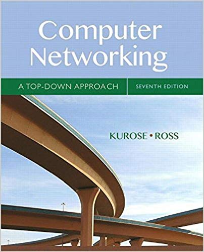
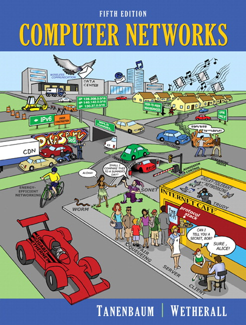
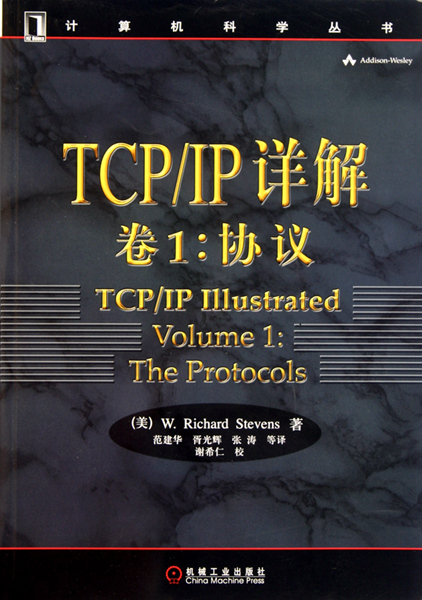
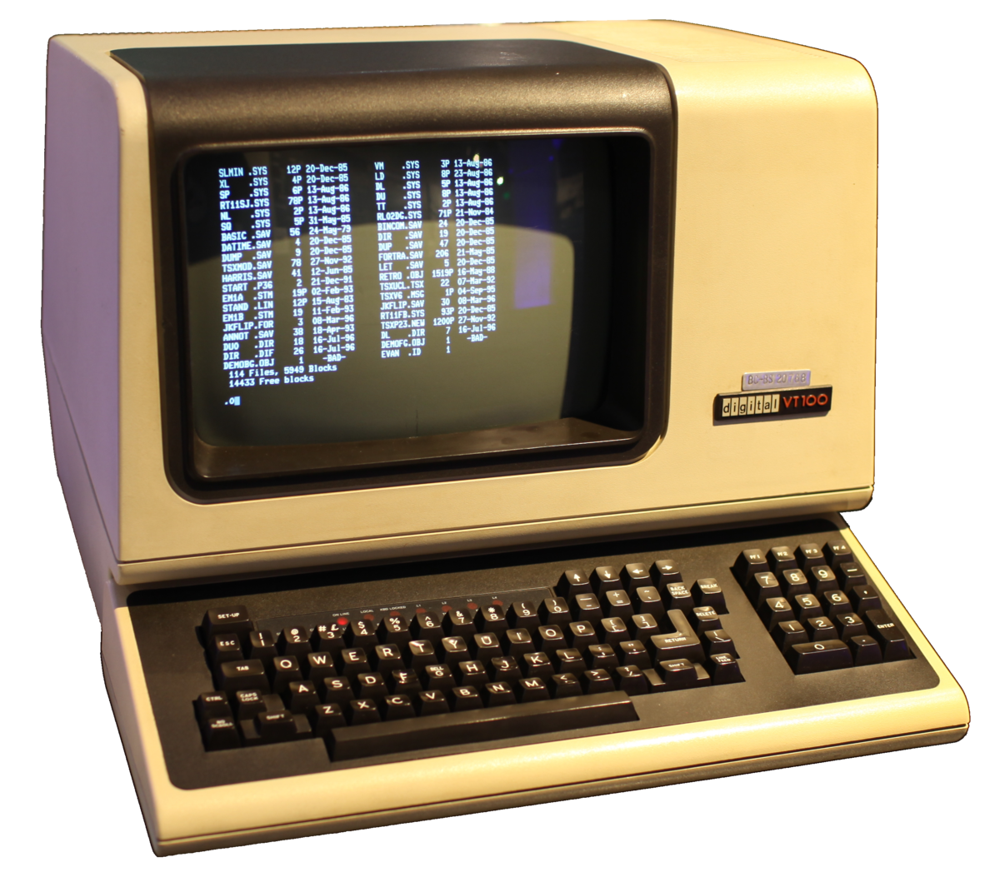

author: QiGe
summary: 计算机网络课程课堂教学
id: html
categories: network, course
environments: Web
status: Draft
feedback link: gridwang@gmail.com
analytics account: Google Analytics ID

# 计算机网络 第一章 概述

## 课前说明

### * 考核：10/20/70原则

### * 作业及设计报告提交

### * 答疑时间：随时

### * 答疑地点：语音楼302

### * 联系方式：**wang@cqjtu.edu.cn**或**13527556383**或**QQ：929051261**

### * 参考书目

1. 《计算机网络－自顶向下方法与Internet特色》第七版, James F.Kurose, Keith W.Ross [英文版](./data/cn7.pdf)

2. 《Computer Networks, 5th Edition》, Andrew Tanenbaum, David Wetherall, 世界经典教材 [英文版](./data/cn5.pdf)

3. 《TCP/IP详解，卷1：协议，卷2：实现》， [美] W.Richard Stevens，机械工业出版社

### * 关于教材及如何学习

### * 学习计算机网络, 你想解决什么问题?

Positive
: 获得学分, 是生活和学习的必需
  微信, QQ, 浏览器等如何工作
  如何少看广告甚至屏蔽广告
  如何科学上网
  网络出现问题, 如何排查
  电脑是否有木马
  如何得到更多的带宽
  ...

## 发展、定义及应用

### 计算机网络发展的3个阶段

#### 1. 面向终端的网络

* 终端：仅具有I/O功能的设备

* 缺点：主机负担重，线路利用率低
* 解决：前端处理机，线路集中器
* 代表：美国航空公司机票预定网

#### 2. 计算机通信网

* 特点：计算机之间、关系对等、以通信为主要目的
* 代表：ARPA网

#### 3. 计算机网络

Positive
: **特点：以通信和共享为目的，遵循相同或相通的通信规则（协议），有层次清晰的体系结构**

### 未来发展方向

Positive
: **通信技术的“高速、宽带、智能、可靠” + 计算机技术的“功能强、体积小、价格低、易操作” ＝> 计算机网络的“开放、综合、智能”**

### 计算机网络定义

Positive
: **用通信线路和通信设备将分散在不同地方、具有自主性的计算机系统连接起来(硬件)，通过相应的网络协议与网络软件(软件)，实现通信和资源共享(目的)的计算机及通信系统的集合**

### 网络应用的模式

#### C/S模式
