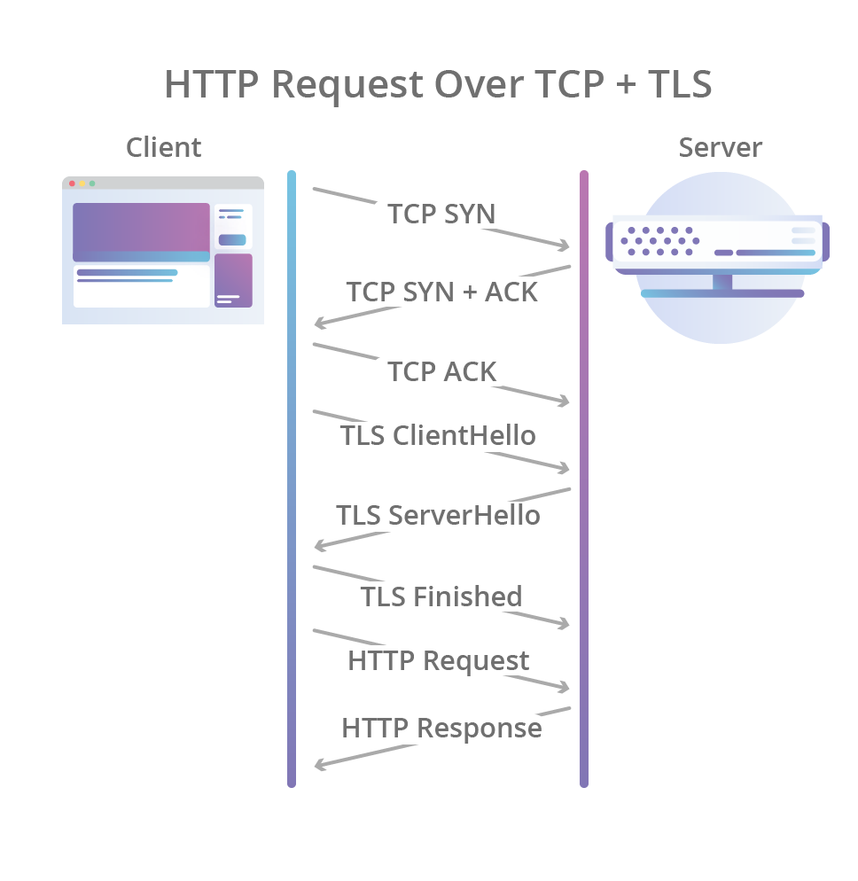

# HTTP(HyperText Transfer Protocol)发展

## HTTP1.0

### 原始HTTP

1996年`HTTP1.0`规范(RFC 1945)发布, 该规范定义了我们今天所知道的基本`HTTP`文本传输格式(假装异常简单的`HTTP0.9`不存在 :).

在`HTTP1.0`中, 客户端对服务器的**每个请求都需要创建一个新的`TCP`连接**, 考虑到在每个请求之前必需的3次握手开销, 那么每个请求都会产生延迟. 如下图(使用了`TLS`)所示.



### 糟糕的TCP拥塞控制算法

即使连接建立好后, 要发送的所有的数据也不能马上都能传出, 因为`Slow Start`算法

> TCP使用了称为"`慢启动Slow Start`"的预热时间用于拥塞控制, "慢启动Slow Start"使`TCP`拥塞控制算法缓慢增加可以传输的数据量, 而不是在建立连接后尽快发送所有未完成的数据.
> 
> 在网络路径上发生拥塞之前的任何给定时刻, 必须经过缓慢的启动过程, 因此即使有可用的带宽而不会发生拥塞, 它们也无法立即使用所有可用的网络带宽.

`HTTP`1.0是一个相对简单直观的协议，但时间证明了早期的设计并不尽人意。随着网页加载的外部资源越来越多，这个问题就愈发突出了。

## HTTP1.1

1999年, 新的`HTTP1.1`规范(RFC 2616)发布. `HTTP/1.1`进一步完善了 `HTTP` 协议, 一直到现在还是最流行的版本.

### 主要改进

#### 1. 持久连接(Persistent Connection)

已经建好的`TCP`连接默认不关闭, 可以被随后的多个请求复用(也不用在请求头部声明`Connection: keep-alive`)

客户端和服务器发现对方一段时间没有活动, 就可以主动关闭连接(现实中一般是: 客户端在最后一个请求时, 发送`Connection: close`, 明确要求服务器关闭`TCP`连接

另外还允许与服务器建立多个连接来进行并行请求

>目前, 对于同一个域名, 大多数浏览器允许同时建立6个持久连接。

#### 2. 管道(pipelining)

在同一个`TCP`连接里面，客户端可以同时发送多个请求而无需`one by one`。这样可进一步提高`HTTP`协议的效率。

>举例来说，客户端需要请求两个资源。以前的做法是，在同一个`TCP`连接里面，先发送A请求，然后等待服务器做出回应，收到后再发出B请求。管道机制则是允许浏览器使用该连接同时发出A请求和B请求

一个`TCP`连接现在可以传送多个请求/回应，势必就要有一种机制用以区分数据包是属于哪一个请求/回应的。

`HTTP1.1`使用了`Content-length`头部字段字段，声明本次回应的数据长度, 如：

```http
Content-Length: 3495
```

上面代码告诉浏览器，本次回应的长度是`3495`个字节，接收完`3495`字节后, 后面的字节就属于下一个回应了。

此外, `HTTP1.1`还采用了**分块传输编码**来针对一些很耗时的动态操作(服务器要等到所有操作完成，才能发送数据)。处理方法是，产生一块数据，就发送一块，采用"流模式"（stream）取代"缓存模式"（buffer）。

### 问题

#### 1. 队头堵塞(Head-of-line blocking)

**持久连接**减少了多建连接的开销, **管道**技术使得在一个连接中可有**并发**的请求/回应. 

但 `pipelining` 要求返回是按序的，如果前一个A请求很耗时（比如处理大图片）, 那么后面的B请求即使服务器已经处理完(准备好数据)，仍会等待前面的请求处理完才开始按序返回。

此时, 就会有许多请求的回应排队等待。这称为"队头堵塞"（Head-of-line blocking）!

为了避免这个问题，只有两种方法：一是减少请求数，二是同时多开持久连接。

#### 协议开销大

HTTP1.x在使用时，header里携带的内容过大，在一定程度上增加了传输的成本，并且每次请求header基本不怎么变化，尤其在移动端增加用户流量。

#### 安全因素

HTTP1.x在传输数据时，所有传输的内容都是明文，客户端和服务器端都无法验证对方的身份，这在一定程度上无法保证数据的安全性


### 其它优化

## HTTP/2

### HTTP/2演示

https://http2.akamai.com/demo

因为HTTP/1.x的问题，我们会引入雪碧图、将小图内联、使用多个域名等等的方式来提高性能。不过这些优化都绕开了协议，直到2009年，谷歌公开了自行研发的 SPDY 协议，主要解决HTTP/1.1效率不高的问题。谷歌推出SPDY，才算是正式改造HTTP协议本身。降低延迟，压缩header等等，SPDY的实践证明了这些优化的效果，也最终带来HTTP/2的诞生。

SPDY 协议在Chrome浏览器上证明可行以后，就被当作 HTTP/2 的基础，主要特性都在 HTTP/2 之中得到继承。


 正式版`HTTP/2`(RFC 7540)发布于2015年5月15日.

## 参考

>1. <https://blog.cloudflare.com/http3-the-past-present-and-future/>
>1. https://mojotv.cn/cloudflare-http3-pass-present-future
>1. https://http2-explained.haxx.se/content/zh/part3.html
>1. https://http3-explained.haxx.se/zh/
>1. https://www.howtogeek.com/442047/how-http3-and-quic-will-speed-up-your-web-browsing/
>1. https://tools.ietf.org/html/draft-ietf-quic-http-23
>1. http://www.52im.net/thread-1709-1-1.html
>1. https://www.jianshu.com/p/c5571765eb3e
>1. https://kinsta.com/blog/http3/

Default mode is clearnet+Tor. Give zeronet permissions to configure hidden service:
>>>   sudo usermod -a -G tor zeronet
>>> Add/edit the following options in /etc/tor/torrc:
>>>   ControlPort 9051
>>>   DataDirectoryGroupReadable 1
>>>   CookieAuthentication 1
>>>   CookieAuthFileGroupReadable 1
>>>   CookieAuthFile /var/lib/tor/control_auth_cookie
>>> Restart tor (reload not enough):
>>>   sudo systemctl restart tor
>>> Run daemon and check status and view log:
>>>   sudo systemctl start zeronet
>>>   sudo systemctl status zeronet
>>>   sudo journalctl -u zeronet
>>> NOTE: all operations including editing zerosite files,
>>>       should be done as user zeronet and config must be passed
>>>       for data directory to be selected to /var/lib/zeronet: 
>>>   sudo -u zeronet python zeronet.py --config_file /etc/zeronet.conf ...
>>>      OR
>>>   sudo su - zeronet
>>>   cd /opt/zeronet
>>>   python zeronet.py --config_file /etc/zeronet.conf ...
Optional dependencies for zeronet
    tor: anonymity
    namecoin-core: local name resolution
ldconfig: file /usr/lib/libaccountsservice.so.0.0.0 is truncated

ldconfig: file /usr/lib/libaccountsservice.so is truncated

ldconfig: file /usr/lib/libaccountsservice.so.0 is truncated

